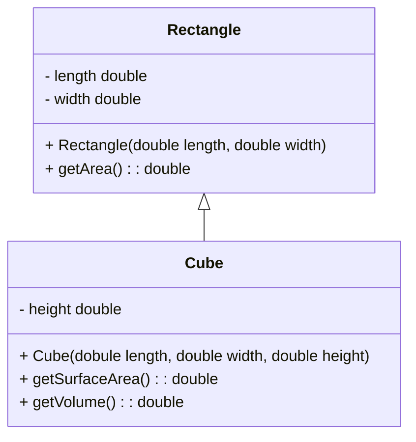

Date: 20th February 2023
Date Modified: 20th February 2023
File Folder: Week 5
#Programming2 #year1 #semester2

```ad-abstract
title: Today's Topics
collapse: open

- Polymorphism
- Abstract Classes + Methods

```


# Polymorphism

```ad-summary
- Polymorphsim = Many Forms
- Allwoing an object mto take on many forms
```

## Definition

Associating multiple meanings to the same emthod name

Several methods have the same name and teh same formal paramter list, but what theyd o or who they behave may be different

```ad-warning
title: ## in java...
polymorphism is implemented using soemthing known as late binding 
- The method that gets executed is determiend at execution time not at compile time
```

Late binding is Dynamic while binding is done during run-time binding

```ad-note
### A reference variable can reference objects of classes that inherit form the variable's class
```

## Two Common Examples

**Method Overloading**
Very common and we have seen this a lot
Where we have multiple functions with the same name that differ based on parameters

**Method Overriding**
Writing a completely different method with the same name that does what you want

### Method Overloading

We can define two or more methods of the same name within a class as long as the argument list or parameters are different.

| When we say "different'we mean want of the following" |                                              |                                   |
| ---------------------------------------------------- | -------------------------------------------- | --------------------------------- |
| The number of parameters is different                | The data type of the parameters is different | The order of them does not matter | 


### Method Overriding

We write a specialized version of a method

Common examples from Ojbect:
- toStirng and equals methods

Any mehtod in the base/parent/super class that we write anotehr version in the derived/child class


## Polymoprhism as an umbrella term

- Inheritance
- Overload
- Override
- Abstract
- Interface
- Even more we still have to learn!

# Binding

When a superclass variable references a subclass object, a potenial problem exists
- What if the subclass ahs overridden a method in the sueprclass?
- The variable makes a call to that method?
- Does the variable calss the superclass's version of the method? Or the subclass's version?

Happens behind the scene

```ad-summary
title: Definition

- The process of matching a method call with the correct method definition
- Java performs dynamic binding or late binding
```


```ad-important
### The object's type that determines which method is called, not the variable type
```

```ad-important
color: 255, 255, 0
### The Is-A relationship (inheritance) does not work in reverse!
```

### Example

- Cube is a Rectangle
- This makes sense.. I use the getArea() within Cube to calcuate surface area and volume of a Cube
- Rectangle is more abstract, it is the parent/super/bass class
- Cube is the speicalized class. It is the derived/child class



# Abstract Classes

An abstract class is not instantiated, but other classes extend it

An abstract method has no body and must be overridden in a subclass

## Abstract Class

- A class that does not define all of its methods
- You will have subclasses taht define those methods
- An abstract class must serve as a superclass
- Sits between Object and its subclassses

## Outline

When we add the `abstract` keyword to the class, this indicated that the classs contains at least 1 abstract method

```java
public abstract class NameOfClass {
	//fields
	//constructors
	//getters/setters
	//methods
	//abstract methods
}
```

### Example Abstract Class Animal

```java
public abstract class Animal {
	public String name;
	
	public Animal(String name) {this.name = name;}
	
	public String getName() {return name;}
	public String setName(String name) {this.name = name;}
	
	public abstract String sound();
}
```

```ad-note
This makes it so that the abstract methods **must** be implemented in the subclass
```

```java
public class Cat extends Animal {
	public Cat(String name) {super(name);}
	
	public String sound() {
		return "meow";
	}
}
```

## Purpose

Define some common behvaior that can be inherited by multiple subclasses without implementing the entire class

An abstract class, bieng a class, can also contain familiar elements:
- Instance variables
- Static variables
- Instance methods
- Static methods

![[Pasted image 20230226214225.png]]


