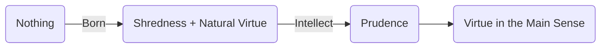
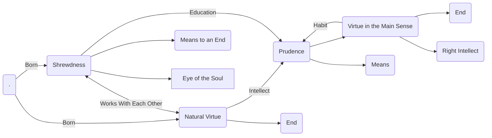

Date: 13th November 2025
Date Modified: 13th November 2025
File Folder: Week 12
#ancient_philosophy
# Book I

## Chapter 1: Teleology

The first sentence 1094a1-3: Aristotle begins his ethical inquiry by pointing out that we are *teleological* entities.

```ad-quote
title: 1094a1-3
Every art and every inquiry, and similarly, every action and every intention is thought to aim at some good; hence men have expressed themselves well in declaring the good to be that at which all things aim '.
```

There are different kinds of ends: 
1. some are for the sake of something else
2. for its own sake

```ad-important
The ulimate goal is "happiness" or *Eudaimonia*
- It is an objective, and not a subjective, conception of "happiness"
- The term is best understood to mean, "well-being" or "flourishing."
```

### Nature of Ethical Inquiry

#### 1094b11-12

Ethics is a part of a political inquiry

```ad-quote
title: 1094b11-12
collapse: closed
Our inquiry, then, has as its aim these ends, and it is a political inquiry;
```

#### 1094b12-28

Ethics deals with particulars and *not* an exact science
- It is a warning about the nature of ethics

```ad-quote
title: 1094b12-28
collapse: closed
and it would be adequately discussed if it is presented as clearly as is proper to its subject-matter; for, as in hand-made articles, precision should not be sought for alike in all discussions. Noble and just things, with which politics is concerned, have so many differences and fluctuations that they are thought to exist only by custom and not by nature. Good things, too, have such fluctuations because harm has come from them to many individuals; for some men even perished because of wealth, others because of bravery. So in discussing such matters and in using [premises] concerning them, we should be content to indicate the truth roughly and in outline, and when we deal with things which occur for the most part and use similar [premises] for them, [we should be content to draw] conclusions of a similar nature. The listener, too, should accept each of these statements in the same manner; for it is the mark of an educated man to seek as much precision in things of a given genus as their nature allows, for to accept persuasive arguments from a mathematician appears to be [as improper as] to demand demonstrations from a rhetorician.
```

#### 1095a1-4

Youths, who do not have life experience, are not appropriate students of ethics

```ad-quote
title: 1095a1-4
collapse: closed
Now a man judges well the things he knows [well], and it is of these that he is a good judge; so a good judge in a subject is one who is educated in that subject, and a good judge without qualification is one who is educated in every subject.
```

## Chapter 2-3: What is *Eudaimonia*?

The fact that we all pursue Eudaimonia is not controversial.

However, there is a **disagreement** in the nature of what Eudaimonia is. Is it to:
- Is it a life of pleasure?
- Wealth?
- Honor?
- Grasping the Form of the Good?

## Chapter 4: Criticisms of Plato’s Good

The two arguments:
1. It is not **univocal**
	- There is no universal Good that is applicable to all instances
2. Even if it were to exist, it is useless because our actions are always of individuals.

```ad-note
Plato seems to put all Good into one form such that of the Forms. However, Plato seems to fragment this idea because each Category has it's own good.
```
## Chapter 5: Two Criteria of *Eudaimonia*

**Criteria One**: It is something that is always pursued for its own sake and never for the sake of something else.
- Always intrinsic and *never instrumental*


**Criteria Two**: It is “self-sufficient” - that which taken by itself lacks nothing. It does not mean a living a solitary life for we are political animals.

```ad-quote
title: 1097b8-11
collapse: closed
By ‘self-sufficient’ we do not mean an individual who leads just a solitary life, but one with parents and children and a wife and, in general, with friends and fellow-citizens as well, since man is by nature political.
```

## Chapter 6: Definition of *Eudaimonia*


```ad-quote
title: 1097b23-25
collapse: closed
Perhaps to say that happiness is the highest good is something which appears to be agreed upon; what we miss, however, is a more explicit statement as to what it is. Perhaps this might be given if the function of man is taken into consideration.
```

The objective conception of “happiness” is derived form the human nature (the function *ERGON* of human being). The reason why he begins with our function is that in the realm of art, the goodness and excellence are both found in the function of artist and artisan.

```ad-example
A flute player, a statue maker, a carpenter, a shoe maker, etc.
```

```ad-quote
title: 1097b25-31
collapse: closed
For just as in a flute-player or a statuemaker or any artist or, in general, in anyone who has a function or an action to perform the goodness or excellence lies in that function, so it would seem to be the case in a man, if indeed he has a function. But should we hold that, while a carpenter and a shoemaker have certain functions or actions to perform, a man has none at all but is by nature without a function?
```

So, in nature too, it is reasonable to believe that the goodness and excellence of human being are found in his function.

### Do Humans have Function?

```ad-quote
title: 109731f
collapse: closed
Is it not more reasonable to posit that, just as an eye and a hand and a foot and any part of the body in general appear to have certain functions, so a man has some function other than these? What then would this function be?
```

We have a function. If you examine our parts such as an eye, a hand, or a foot, each has its own function. It is, therefore, reasonable to believe that we have the overall function, which is to live a life.

### Senses of Reason

```ad-quote
title: 1098a1-4
collapse: closed
Now living appears to be common to plants as well as to men; but what we seek is proper to men alone. So let us leave aside the life of nutrition and of growth. Next there would be the life of sensation; but this, too, appears to be common also to a horse and an ox and all animals. There remains, then, the life of action of a being who has reason.
```

**Two Senses of Reason**
1. In the sense of obeying
2. In sense of possessing
	- In terms of passivity
	- In the sense of activity

```ad-important
So, the function of human being is an activity of the soul according to reason or not without reason.
- Both sences are important in themselves, but activity means that something is done about it.
```

```ad-quote
title: 1098a4-8
collapse: closed
Of that which has reason, (a) one part has reason in the sense that it may obey reason, (b) the other part has it in the sense that it possesses reason or in the sense that it is thinking. Since we speak of part (b), too, in two senses, let us confine ourselves to the life with reason in activity [i.e., to the process of thinking], for it is this sense which is thought to be more important.
```

### Definition of Happiness

```ad-quote
title: 1098a8-17
collapse: closed
Accordingly, if the function of a man is an activity of the soul according to reason or not without reason, and if the function of a man is generically the same as that of a good man, like that of a lyre-player and a good lyreplayer, and ofall others without qualification, when excellence with respect to virtue is added to that function (for the function of a lyre-player is to play the lyre while that of a good lyre-player is to play it well, and if so, then we posit the function of a man to be a certain kind of life, namely, activity or actions of the soul with reason, and of a virtuous man we posit these to be well and nobly done; so since each thing is performed well according to its proper virtue), then the good for a man turns out to be an activity of the soul according to virtue,
```

**Comparison**: in the realm of art, the function of a lyre-player and a good lyre-player is the same. They differ in terms of how well they perform their function. A good lyre-player performs his function well or according to its excellence.

Similarly, the function of a human being and a good human being is the same. They differ in terms of how well they perform their function. A good human being performs his function well or according to his excellence.

```ad-summary
title: Definition
*Arete*: Excellence or virtue
```

```ad-important
*Eudaimonia* is an acivity of the soul according to reason with its excellence or virtue (*Arete*)
```

## Chapter 13: Human Psychology

Three part sin human soul:
1. The rational part: the part that has reason itself
2. The appetitive part: the part that which listens or resists reason
3. The nutritive part: the part that causes nutrition and growth

The Rational & the Appetitive parts share in reason, but not the Nutritive part

### Two Kinds of Virtues

Since Eudaimonia involves excellence as regards to reason, and reason is said in two different senses, there are 2 kinds of excellence or virtue that correspond to 2 different parts of the soul.
1. **Intellectual Virtue**: The excellence of the rational part (wisdom, prudence, intelligence, etc.)
2. **Ethical Virtue**: The excellence of the appetitive part (courage, generosity, moderation, etc.)

# Book II

## Chapter 4: Ethical Virtue

There are three things in the appetitive part of the soul:
1. **Feelings**: Desire, anger, fear etc., whatever is accompanied by pleasure or pain
2. **Powers**: Capacities to be affected by feelings
3. **Habits**: Qualities to be well or badly disposed with reference to the feelings.

#comebacklater 

# Book III

## Part 6: Circularity in Gaining Habit

For a bad person,w hat appears to be good is not a real good; for a good person, what appears to be good is a real good. It is a good person who is the standard for a correct judgment.

```ad-question
Are we responsible for pursuing what appears to be good?
```

**Yes**, it provides that we are responsible for the habit that causes the appearance.

*Follow-Up Question*: How are we responsible for our habit when it is our habit (which is a virtue) that makes us responsible? Isn’t there a circularity involved in Aristotle’s explanation?

```ad-quote
title: 1114b1
One might say that all men aim at the apparent good but cannot control what appears to them to be good, and that the end appears to each man to be of such a kind as to correspond to the kind of man he is.
```

```ad-quote
title: 1114b16-25
So whether it is not by its nature that the end appears to each man such as it does but depends on him somewhat, or whether the end is natural but virtue is voluntary by the fact that a good man does all else voluntarily, vice too would nonetheless be voluntary; for in the case of a bad man, too, his *actions* will likewise be caused by him even if the end is not. If, then, as it is said, the virtues are voluntary (for we ourselves are somehow partly responsible for our habits, and it is by being persons of a certain kind that we posit the end as being of a certain kind), the vices too will be voluntary for a similar reason.
```

# Book VI

## Review: Ethical Virtue

```ad-summary
"[Ethical] virtue, then, is a habit, disposed toward action by deliberate choice, being at the mean relative to us, and *defined by reason and as a prudent man would define it.*" (11.6, 107b36-a1)
```

**Eudaimonia** → “Happiness”
- An activity of the soul (*Psyche*) with reason in accordance with virtue (in *Areze*/excellence)
- Draws the difference between subjective (happiness) and objective (**Eudaimonia**)
- This is part of our objective “human nature” and employs the word *function* onto this

**Function of a Human Being**
- To live an active life of reason

**Parts of the Psyche**
1. The rational part: By means we actually *reason* → Intellectual Virtue
2. The appetitive part: By how we feel *emotions and feelings* (In **participation** of reason) → Ethical Virtue
3. The nutritive part: The biological means to stay alive (necessary food, drink, and breathing)

*Three aspects of the appetitive part:*:
1. Feeling ($X$)
2. Powers ($X$)
3. Habit ($\checkmark$) → Aim at the mean relative to us

The ethical virtue is a characteristic of habit that we have cultivated, so we can always aim toward the context we are selecting
- Both *objective* and *relative*
- There is always a right answer, but that answer differs from context to context

The person must be able to chose a means given to an end. The part of choice is also critical

```ad-note
Book VI will cover the last part of his definition
```

## Five Intellectual States

1. **Prudence**: “A disposition with true reason and ability for actions concerning human goods” (VI 5, 1140b21)
2. **Scientific Knowledge**: Is about universal and necessary truths that can be demonstrated; in contrast the object of action varies (VI 3)
3. **Craft/Art**: Is concerned with production rather than action (VI 4).
4. **Intuition**: Grasps the principles which cannot be demonstrated (ex. definition) (VI 6)
5. **Wisdom**: The most accurate of the sciences and includes both intuition and scientific knowledge about the most knowable object (not human goods) (VI 7)

### How are they related?

**The rational part** - (the scientific subpart) - *Wisdom*, which is a combination of scientific knowledge and intuition, is an intellectual virtue (VI2, 1139a1-15; VI 8; 1141a19-b3; VI 12, 1143b15-17)

**The estimative subpart** - *Prudence*, which is an intellectual virtue (VI 5, 1140b26)

The appetitive part - the ethical virtue

```ad-note
Craft/Art is not a virtue. 1440b21-25
```

## Prudence

```ad-example
A prudent person deliberates well about goods attainable by action and knows the particulars rather than the universals
```

If virtue is a habit, *Prudence* is a *virtuous* habit.
- To be prudent, you need to be virtuous; to be virtuous, you need to be prudent. They presuppose each other
- But prudence is somehow responsible for forming a virtuous habit. How is this possible?

```ad-quote
title: VI 13: 1143b18-33
One might raise certain problems concerning these virtues: Of what use are they? Wisdom investigates none of the things which make a man happy, for it is not concerned with any generation of objects; and though prudence does this, for what purpose is it needed, if indeed prudence is concerned with things which are just and noble and good for a man but which will be done by a good man anyway, and if by merely knowing them we are no more able to act, since the [ethical] virtues are habits, just as we are no more able to perform, by knowing things which are healthy or in good physical condition, those things which do not themselves produce but come to be from the corresponding habits (for we are no more able to act in a healthy or well-conditioned manner by having medical science or the science of gymnastics)? If, on the other hand, we are to posit a prudent man to be not for the sake of these but for the sake of coming to be virtuous, prudence would be of no use to those who are already virtuous, nor to those who do not possess virtue, for it would make no difference whether they possess prudence themselves or obey those who possess it; and it would be enough for us if, in the case of prudence, we use the same argument as we did in the case of health, for although we wish to be healthy, still we do not learn medical science.
```

Prudence is concerned with just, noble and good actions, but it is not simply a matter of knowledge since it is a habit. What is its use?

```ad-example
If prudence is a means to be become virtuous it is useless to botha  virtuous and not virtuous people: it is useless to vrtuous people since they already possess virtue; and it is ueless to non-virtuous people since they do no possess that habit
```

The difference between virtue and prudence: virtue makes the end in view right; and prudence makes the means towards it right.

### Right Action

```ad-quote
title: 1144a8-23
Again, a man’s work is completed by prudence as well as by ethical virtue; for while virtue makes the end in view right, prudence makes the means towards it right. But of the fourth part of the soul, i.e., of the nutritive part, there is no such virtue; for that part cannot act or refrain from acting. As for the argument that through prudence we are no more able to perform noble and just actions, let us begin a little way back and use the following principle. Just as we say that those who do what is just may not yet be just, as in the case of those who perform what is ordained by the law but do so unwillingly or through ignorance or for some other reason but not for the sake of what is just (even if they do what they should and whatever a virtuous man ought to do), so it seems that in order to be good a man must be disposed in a certain way, that is, he must act by intention and for the sake of the things done. Now that which makes the intention right is virtue, but the things which are by their nature done for the sake of [that intention] depend not on virtue but on another power. Let us attend to these matters more clearly for 2 moment.
```

It is not enough to simply perform virtuous action, but it must be performed having being disposed in a certain way: you must intend to act in that way and for the sake of the action.
- Now virtue makes the right intention; so there must be another power to avoid the circular manner.

### Cleverness

This  power is identified as “shrewdness” or “cleverness”: it enables one to succeed in one’s action; and it is the means leading to an aim. If the aim is noble, the power is praiseworthy; if it is bad, the power is blameworthy.

In a good person, a combination of shrewdness (*the eye of the soul*) and virtue develops into prudence.
- We are born with natural virtue which becomes virtue in the main sense (when we acquire our intellect).
- Every virtue is a species of prudence

```ad-quote
title: 1144b1-3
Let us then examine also virtue once more; for virtue, too, has its parallel, that is, as prudence is related to shrewdness (by being similar but not the same), so natural virtue is related to virtue in the main sense.
```



### Knowledge and Virtue

Just as shrewdness is to prudence, natural virtue is the virtue in the main sense.
- More precisely, a combination of shrewdness and natural virtue will develop into prudence which in turn will produce virtue in the main sense.

Socrates as correct in thinking that without knowledge, there is no virtue but was mistaken in believing that every virtue is knowledge (i.e. prudence).

### Prudence, Virtue, and Right Intention

Prudence is concenred with the means while virtue is concerned with the end; and together produce the right intention.

We begin with a combination of natural virtue (we are born good) and shrewdness (we “know” what is good by means of the eye of the soul); together they develop ino prudence which in turn produces virtue in the main sense; they in turn delveop into habit that reinforces each other; and as a result this habit produces the right intetion.



```ad-warning
Gaining intellect and properly using shrewdness and natural vitrue is based on **nurture**
```

# Book X

## What is Pleasure?

Aristotle compares it with an activity like seeing (an activity is complete at any interval of time). 
- If pleasure is *an activity* like seeing, then it is **not** *a motion*
- Motion takes *time*

```ad-example
Building a house is an exmaple of motion; a house is compelte only when it has been built and not before.
```

In contrast, what is pleased in every interval of time and hence is always complete (just like seeing).

### Corresponding Pleasures

For every faculty of sensation and thinking, there are **corresponding pleasures**

```ad-example
Take a faculty of sensation, like seeing: when sight is in good condition and it ijs seeing a beautiful object, pleasure **accompanies** such an activity which is perfect.
```

### Three Ways an Activity Can Be Made Perfect

1. When the faculty in question is in an *excellent condition* as opposed to a bad condition
2. When the object in question is *beautiful* rather than ugly.
3. When the pleasure makes the activity perfect - it does so as an end that supervenes when all the excellent conditions are met; it is something that accompanies over and above the activity in question; it enriches the experience of that activity.

```ad-quote
title: 1174b33-35
But pleasure perfects the activity not as a disposition which resides in the agent but as an end which supervenes like the bloom of manhood to those in their prime of life;
```

### Pleasure and Activities

Just as there are different kinds of activities, the corresponding pleasure would also be *different*.

**Reasoning**:
1. It is the pleasure that increases or makes better the very activity in which you are engaged in. ex. in each field, it is those who enjoy and derive pleasure form that activity that each field makes its own progress.

```ad-quote
title: 1175a33-1175b2
For an activity is increased along with the pleasure which is proper to it; for those who engage in activity with pleasure judge things better or think them out more accurately than those who take little or no pleasure in those activities, e.g., those who become geometricians and think out each geometrical object better are those who enjoy geometrical thinking, and, similarly, it is by enjoying their activity that those who love music or constructing a building, etc., make progress in their proper field. What causes each of them to advance further in his own field is pleasure, and that which causes such advance is proper to that field; and attributes proper to subjects which are different in kind are themselves different in kind.
```

2. Other pleasures obstruct the very activity you are engaged in. you have then a proper pleasure which makes its activity more accurate, more enduring and better; and the alien pleasure which impairs the activity. It is the proper pleasure that supervenes on an activity. Thus, there is an appropriate pleasure that is by nature accompanies its activity.

```ad-quote
title: 1175a3-11
This becomes even more apparent from the fact that activities are obstructed by the pleasures of other activities; e.g., those who love to hear flute-playing are unable to attend to an argument when they hear attentively someone playing the flute, for they enjoy listening to the flute more than the activity of attending to the argument, and so the pleasure of hearing flute-playing destroys the activity connected with the argument. It is likewise in all other cases in which a man is engaged in two things at the same time; for the more pleasant activity pushes the other activity back, and if the former activity is much more pleasant, it pushes the latter activity even further back so that the man cannot even attend to the latter activity.
```

3. There are good and bad activities; correspondingly, there are appropriate pleasure for each activity. Human beings differ in what they find pleasurable. Ex. healthy body will find sweet things sweet, but sick body (with fever) will not find them sweet. Similarly, in the case of pleasurable, good human being will find virtuous things pleasurable and bad human being will find vicious things pleasurable.

```ad-quote
But in the case of men, at least, the pleasures vary to no small extent; for the same things delight some men but pain others, and they are painful or hateful to some but pleasant or lovable to others. This happens in the case of sweet things, too; for they do not seem the same to those who have fever and to those who are healthy, nor hot both to a sickly man and to one in good physical condition, and similarly in other cases. In all such cases, then, what is thought to be the case is what appears to a virtuous man. And if this is well stated (as is thought to be) and the measure of each thing is virtue or a good man as such [i.e., as virtuous], those things, too, will be pleasures which appear to him to be pleasures and those things will be pleasurable which a good man enjoys. And if the things which distress him appear pleasant to some persons, there is nothing surprising about this (for men are ruined or impaired in various ways), and such things are not pleasurable but only to these persons and to others who are disposed in such a manner. So it is clear that we should not speak of those pleasures which are generally regarded to be disgraceful as being really pleasures, except to those who are corrupt.
```

### Real Pleasure

The real pleasure is found in good activities. It is a pleasure that accompanies a person with a healthy soul; the pleasure in a qualified sense is found in bad activities. It is a pleasure that accompanies a person with sick soul.

**Class Discussion**
- A somewhat corrupt person that does a virtuous activity, do they feel pleasure?
	- If the person was virtuous, they would enjoy the pleasure. if not, they would not understand the pleasure.
- Find pleasure in non-virtuous activities, but do virtuous activities out of guilt. Does that still make you a bad person?
	- Continent vs. Incontinent vs. Virtuous vs. Vicious person
	- Virtuous people do the right thing and love doing it
	- **Continent** people do the right thing out of necessity
	- Incontinent people don’t do the right thing even though they know how to do it
	- Vicious person does the wrong thing and does not know it is wrong.
	- The continent person lines up with this description

**The Goal**: Virtuous people enjoy doing good actions and gain pleasure from it. 
- The closer you get to this, the more virtuous the person is, and the more happy they would become.
## What is Happiness?

It is not a disposition; otherwise, a person who sleeps all his life and who lives like a plant would become happy.
- What is the ultimate goal then towards happiness?

### Not an amusement

Most people think that the ultimate goal is **amusement**.
- Tyrants (who are despotic) especially agree, for this is a particular kind of pleasure that they aim at.

```ad-quote
title: 1776b18-24
But perhaps the apparent happiness of such men is no sign that they are really happy, for virtue and thought, from which good activities arise, do not depend on despotic power; and the fact that such men, who have never tasted pure and liberal pleasure, resort to bodily pleasures is no reason for regarding these pleasures as being more choiceworthy, for children too regard the things they value as being the best. It is with good reason, then, that just as different things appear to be of value to children and to men, so different things appear to be of value to bad men and to good men.
```

Now different things would be different from person to person

Besides, Aristotle finds it absurd that the end of human being is an amusement; that is, we toil hard for the sake of amusement. It would trivialize human life and would make it appear foolish and childish.
- That, we amuse ourselves for the sake of serious work. however, we should recognize that we do need amusement.

### Contemplation

It is activity according to virtue. The best activity will be according to the highest virtue. It is contemplation, because:
1. Intellect is the best part in us and is concerned the best knowledgeable object
2. It is the most continuous activity that we can engage in. This is so because it is accompanied by pure pleasure.
3. It is the most self-sufficient activity. Ethical virtues, for example, require other human beings; but in wise person can theorize even alone although it is better to have colleagues.
4. It is loved for its own sake; nothing results form it except contemplation itself. In contrast, practical activities we gain something other than the activities.
5. It depends on leisure; we toil for the sake of leisurely activity (thinking is most of all depend on it.)

```ad-important
title: The devine activity

We should engage in this divine activity not in so far as we are human bieng; but in so far as we share soemthing divine in us.
```

```ad-quote
title: 1177b17-26
So if political and military actions among virtuous actions stand out in fineness and greatness and, being toilsome, are aimed at some other end but are not chosen for their own sake, whereas the activity of the intellect, being theoretical, is thought to be superior in seriousness and to aim at no other end besides itself but to have its own pleasure which increases that activity, then also self-sufficiency and leisure and freedom from weariness (as much as are possible for man) and all the other things which are attributed to a blessed man appear to exist in this activity. This, then, would be the perfect happiness for man, if extended to the full length of life, for none of the attributes of happiness is incomplete.
```

```ad-quote
title: 1177b31-1178a1
So since the intellect is divine relative to a man, the life according to this intellect, too, will be divine relative to human life. Thus we should not follow the recommendation of thinkers who say that those who are men should think only of human things and that mortals should think only of mortal things, but we should try as far as possible to partake of immortality and to make every effort to live according to the best part of the soul in us; for even if this part be of small measure, it surpasses all the others by far in power and worth.
```

## Post-Class Discussion

- It is both instrumental and intrinsic, but Aristotle focuses on the intrinsic value
	- If you fail to contemplate, you have not obtained fulfillment as a human being
	- ex. Prudence is an instrumental way to use it for the sake of reason.
- “Ignorance is Bliss”: With this statement, what would his argument be against this? Would he see any validity in that statement?
	- He would never see it true in any situation
	- Is counter to the human function
	- Human function is to live an active life of reason
	- The goal is to *not* be ignorant.
	- ex. Children and animals cannot be happy since they cannot perform the activity of reason
- Neutral activity that gets pleasure. (ex. a single player video game)
	- Rational part and the appetite part → both participate in reason
	- We must have excellence in both of them
	- We must exhibit ethical virtue
	- Contemplation should be done in one’s leisure (*scholē*)
	- Purest pleasure comes from contemplation
- Pleasure machine thought experiment
	- Virtuous machine that hooks you and cannot leave
	- You will experience the most happiest and the most pleasurable life
	- Aristotle would not go in since it would be a trick. It is produced by illusion rather than by truth.