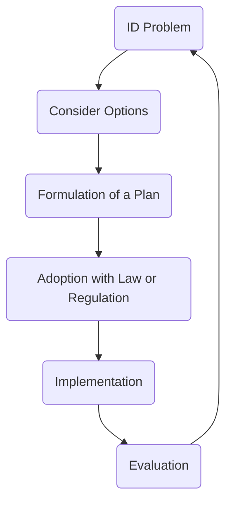

Date: 27th October 2025
Date Modified: 27th October 2025
File Folder: Week 10
#environmental

```ad-abstract
title: Today's Topics
collapse: open

- Topic1
- Topic2
- Topic3

```

# Module 5.2: Environmental Policy

## Case Study: The World Tackles Ozone Depletion

**What is Ozone**: It is a triple-bonded Oxygen molecule

![[Pasted image 20251027100735.png]]

**Saving the Ozone Layer and the Role of Environmental Policy**
- *Dr. Susan Solomon* in Antarctica where the first one to realize that the ozone in the atmosphere was changing
- Headlines were saying that there was a “Hole in the Ozone Layer”
	- Not exactly true, but it got the public to want to take action for it.

![[Pasted image 20251027100954.png]]

### What Causes Ozone Depletion?

1. **Chlorofluorocarbons (CFCs)** and other chemical pollutants (ex. $CF_{2}Cl_{2}$)
	- Was common in solvents, aerosols, refrigeration, and foams
	- Needed to be replaced with other chemicals
	- As the CFC concentration increased, the ozone layer decreased. This means that there is a *negative correlation*

### Why is the Atmosphere Important

1. Temperature Regulation
2. Protection from UV radiation

![[Pasted image 20251027101540.png]]

![[Pasted image 20251027101658.png]]

```ad-important
The ozone layer sits in the **stratosphere**
```

### Dangers Associated with Ozone Depletion

1. **Increased UV Radiation**
	- UV-A: Causes sunburns and skin damage
	- UV-B: Can causes permanent DNA damage, which can lead to skin cancers and cataracts.

### Testing a Hypothesis

**Hypothesis**: CFCs are breaking down the ozone layer.
- If CFCs are breaking down the ozone layer, 

![[Pasted image 20251027102141.png]]

![[Pasted image 20251027102202.png]]

```ad-important
The CFCs disrupt the natural ozone to oxygen loop, which causes less ozone to reform as more Hypoclorate accumulates in the atmosphere. It utlimately catalyzes the reaction.
```

## What are Environmental Policies and Why Do We Need Them?

**Three Main Purposes**
1. Protect public/natural resources
2. Improve public health
3. Restoring damaged environments

Prior to 1969, there were not *performance standards* established in the United States
- 1962: *Rachel Carson* published *Silent Springs*, which pushed off many of the legislation today

```ad-note
Silent Springs warned their audience about:
1. Some chemicals have large effects at small doses
2. Certain human development stages are more vulnerable
3. Mixture of chemicals can have unexpected effects
```

- 1969: The NEPA was passed (National Environmental Policy Act)
	- 1970: Clean Air Act
	- 1972: Clean Water Act
	- 1973: Endangered Species Act
	- 1974: Safe Drinking Water Act
	- 1976: Toxic Substances Control Act
	- 1982: Nuclear Waste Policy Act

*Two Things to Consider*:
1. What is a safe quantity of a pollutant?
2. How do we keep exposure levels below that?

### How are Policies Developed and Administered in the U.S.



- The EPA deals with the *Implementation and Evaluation* 

### Factors that Influence Policy Decisions

- Congress
- Congressional Committees
- Presdientially Appointed Science Advisers
- Lobbyists
- Influential Individuals
- Private Citizens
- Academic Organizations
- Federally Funded Research Organizations
- Federal Advisor Committees
- Judiciary
- White House
- Press


