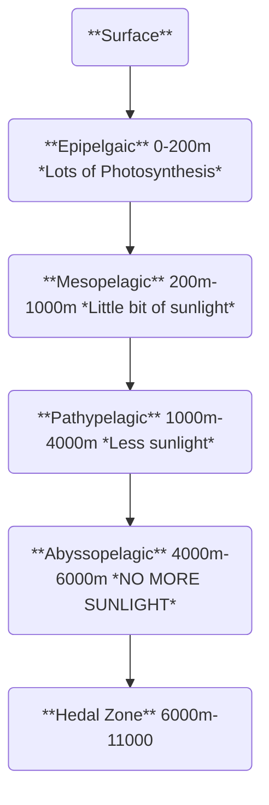

Date: 7th November 2025
Date Modified: 7th November 2025
File Folder: Week 12
#environmental

```ad-abstract
title: Today's Topics
collapse: open

- Topic1
- Topic2
- Topic3

```

# Module 6.2 Water Pollution

## Case Study: Suffocating the Gulf of Mexico

**Eugene Turner:** Climate Researcher
- 1970’s: were confused why the water oxygen levels were so low in the Gulf

## Water Pollution

```ad-summary
title: Definition
Substances that degrade the qualitiy of water
```

- Oil
- Nutrients (Nitrogen and Phosphorus)
- Plastics
- Sentiment
- Bacteria

```ad-example
During the 2016 Rio Olympics, the competitors oars were bleached and they had to wear gloves.
```

#comebacklater 
## Reducing Urban/Suburban Storm Water Runoff

1. Rain barrels
	- Make sure you cover them properly to avoid mosquito growth
2. Rain gardens
3. Storm drain
4. Redirected downspouts
5. Permeable Pavement

## Nutrient Runoff

As the amount of crops have increased, so has the fertilizer use
- The amount of nitrogen in phosphorus in fertilizer can affect the quality of water significantly

*How can we reduce runoff*
- Reduce overall fertilizer use and/or alter fertilization application strategies
- Alter drainage systems to decrease runoff and increase infiltration (edge-of-field monitoring)
	- Control Set: Free drainage
	- Test Set: Control Damage
	- Checked for:
		- Water loss
		- Nutrient loss
		- end-of-season yield
![[Pasted image 20251112101142.png]]

## Protecting Aquatic Habitats

**Holistic Strategies** need to be used to protect and restore aquatic habitats

## Case Study: Gulf of Mexico

### Gulf of Mexico Regional Ecosystem Restoration

Steps:
1. Restore and conserve habitats
	- Restore natural flows
	- Restore riparian areas
	- Restore sea grass beds
2. Replenish and protect marine resources
	- Better regulation
	- Reduce runoff from animal operations
	- Implement precision fertilizer application
3. Restore water quality
	- Restore and manage coral reefs and oyster beds
	- Track sentinel/indicator species 
	- Minimize or eliminate invasive species
4. Enhance community resilience
	- Improve coastal protections against storms
	- Promote low-impact growth plans
	- Enhance education and outreach

# Module 6.3: Marine Ecosystems and Ocean Acidification

## Why are Marine Ecosystems Important?

1. There is high biodiversity
2. They are easily affected by environmental impacts

## Case Study: Coral Reefs in Crisis Due to Ocean Acidification

**Aquarius Reef Base**: The only functioning reef base left that does a lot of research at Key Largo

### What is Ocean Acidification, and What Are Its Causes?

```ad-note
title: Reminder
![[Pasted image 20251112103830.png]]
```

The pH has shifted significantly from 8.2 to 8.1, which is a 30% increase because of the logarithmic scale of the pH scale.
- Before the industrial revolution: 8.2
- pH now: 8.1
- In 2100: 7.7 *gulp*

![[Pasted image 20251112103949.png]]

### Effects of Ocean Acidification

- Coral Reefs cannot grow in higher pH environments
- Shifts in nutrient availaiblity and planktonic communities
	- Nitrogen, iron
	- Smaller plankton
	- Less plankton
	- Decreased carbon capture
- Marine Calcifiers (shells/exoskeletons)
	- ex. Clams, Sea Urchin, Crabs, Lobsters, Oysters, and microscopic organisms

### Acidification alters ocean chemistry and calcification

$$
CO_{2}+H_{2}O \to H_{2}CO_{3} \quad \text{(Carbonic Acid)}
$$
$$
H_{2}CO_{3} \to HCO_{3}^- + H^+
$$
$$
HCO_{3}^{-}\to CO_{3}^{-2} + H^+
$$
If more hydrogen ions are present, it binds to the bicarbonate needed to make shells. It also dissolves shells by release calcium and biocarbonate molecules.

```ad-important
Biodiveristy can be directly hindered due to drops in pH in the ocean.
```

**Two Big Problems**
1. Less carbonate to make the calcium carbonate shells
2. Hydrogen ions break down existing calcium carbonate shells

### Pteropod Experiment

- Tiny snails that float through the ocean
- Exposed them to pH levels that expected by 2100
- The shells became pitted by day 16
- By day 45, the shell became nearly fully dissolved

## What Environmental Conditions Determine the Location and Makeup of Marine Ecosystems?

### Ocean Life Zones

```ad-summary
Different regions of the ocean
- Typically based on the depth of the ocean
- The **two main factors**
	1. Light
	2. Pressure
```



### Continental Shelves

Where the land meets the ocean and contains:
- Coral reefs
- Estuaries
- Intertidal zones

```ad-note
Part of the euphotic zone (where photosyntesis can happen, but not necessarily on the open ocean)
```

## In What Regions of the Ocean Are Corals Found, and How Are They Being Impacted by Human Activity?

### Coral Reefs: Distribution and Status

- Happens in shallow, tropical waters
- From 30 degrees N to 30 degrees latitude

**Value**
1. Extremely bio-diverse (keystone species since it creates such a large habitat for other creatures)
2. Provides a lot of food for humans and other animals
3. Tourism and recreation
4. Storm Buffer for coastal areas
5. Water purification (a lot of organisms are filter feeders)
6. Antibiotics/anti-cancer chemicals for pharmaceuticals
7. Absorption of $CO_{2}$

### Major Threats to Coral Reefs

1. Over-fishing and destructive fishing
2. Inland pollution
3. Coastal development
4. Marine-based pollution
5. Thermal stress


## On What Mutualistic Partnership Do Corals Depend, How Is It Affected by Bleaching, and What Can Cause Bleaching?

### Coral Biology

**Mutualisms**
- Corals
	- Gives carbon dioxide, water, shelter
- Zooxanthellae
	- Gives sugars, lipids, and oxygen
- These are exchanged back and forth

![[Pasted image 20251117103736.png]]

### Coral Bleaching

In a bleaching event, the coral gets stressed, which kills the zooxanthellae. 
- This leads to the coral loosing access tot heir sugars, lipids and oxygen
- Can only last a few weeks without them

### Research at the Aquarius Reef Base

Looking into the acidification of crevice microhabitats
- They found that there are biochemically different species (ex. sponges)
- There is a decrease growth in those different sponges

## In Addition to Acidification, What Other Threats Do Ocean Ecosystems Face?  

### Threats to Oceans

1. Fishing pressures
	- Especially critical on top-level predators that reproduce slowly
2. Pollution
3. Invasive Species
	- Ex. Lionfish are aggressive predators that have spread way too far outside their native habitat and kill a lot of native species
	- Lionfish Derbies: Catch as many lionfish as you can for prizes

## How Can We Reduce the Threats to Coral Reefs and Other Ocean Ecosystems?

### Reducing the Threat

1. **Marine Protected Areas**:
	- Newer than National Parks
	- Has became much more prevalent in recent years
2. **Reduce $CO_{2}$ Release**
3. Reduce pollution
4. Reduce destructive fishing practices


