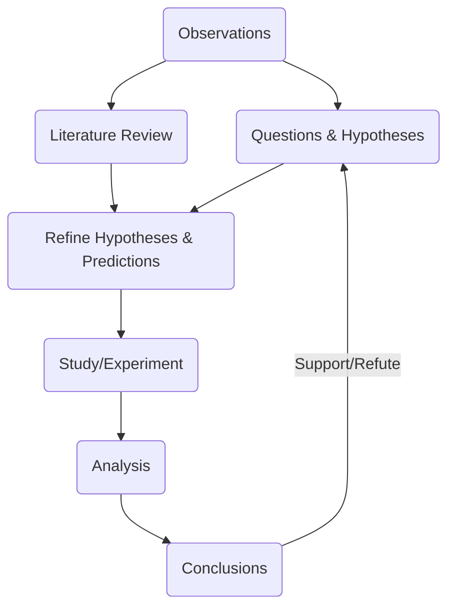

Date: 5th September 2025
Date Modified: 5th September 2025
File Folder: Week 2
#environmental

```ad-abstract
title: Today's Topics
collapse: open

- Bats
- Science Literacy
- Process of Science

```

# Science Literacy and the Process of Science

## How Do Scientists Study the Natural World

```ad-summary
title: Definition
**Science** is a body of **knowledge** that is under constant **revision**. A standard **process** is used to cause these changes in science.
```

What is a *Scientific Question?*:
- A phenomena that can be objectively observed
- You need to make *observations* using tools to gather *empirical evidence*

### Scientific Method and How it is Used

```ad-summary
title: Definition
A procedure used ot empirically test a hypothesis.
```

You use observations to make *inferences*, which are conclusions drawn based on these observations and prior knowledge.



### Hypothesis & Testing

A possible explanation for observations and based on some previous knowledge.


```ad-example
Three hypotheses for WNS:
1. Opportunistic (WNS was a secondary infection)
2. Recent Mutation (The fungus had recnelty mtuated to become more deadly)
3. Novel Pathogen (The fungus was new to the United States or the areas where the bats were infected)
```

```ad-important
Make sure that is is *testible* and *falsifiable* (If... then...)
```

## Degree of Certainty in Science

When you draw conclusions, you either accept or reject hypotheses

```ad-example
1. They found no other pathogen, which rejected the Opportunistic hypotheses
2. They did not find any mutations since P.D. was equally deadly, which rejected the opportunisic hypotheses
3. They found no evidence of P.D. in the US, but did find the same fungus in Asia that already co-evovled with them. That means that they accepted this hypotheses.
```

![[Pasted image 20250905104308.png | center]]

## Comparative Study

Examines similar phenomena in different species or regions in hopes to find changes across the world.`

```ad-example
The amphibian decline due to a chytrid fungus
```

### Example: What did they find on the bats?

1. Hibernating Bats: Have a low body temperature and a weaker immune system
2. Attacked hairless areas on the bat
3. Appeared to die of starvation: Had to wake up more often than usual, which means they burned through their energy reserves much faster
## Cause of White-Nose Syndrome? A Case Study in Scientific Method

```ad-summary
In 2007, NY conservation spotted thousands of dead bats. This cause a rapid spread, that will cause 6 million dead bats by 2016!
```

### What is Causing White-Nose Syndrome

It is caused by a Fungus! (*Pseudogymnoascus destructans* aka. Pd)
- Grows on hairless areas
- Thrives on hibernating bats who have lower body temperature and a weaker immune system
- The fungus thrives in cool, dark, and wet environments (aka. a **cave** would be perfect)

