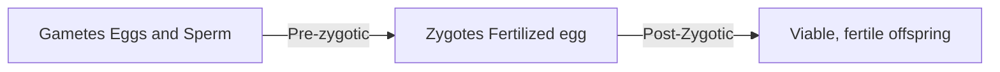

Date: 24th September 2025
Date Modified: 24th September 2025
File Folder: Week 5
#environmental

```ad-abstract
title: Today's Topics
collapse: open

- Evolution and Extinction

```

# Module 3.1: Evolution and Extinction

## What is Evolution?

It is simply *change over time…*

```ad-question
But *what is* changing over time?
```

```ad-summary
A heritable change in a population over time, which is cause by a differing **allele frequency**.
```

## Natural Selection

```ad-summary
title: Definition
The main mechanism by which *populations* evolve and adapt
```

![[Pasted image 20250924101859.png | center]]

### Charles Darwin's Theory of Evolution by Natural Selection

- Used to be into medicine until he thought it was gruesome
- He hopped at a chance to go around the world for ecology
- Got most of his theories by studying populations on the **Galapagos Islands**

*Observation he made:*
1. Different islands had similar species, but with slightly different adaptations
	- Ex. The Tortoises had slightly different shells that let them move their heads differently
	- Ex. Galapagos Finches had different beak shapes depending on what food sources were available
2. Island species resembled mainland species… somewhat

![[Pasted image 20250924102527.png]]

### Alfred Russel Wallace

Background:
- Naturalist younger than Darwin
- Found observations in Southeast Asia
- Outlined the same findings, which kicked Darwin’s ass in gear to write the book

Led to the publication of **On the Origin of Species** by Darwin

### Observations by Both of Them: How it Leads up to Adaptation

1. Variations in inherited traits (genetic variations)
2. Overproduction of offspring, which creates *competition* among a species

**Inferences**:
1. Individuals with higher fitness leave more viable offspring
2. Differential reproductive success leads o accumulation of favorable traits
	- Leads to a change in the frequencies of alleles (gene variants) in a population

![[Pasted image 20250924103210.png]]

```ad-important
These observations and inferences point to the end result: **Adaptation**
1. Traits that allow organisms to survive and reproduce
2. The process where you accumulate traits that are favorable
```

```ad-warning
Adaptation is always *Environment-Specific*
```

### Natural Selection can Have Different Outcomes

![[Pasted image 20250924104507.png | center]]

1. **Directional Selection**

![[Pasted image 20250926100440.png]]

```ad-note
Directional Selection *shifts* the population towards or away from one extreme trait.
```

2. **Disruptive S2. **Disruptive Selectionelection**

![[Pasted image 20250926100620.png]]

- Aka. Selection *against the average*
- This increases **variation** in the population
- Ex. Black-Bellied Seedcrackers
	- Some seeds are large and some are smaller, but none in the between
	- So, they evolved to have large peaks or small beaks

3. **Stabilizing Selection**

![[Pasted image 20250926100853.png]]

- OR selection against both extremes
- It *reduces* variation
- Ex. Human Birthweight

![[Environmental Issues - Week 5 Day 2 2025-09-26 10.12.54.excalidraw | center]]

```ad-important
Traits selected for, or against, will depend on the environment
```

## Types of Genetic Change

1. **Mutation**
	- Often detrimental or neutral, but not always
	- Environments change
	- Ex. Pesticide/Antibiotic Resistance
2. **Genetic Recombination**
	- Happens in the production of eggs and sperm
	- Chromosomes are the main culprit

### Co-evolution

```ad-summary
It allows populations to adapt to each other. Two species provide the selective pressure for each other.
```

*Example*: Predator-Prey Interactions
- Both have selective pressures
- Predators will get better at picking off prey
- Prey will become better camouflaged or be able to dodge predators better

*Other examples:*
- Host-Parasite
- Mutualism
- Plant-Pollinator

### Random Events

```ad-note
Populations can also change over time due to *random events* 
```

This is called **Genetic Drift**:
1. *Bottleneck Effect*: Sudden reduction in population size
	- This often causes a reduction in genetic variation
	- Changes allele frequencies

![[Pasted image 20250926103029.png | center]]

```ad-example
title: Example: Greater Prairie Chickens
Human intervention destroyed their habitat, leading for thme to exist in only a fraction of their original habitat
```

2. *Founder Effect*: A small group becomes isolated
	- Loss of genetic variation in new area

## Diverging Species

```ad-summary
Populations can diverge into subpopulations or new species
```

*How Does it Happen?*: Reproductive Barriers
- It was keeps different sub populations from breeding with each other


### Pre-Zygotic Barriers

1. Habitat isolation (Place)
2. Temporal Isolation (Time)
3. Behavioral Isolation (Courtship dances can be different across species)
4. Mechanical Isolation (reproductive parts are different across species)
5. Gametic Isolation (When eggs and sperm cannot fuse)

### Post-Zygotic Barriers

1. Reduced Hybrid Viability (They do not survive as well post-birth)
2. Reduced Hybrid Fertility (ex. Mule) 

