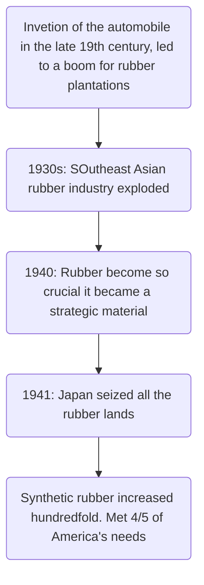

Date: 3rd February 2026
Date Modified: 3rd February 2026
File Folder: Lecture 4
#matsci

# Review: Materials and Packing

*Crystalline Materials*:
- Atoms in periodic, 3D arrays
- Typical of:
	- Metals
	- Many ceramics
	- Some polymers

FCC → Face-Centered Cubic
HCP → Hexagonal Close-Packed
BCC → Body-Centered Cubic

*Noncrystalline Materials*:
- Atoms have no periodic packing
- occurs for:
	- Complex strucutres
- “Amorphous”

![[Pasted image 20260203120901.png]]

# Polymers

## Historical Background



## Natural Polymers

```ad-example
- Skin
- Muscle
- Blood vessels
- Nerves
- Starches
- Proteins
- Silk
- Cotton
- Wool
```

## Synthetic Polymers

![[Pasted image 20260203121425.png]]

## Polymerization

**Example Reaction**:

![[Pasted image 20260203121501.png]]

### Polymer Macromolecules

Poly - Many; Mer: part

**Monomers**: a single part of a polymer → polymerization binds them together → polymer

![[Pasted image 20260203121554.png]]

## Measurements of Polymers

**Molecular Weight of a Polymer (MW)**:
- Represents a statistical mean in a distribution of polymer chains of different lengths about tha mean
- Not exactly the same for one polymer

**Degree of Polymerization (DP)**:
- Can be very different for even one polymer

$$
\text{DP}= \frac{\text{Average Molecular Weight}}{\text{Monomer Molecular Weight}}= \frac{\text{MW}_{ave}}{\text{MW}_{monomer}}
$$

### How MW Affects Performance

![[Pasted image 20260203121849.png]]

## Hip Arthroplasty History

```ad-note
Osteoarthritis is the most common reason for hip replacement
```

- Initially, only the femoral head was replaced using cement-less (Moore) and cemented (Thompson) prosthesis
- These devices, however, could only be used when the acetabulum was unchanged, limiting the applications to femoral neck fracture.

![[Pasted image 20260203122224.png]]

*Current Total Hip Anthroplasty*

![[Pasted image 20260203122259.png]]

## Molecular Shape

**Conformation**:
- Chain bending and twisting are possible by rotation of carbon atoms around their chain bonds
- As a result, it is not necessary to break chain bonds to alter molecular shape.

![[Pasted image 20260203122526.png]]

![[Pasted image 20260203122530.png]]

## Copolymers

```ad-summary
title: Definition
Two or more monomers polymerized together
```

1. **Random**: A and B randomly positioned along chained
2. **Alternating**: A and B alternate in polymer chain
3. **Block**: Large blocks of A units alternate with large blocks of B units
4. **Graft**: Chains of B units grafted onto A backbone

![[Pasted image 20260203122628.png]]

## Polymer Strucutres

1. Linear
2. Branched
3. Cross-linked
4. Network

![[Pasted image 20260203122800.png]]

![[Pasted image 20260203122813.png]]

## Polymer Classifications

1. **Thermoplastic**:
	- Soften when heated, harden when cooled
	- Most linear and branched polymers
	- Can be recycled
	- Cost more to make
	- HDPE, PVC, ABS
2. **Thermosets**
	- Permanently hard during their formation
	- Do not soften upon heating
	- Most cross-linked and all network polymers
	- Cannot be recycled
	- Resins, some rubbers

## Rubber Vulcanization

### History

American inventor of the vulcanization process that made possible the commercial use of rubber
- 1800-1860
- In 1839, he accidentally dropped some India rubber mixed with sulfur on a hot stove and discovered vulcanization
- Left in debt regardless of his inveiton
- Goodyear was founded postmortem in 1898 by Frank Seiberling


### What is it?

Vulcanized rubber is generally not strong, does not retract essentially to its original shape after a large deformation, and it can be very sticky.
- Turns rubber from a thermoplastic to a thermoset

![[Pasted image 20260203123452.png]]

## Crystallinity in Polymers

Ordered atomic arrangements involving molecular chains
- Crystal structures in terms of unit ells
- Ex. Polyethylene unit cell

![[Pasted image 20260203123557.png]]

**Crystalline Regions**:
- Thin platelets with chain folds at faces
- *Chain Folded Strucutres*

![[Pasted image 20260203123756.png]]

### Rarely 100% Crystalline

- Different for all regions of all chains to become aligned
- Degree of crystallinity expressed as a *percentage*
- Some physical properties depned on this percentage
- Heat treating causes crystalline regions to grow and increase the percentage

![[Pasted image 20260203123804.png]]

### Semicrystalline Polymers

Some semicrystalline polymers form **spherulite structures**
- Alternating chain-folder crystallites and amorphous regions
- Speherulite structure for relatively rapid growth rates.

![[Pasted image 20260203123904.png]]

```ad-note
- Linear is easier to form crystals than cross-linked
- Block is easier than graft
```

## Downsides to Polymers

WE are identifying some negative results from the “plastics age”
- Major pollution
- Microplastics