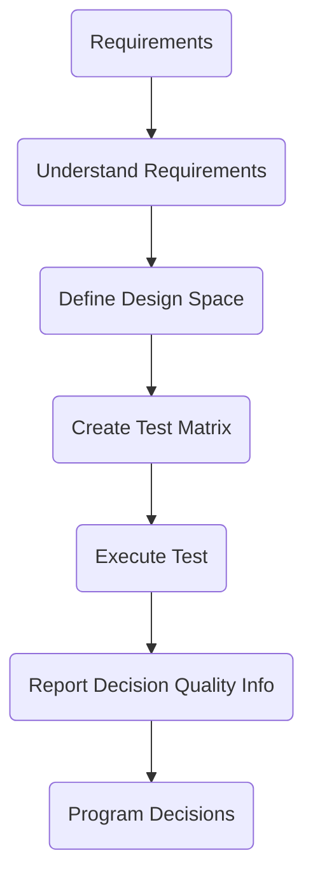

```ad-summary
title: Author Information
**Dr. Darryl Ahner**
- Wright State University
```

# Scientific Test and Analysis Techniques


```mermaid
flowchart TD
A(Requirements)-->B(Understand Requirements)-->C(Define Design Space)-->D(Create Test Matrix)-->E(Execute Test)-->F(Report Decision Quality Info)-->G(Program Decisions)
```

