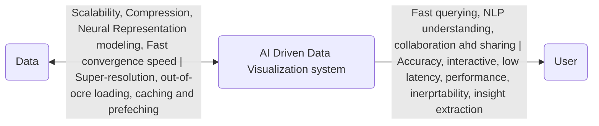
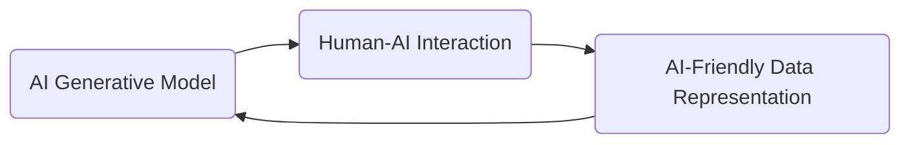
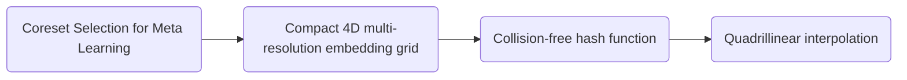

```ad-summary
title: Author
**Name**: Dr. Sun
**Title**: Assistant Professor of EECE
```

# What Does Data Visualization Need to Solve Today

```ad-important
There is a gap between the Data, the AI models, and the User
```



From the side of AI-Driven data visualization ssytems:
- Workflow integration
- Agentic AI orchestration
- Computational accessbility

# Next-Gen Data Visualization



**Ai-Generative Model**:
1. *Importance Mask
	- Text-to-images/videos exist 
	- Use the viewpoint as a visualization technique
	- **image inpainting*
	- Neural Rending through Image Generative model with 
		- Sampling pattern → Partially rendered image → Ai generated image
		- Can we reduce the # of samples to increase rendering speed without reducing the quality?
	- An *inportant mask* creaed via a NN (GAN)
	- Generates $N$ renders, puts it into a model that creates an importance mask, and then is recursively put back to generate a better image with the most important
	- States of Importance Mask
		1. Encoder
		2. Normalization
		3. **Rejection Sampling**: Changes the values to a binary image
		4. Selective Rendering
		5. Decoder
	- Evaluation:
		- Cheat 1.5-3x more frames per render compared to the State-of-the-Art
2. Color Encoding

**Human-AI INteraction**:
1. RmdnCahce
2. Copilot for Agri.
3. ADMA
4. 3D Clustering

**Ai-Firneldy Data Representation**
- F-Hash
- Adaptive-FAM
- MFA-DVR
- Scalable MFA
- PBEB
- Mutli-view Rec

## Paper 2: Large-Scale Volume Visualization using **RmdnChache**

*Potential Solutions*:
1. Mutlithreading
2. Data compression
3. multi-resolution with level of detail
4. out-of-core with caching and prefetching
5. Neural rendering

```ad-question
Is there anything we can learn from the user?
```

### Problem Formulation

$$
H(P_{n-1}, P_{n-m+2},\dots,P_{n})=\hat{P}_{n+1} \approx P_{n+1}
$$

We want to use *point prefeching* and *range prefetching* to determine what needs to be loaded in the next frame

**Point Prediciton NN**

```ad-summary
Next viewpoint prediction through NN
```

**Range Prediction**

```ad-summary
Visible data retrieval from a 3D neighborhood of the viewpoint
```

1. Start from  a 3D gaussian such that:
	- $x, y, z \to r, \theta, \rho$
	-  Where a 3D cartesian space is optimized into a 2D spherical space
2. Put it thorugh a Mixture Desnity Network (MDN) in a spherical space

$$
r = \sqrt{x^2+y^2+z^2}; \theta = \arctan \frac{\sqrt{x^2+y^2}}{z}; \rho = \text{Look at the paper lol}
$$

## Results

Viewpoint and isocontour prediction with a low miss rate (3.8%→2.2% per views)
- Lowest in the literature at the time of writing

## Paper 3: F-Hash in IEEE VIS’25

### Problem Setting

Neural network-based scientific data analysis is critical now
- Compression
- Rendering
- Super-resolution

Implicit Neural Representation (INR) Training Acceleration
- Needs to be converted from a NN into an INR to understand it
- Multi-resolution Hash Encoding (MHE) is the most common method (from Nvidia)

```ad-warning
title: Problems
- MHE takes a long time to train
- Needs a large hash table and can have hash collisions
- Hash bucket waste due to these large tables, which hurts resource optimization
```

### Method

```ad-summary
**F-Hash**: A freature-based hash design for multi-resolution input encoding with SOTA convergence speed for modeling large-scale time-varying volumetric data
```



**Meta learning**: Select a subset from a core dataset
- Feature selection, but even more specific

# On Going Projects

## Cloud Classification with NASA

- Find which clouds are which given satellite images
- Not a super good database set now
- Labeling tool via NASA as the base dataset
- Hugh’s algorithm to extract the more data

## Neural Rendering

1. Super-resolutions
2. Gaussian Splatting
	- Derive a point of view via a 3D Gaussian Cloud
	- An image can be generated from *any viewpoint*
3. NeRF

## Agentic Workflow for Scientific Discovery

Self-directed agent for scientific analysis and visualization

# Conferences

1. IEEE VIS
2. PAcific VIS
3. EuroVIs
4. Super Computing (SC)
5. Siggraph

# Final Thoughts

*Research Interest*
- There is a lot of overlap between different fields-of-study
- Look deep to find out what it is actually about

*You are the one who leads the project*
- Go to the literature review
- Be proactive to find new methods
- Provide the feedback to the professor, not just do what she/he says

*Don’t lose hope lol*

