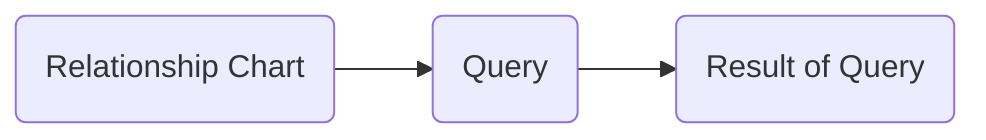

# 1. Introduction / Pre-Class Notes

```ad-abstract
title: Summary
- Today, he will go over the syllabus, course outcomes, what to expect, and grade breakdowns
```

## Pre-Class Notes

- N/A for today. Check canvas for the lecture
# 2. Lecture & Discussion Notes

## Introduction

```ad-summary
title: Instructor
**Name**: Dr. Seokki Lee
**Title**: Associae Professor
**Contact**: seokki.lee@uc.edu
**Office**: Digital Future 5100
```

```ad-note
The only database professor at UC. Planning on connecting this course to the distributed setting
```

- Remember participation gets you brownie points

### Research Interests

- Eff. compelx query processing and provenance capture over big data
- Generae concise and meaningful explanations
- **Database and data provenance applications**
	- Explanable ML
	- Informed data sharing
	- Data visualization with explanations
	- Analyze data to explain what the “black boxes” are doing
	- Pretty new idea with around a paper with another in the works

#### Provenance Explained



*Example*: **Relation Train**

| frommCity | toCity  | price |
| --------- | ------- | ----- |
| NY        | Chi     | 40    |
| Chi       | Seattle | 75    |
| NY        | DC      | 25    |
| Cincy     | Chi     | 20    |

```ad-question
Return two hop connections given travel budget 100
```

**Return**

| X     | Y       |
| ----- | ------- |
| Cincy | Seattle |

```ad-note
Imagine this on a much larger scale and automatic. It is important to ask *why/how* the result was derived, not just the result. This is the crucality of provenence
```

```ad-warning
This is becoming even more important as LLMs become much larger and become more "unpredictable." It is necessary that we understand where the data comes from, if it is correct, and if the source it is getting it from reliable.
```

#### Example Flowchart

![[Pasted image 20260824092516.png]]

## Semester Overview

```ad-note
This class will focus on both practicallity and theory. It will focus on DBMS's instead of a broader scope.
```

### *Question*: What is DBMS? Why use a DBMS?

A collection of interrelated data anda  set of programs to access those data
- Provding a way tos tore and retrieve database information
- Allows users to easily query and access data to find the meaningful information they need
- *On the backend* the data is stored on a machine and it’s storage. DBMS is responsible for getting that data as efficiently as possible
- Server side AND client side clients

### Why are Databases Important?

1. Provide persistent storage
	- Once the data is in the system, it stays there *in theory*
2. Efficient declarative access to data → querying
3. Protection from hardware/software failures
4. Safe concurrent access to data
	- Multiple users accessing the same file at the same time

```ad-note
Basically any major business has their own database that fits the needs of their company. Ex:
- University
- Banking
```

![[Pasted image 20260824093253.png]]

```ad-warning
If databases are not implemented correctly, you can get errors very easily in the real world
```

### Database Systems Examples

![[Pasted image 20260824093548.png]]

### Why are they interesting?

1. Pragmatic perspective
	- Important in the job market
2. Connection across many fields
	- Distributed systems
	- AI and ML
	- Operating and file systems
	- Hardware
3. Strong database research
4. Strong theoretical foundations

```ad-note
First half is hands-on, and the second half is more theory-based
```

## Course Topics

1. Relational languages
	- Important, but underestimated
	- *Allows you to see how a query is processed*
	- Necessary to understand if the database has failed or is running poorly and needs fixed
2. Declarative languages
	- SQL
	- Data warehousing
	- Datalog
3. Transaction management
- Ensures that the database remains in a consistent (correct) state despite system and transaction failures
4. Distributed databases
	- Trying something new
	- SparkSQL

## Canvas

*Includes*:
- Syllabus and course materials
- Announcements and discussions
- Assignments and projects
- Grades
- **basically everything u need**

## Workload Breakdown

**Exam (25%)**
- Comprehensive Exam

**Course Project (35%)**
- Three project reports (5% each)
	- About one time *each month*
- Presentation + project outcomes (20%)

**Take Home Assignemnts (20%)**
- Five HWs

**In-Class Activities (15%)**
- Three activities (5% each)
- Relational algebra, Advanced SQL, and Datalog

**Participation (5%)**
- Attendance and active participation

**Bonus Points (+5%)**
- Additional questions/requirements in HW, the comprehensive exam, and the project

*Breakdown*

| Grade               | Percentage |
| ------------------- | ---------- |
| Final Exam          | 25%        |
| Project             | 35%        |
| HW                  | 20%        |
| In-Class Activities | 15%        |
| Participation       | 5%         |
| Bonus               | +5%        |
## Grade Breakdown

| Grade | Percentage |
| ----- | ---------- |
| A     | [92, 100]  |
| A-    | [89, 91]   |
| B+    | [86, 88]   |
| B     | [83, 85]   |

## Project Summary

**Submissions**:
- Reports → PDFs
- Presentation → Slides in `ppt`
- Others: provide link to the final report

**Presentation**:
- 10 Min timeslot + 3 minute Q&A
- A poll for scheduling is under “announcements”

**Course Projects**:
- Every student *must* contribute to *every component*. 
- The level of contributions MUST be clear in the reports
- **dont let others freeload & includes cheating**

## Late Policy

- -10% for every 3 days late
- Only exception: **health issue**
# 3. Action Items & Follow-Up
- [ ] Prepare group of 3
- [ ] Record the team at the discussion board
- [x] Basic SQL Review ⏫ 📅 2026-08-31 ✅ 2026-08-31