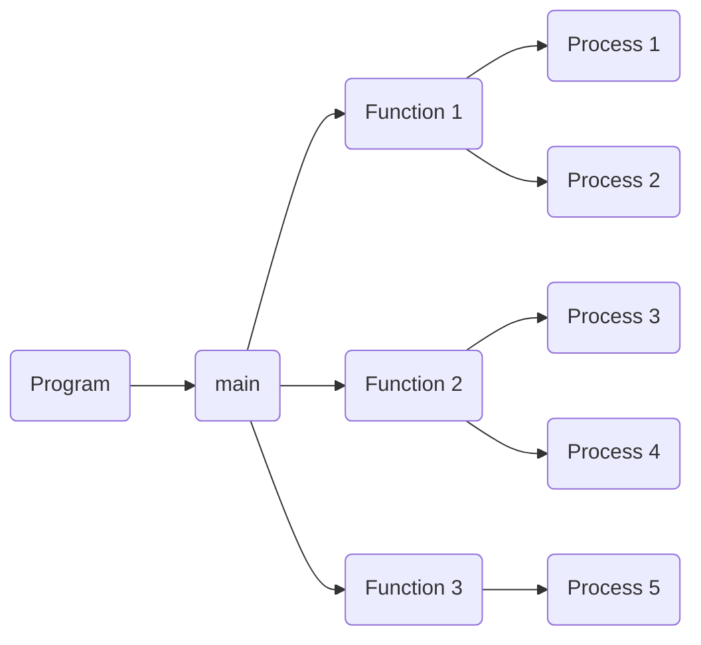

# 1. Introduction / Pre-Class Notes

```ad-abstract
title: Summary
- Fundamentals
- Types of operating systems
- Operating system structure
- 
```


## Pre-Class Notes

- Be ready to write fast and draw fast
# 2. Lecture & Discussion Notes

## Basic 4-Level Layered Architecture

![[Lecture 2 - Operating System Fundamentals 2026-08-26 10.13.31.excalidraw]]

1. **Actors/Users**: The person who is using the operating system. Also known as the Mode 0 stack
2. **Programs**:
3. **Processes**
4. **Threads**
5. **Kernel**: Bottom level of an “OS”. Also known as the Mode 1

## Levels of Software
### Operating System

```ad-example
- Linux -> Ubuntu, Fedora, Open Sus, Red Hat
- Windows -> 11, 10, 7, etc.
- Mac OS -> Optimized
- Android
```

**IBM Legacy**
1. Visual Age (killed by Java)
2. DBT → Oracle Competator
3. Websphere (died to Apache)

```ad-question
Why did almost all of them died off?
```

They were good, but they were too *heavy*, which is why they were outcompeted


```ad-warning
If you do not learn about all the different types of OSes, you might fall behind when one becomes obsolete
```

### Programs

A ton of programs run on an OS at a time




### Process

```ad-summary
title: Definition
A part of a program under execution
```

**CPU**: a critical section of the class aka. a logical view 
- a bunch of different versions based on what architecture we use
- *A process is a class as a program is a day*

![[Lecture 2 - Operating System Fundamentals 2026-08-26 10.33.38.excalidraw]]

#### Time Quantum

```ad-example
Do you have a seat in this class? If not, you will be kicked. Otherwise, you will take your seat and wait your time slot
```

**How much time does each process get?**
$$
\left \{ \begin{matrix}
\text{yes}\\ \infty 
\end{matrix} \right \} \quad \text{vs.} \quad \left \{ \begin{matrix}
no\\ 0 
\end{matrix} \right \}
$$
### Running a Program

1. **Single Entry**: Line-by-line, even through looping. Line-in-line-out until the program completion

### Threads

```ad-warning
The best, most difficult, and most important part of the program
```

- Processes make threads to break up their execution into more steps
- Threads run in parallel to speed up process execution.

```ad-important
With threads, we have to be very careful about inter-process communication. Things running in parallel will run into race conditions, blocks, etc.
```


# 3. Action Items & Follow-Up
- [x] Ready chapter 1 of book for D-OS 🔼 📅 2026-08-31 ✅ 2026-08-28
- [x]  ✅ 2026-08-28