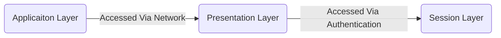

# 1. Introduction / Pre-Class Notes

```ad-abstract
title: Summary
- Distributed System Calls
- Wide Area Network (WAN)
	- D-OS
	- Distributed Computer Network (DCN)
- RPC Calls
```

## Pre-Class Notes
# 2. Lecture & Discussion Notes

## General Layout of Class

### First Module

- Chapter 1 and 2 → sl1 + sl2
- Gaps filled in class


### Second Module

- Chapter 3 and 4 → sl3 
- Gaps filled in class

### Assignment 1

- Lecture will be released Monday that will fill in some of the gaps

## Unofficial Office Hours

- Monday & Wednesday (2:30-4:30 PM)

## Distributed Systems Myth

```ad-warning
A big gap so far (the bridge between chaper 1 and 2)
```

*From last time we assume:*
1. Orthodox OS
2. Uniprocessor
3. Light degree of multiprocessing
4. We are not sharing the operating system with anyone

```ad-important
**Never** claim that you know the distributed systems, rather, say you known distributed operating systems (the most important part aka. around 70% of the battle). We will know:
1. Advanced Computer Networks
2. Computer Architectures
3. ORACLE distributed
4. Cloud computing
```

## System Calls in D-OS

```ad-summary
A system call is used to get information from one part of the distributed network from another
```

```ad-example
- Date
- Time
```

## Wide Area Network (WAN)

In a WAN:
- We have two sides of the internet (**client-server model**)
	- Each side contains switches that connect users together
	- Runs on IPV4
- In between, we have a **logical tunnel** that uses RPC
	- This tunnel has a bandwidth
	- Typically runs IPV6
- Between the WAN and the Internet, we have *routers* that send the data in the correct direction across the logical tunnel(s)


```ad-warning
This RPC logical tunnel is typically the gap left behind in computer networks classes
```

## Algorithms on the WAN

```ad-note
title: Remember
Time quantums (also known as time slices) make up timeslots, much like a schedule, in a distributed network
```

To ensure we do not stay in a time quantum forever ($\not{\to \infty}$) we want to be *preemptive* with our algorithm choice

**Choices**:
1. $\overline{\text{FCFS}}$, cannot use because it will end up being out of order
2. Round-Robin
	- Each time quantum is given a certain timeslot where the process must run by the end of.
	- Similar to how a professor needs to stop teaching after 55 minutes to make sure students can get to their next class

### The Common Layers (OSI Model)

1. Application Layer
2. Presentation Layer
3. Session Layer
4. Transport Layer
5. Network Layer
6. Data Link Layer
7. Physical Layer
	- Ethernet, Fiber, etc.

```ad-note
Applicaiton, presentation, and session layers are often combined. All about authentiation and maintaining sessions using tokens.
- *ex.* Gmail creates a session for its users to keep them logged in and presents them the information through a maintained application via the web browser
```



#### Delivery Methods

**End-to-End Delivery**
- Important from Application layer to transport layer
- Distributed **Operating** systems

**Process-to-Process Delivery**
- Important from Transport layer and lower
- Distributed *systems*
- Deals with the logical tunnel and the RPC calls

```ad-important
All layers from from right-to-left and left-to-right service each other
- Physical layer *services* the data link layer
- Data link layer *services* the network layer
- etc.
- Then, the application layer services the presentation layer
- The presentation layer services the session layer
- etc.
```

## Round-Trip-Time (RTT) in Terms of Connections

![[Lecture 6 - D-OS Gaps 2026-09-04 10.50.25.excalidraw]]

```ad-summary
The delay between receiving a request and sending a reply. Want to make sure it is done before the timeout timer to ensure an efficient network
```


## Process Graph For Distributed OSes

Instead of a viewing processes on a standalone machine, we are considering **millions** of processes on multiple *clients*
- On the other side (*server*), we have millions-to-billions of processes as well
- A communication link is established between the two
- As soon as the client types in a DNS/IP address, we get an application to our client from the server
- Demand a process to get a process from the other side

```ad-question
What are we missing? How do we get to this point?
```

$\star$ We are using:

*Security*:
- TLS is used, which has standards (such as KERABOS) and runs using **SHA + RSA**


# 3. Action Items & Follow-Up
- [x] Review D-OS lecture 6 📅 2026-09-09 ✅ 2026-09-09