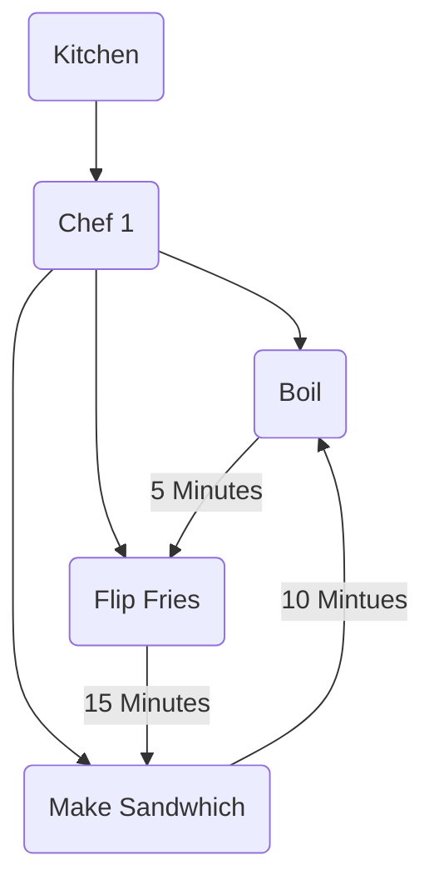
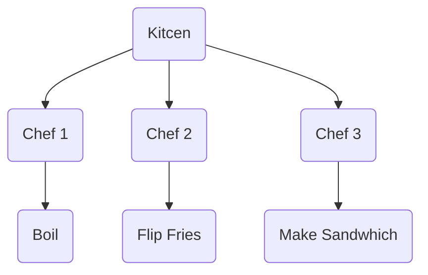

# 1. Introduction / Pre-Class Notes

```ad-abstract
title: Summary
```

## Pre-Class Notes
- Shalwg I have no idea
# 2. Lecture & Discussion Notes

## Vector Logical Lock

To tell if $C_{i}(a)<C_{j}(b)$, then $a \rightarrow b$

Define $VC_{i}(a)=\left[TS_{1}, TS_{2},\dots,C_{i}(a),\dots,TS_{n} \right]$, where $n$ is the number of cooperating processes.

Use *pair-wise maximum*
- Much like an independent-dependent variable relationship
- It helps order the events in a causal-and-effect relationship

![[Pasted image 20260911102106.png]]

**Matrix Logical Clock**


$$
MC_{i}[i,i] = MC_{i}[i,i]+d
$$

$$
MC_{j}[j,l]=\max(MC_{j}[j,l], TS_{i}[j,l]) : l=1\dots n
$$

$$
MC_{j}[k,l] = \max(MC_{j}[k, l], TS_{i}[k,l]) : k=1\dots n, l=1\dots n
$$

## Memory: From a Logical View

### Intro Example

```ad-example
Lets say we imagine a kitchen (like a process)
- A space that can contains a chef that do various tasks around the kitchen (threads)
```




Assume that is no timer in place
- You keep on watching the water until it boils
- You wait for the fries to be ready to flip the fries
- You make the sandwhich, leaving the fires to burn and the water to boil away
- This whole process takes 30 minutes

What if we instead set a time quantum such that everything needs to be done within 55 minutes

```ad-summary
This is an example of **blocking**
```

#### Hire More Chefs

Assume that we hire 2 more chefs:
- We will be running our threads in parallel



To do so, we need to take advantage of **context switching**:
- Run a thread, save where it is executed to, run another read, return the to the previous thread using the saved location
- Continues endlessly for every thread on the processor to ensure minimum downtime
- Done via the **Process Control Block (PCB)**

```ad-important
This is critical since the CPU needs to do the CS the right amount of times since it is inversely proprotional to the execution time  
```

## Scheduling Algorithm

Assume the scenario that there are office hours and students need help. How will we serve them?

**Option 1: First-Come-First-Serve (FCFS)**
- No pre-emption and the processes are run as they come into the CS queue
- The processes run as they come to the CPU til completion
- Ex. Someone can take the whole 55 minutes of office hours, which indefinitely *blocks* the rest of the students

**Option 2: Round Robin (RR)**
- A pre-emptive algorithm that provides *time slices* for their incoming threads to run on
- This is good with a bunch of small processes that need to run one-after-another
- However, this makes it so large queries can be interrupted multiple times in a row until it is finished executing

*Example*: Solaris Thread Implementation
- A good example of a large multi-threading OS typically used for distributed systems

![[Pasted image 20260911105416.png]]

```ad-note
These scheduling algorithms are the basis of concurrent programming languages
```


# 3. Action Items & Follow-Up
- [x] Ch 6 pre-readings for D-OS 📅 2026-09-11 ✅ 2026-09-16
- [x] Review Lecture 8 for D-OS 📅 2026-09-14 ✅ 2026-09-16