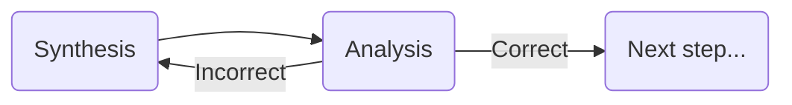

# 1. Introduction / Pre-Class Notes

```ad-abstract
title: Summary
- Boolean Expressions at the switch level
```

## Pre-Class Notes

- Part of the same lectures as the first
- Link to whole PDF [[switches.pdf]]
# 2. Lecture & Discussion Notes

## Switch Basics

There are **two** types of switches:
1. Normally **open** switches
2. Normally **closed** switches

To turn on a switch and change their state, you need to apply an **external stimulous**.
- Let us assume $x$ is the switch, and $f$ is the bulb…

**Open Switch Logic Table**

![[Pasted image 20260824124209.png]]

| $x$ | $f$ |
| --- | --- |
| 0   | 0   |
| 1   | 1   |
$$
	\therefore f = x
$$

**Closed Switch Logic Table**

![[Pasted image 20260824124218.png]]

| $x$ | $f$ |
| --- | --- |
| 0   | 1   |
| 1   | 0   |
$$
	\therefore f = \bar{x}
$$

## Connection Basics

There are **two types** of connections:
1. Series
2. Parallel

**Series Truth Table**

![[Pasted image 20260824124519.png]]

| $x$ | $y$ | $f$ |
| --- | --- | --- |
| 0   | 0   | 0   |
| 0   | 1   | 0   |
| 1   | 0   | 0   |
| 1   | 1   | 1   |

$$
	\therefore f=xy \Rightarrow \text{AND gate}
$$

**Parallel Truth Table**

![[Pasted image 20260824124718.png]]

| $x$ | $y$ | $f$ |
| --- | --- | --- |
| 0   | 0   | 0   |
| 0   | 1   | 1   |
| 1   | 0   | 1   |
| 1   | 1   | 1   |

$$
	\therefore f=x+y \Rightarrow \text{OR Gate}
$$

```ad-warning
Make sure you try to connect circuits like this in this combinations for now to simplify things
```

```ad-important
Going from switches into a truth table is called **analysis**
- Can be used to *check synthesis*
```
## Basic Functions

### XOR
$$
	f=\text{XOR}(x,y) = \bar{x} y + x\bar{y}
$$


| $x$ | $y$ | $f_{expected}$ | $f_{actual}$ |
| --- | --- | -------------- | ------------ |
| 0   | 0   | 0              | 0            |
| 0   | 1   | 1              | 1            |
| 1   | 0   | 1              | 1            |
| 1   | 1   | 0              | 0            |

![[Pasted image 20260824125317.png]]

```ad-important
Going from a function to switches is called **synthesis**
```

## Design Process

```ad-note
If your synthesis is found wrong by *analysis*, you go back and re-synthesize the circuit
```




- This is done by using multiple tools

## Section 1 Questions
### Quiz 1

```ad-question
Implement a NAND Gate
```

**Truth Table**

| $x$ | $y$ | $f$ |
| --- | --- | --- |
| 0   | 0   | 1   |
| 0   | 1   | 1   |
| 1   | 0   | 1   |
| 1   | 1   | 0   |

**Function**

$$
	f = \bar{(xy)} \Rightarrow \bar{x}+\bar{y}
$$
**Switches

### *Practice*: Implication

```ad-question
$F(A,B) = A \rightarrow B$ is defined as 
```

### Majority of Three

```ad-question
$F(x, y, z)$ = 1 when two or more inputs are 1's; 0 otherwise
```

**Truth Table**

| $x$ | $y$ | $z$ | $f$ |
| --- | --- | --- | --- |
| 0   | 0   | 0   | 0   |
| 0   | 0   | 1   | 0   |
| 0   | 1   | 0   | 0   |
| 0   | 1   | 1   | 1   |
| 1   | 0   | 0   | 0   |
| 1   | 0   | 1   | 1   |
| 1   | 1   | 0   | 1   |
| 1   | 1   | 1   | 1   |

**Function**

$$
	f = xy+yz +xz
$$

**Circuit**

![[Pasted image 20260824131234.png]]


## Synthesis of Series-Parallel Switching Circuits

```ad-important
Remember K-Maps, they are back ofc
```

### Example 1

| $A$ | $B$ | $C$ | $F$ |
| --- | --- | --- | --- |
| 0   | 0   | 0   | 0   |
| 0   | 0   | 1   | 0   |
| 0   | 1   | 0   | 1   |
| 0   | 1   | 1   | 1   |
| 1   | 0   | 0   | 1   |
| 1   | 0   | 1   | 1   |
| 1   | 1   | 0   | 0   |
| 1   | 1   | 1   | 1   |

*Without Simplification*

![[Pasted image 20260824131921.png]]

$$
	F = \bar{A}B \bar{C} + \bar{A} BC + A \bar{B} \bar{C} + A \bar{B} C + ABC
$$
*With K-Map*


| **A; B,C** | *00* | *01* | *11* | *10* |
| ---------- | ---- | ---- | ---- | ---- |
| *0*        | 0    | 0    | 1    | 1    |
| *1*        | 1    | 1    | 1    | 0    |
|            |      |      |      |      |

$$
	F = A \bar{B}+BC+ \bar{A}B
$$
![[Lecture 2 - Switching Circuits and Switching Expressions 2026-08-24 13.21.24.excalidraw]]

![[Pasted image 20260824132234.png]]

```ad-note
K-map reduced it down from $15\to 6$
```

```ad-warning
K-maps do not reduce the # of switches down to perfect minimum, but it is a good estimate.
- ex. we can take B as a common factor to reduce the # of switches down to 5
```

$$
	F =A \bar{B} + B(C+\bar{A})
$$
![[Pasted image 20260824132449.png]]

## Nested AND-OR Expressions

```ad-summary
Any nested AND-OR expression of positive and negative variables cna be implemented as a series-parallel switching network
```

Given variables $x_{1}, x_{2}$,
- $x_{i}$ is an expression
- $x_{j}$ is an expression
- If $F$ and $G$ are expressions, then
- $FG$ is an expression
- $F+G$ is an expression

```ad-example
- $F = ((\bar{a}b)+(c(\bar{a}+\bar{d})))$
```

### General Boolean Expressions

```ad-note
General nested Boolean AND-OR-NOT expressions can be implemented after using the De Morgan’s Laws to move all negations from subexpressions to variables.
```

**De Morgan’s Laws**

$$
	(1) \to (F+G+\dots)^\prime=\bar{F}\bar{G}
$$
$$
	(2) \to (FG\dots)^\prime=\bar{F}+\bar{G}+\dots
$$

#### Example

```ad-question
Consider $F = AB’ + B(C + A’)$ Suppose we wish to implement $F’$ as a series-parallel switching circuit
```

$$
	\bar{F} = (A \bar{B} +B(C+\bar{A}))^{\prime}
$$
$$
	(\bar{A}+B)(\bar{B}+\bar{C}A)
$$
$$
	= \bar{A}\bar{B}+AB \bar{C}
$$

### Quiz 2

```ad-question
Implement $F$ as a series-parallel switching circuit given the previous expression from earlier

$F(x, y, z)$ = 0 when two or more inputs are 1's; 1 otherwise

$F = (xy+yz+xz)^\prime$
```

$$
	F = (\bar{x}+\bar{y})(\bar{y}+\bar{z})(\bar{x}+\bar{z})
$$

*Which is correct? A or B?*
![[Pasted image 20260824133242.png]]

### Quiz 3: Vector Equivalence

```ad-question
Design a series-parallel swithcing circui to check for the *equivalence* of two 8-bit binary numbers
- $A, B$ #comebacklater 
```

## Subcircuit Connection

```ad-question
What if the switch had a third terminal such that circuits could be connected together?
```

*Example*: Turning a Majority circuit into a minority circuit using the least amount of switches possible.
- This allows us to use previously designed switch circuits and put them together to create a system

![[Pasted image 20260824133650.png]]

### Swich as a 3-Terminal Device

![[Lecture 2 - Switching Circuits and Switching Expressions 2026-08-24 13.39.31.excalidraw]]

```ad-important
This means we need to add one more primative, the subcircuit with the three-way switch
```

## Memory in Sequential Circuits

```ad-example
title: Example: Dating Machine
On any given day, Jack and Jill can go on a date provided
1. they both agree to go on a date and
2. they did not go no a date on the day before
```

```ad-warning
We need a way to *store the state* of Jack or Jill previously being on a date the day before or not
```

**Therefore**, we need ot use a flip flop
- Can be implemented by using a combination of capacitors and inductors

![[Pasted image 20260824134447.png]]

```ad-note
This will yet become another primative that we need
```

## Implementation fo Switching Circuits in a Physical Medium

Potential mediums:
1. Electromagnetic
2. Hydrauic
3. Pneumatic
4. **Solid-state electronics**
	- Bipolar
	- Field-effect

### Physical Characteristics to Consider…

1. Space
2. Speed
3. Power
4. Reliability
5. Cost
6. …

```ad-important
The best medium that optimizes all these metrics for circuits at the moment are **CMOS: Complementary Metal-Oxide Silicon**
```

## Additional Practice

![[Pasted image 20260824134825.png]]
# 3. Action Items & Follow-Up
- [ ] Review Lecture
- [ ] **QUIZ**: SW-1 
- [ ] *practice*: Implication on slide 6
- [ ] **QUIZ**: SW-2 ⏫ 
- [ ] **QUIZ**: SW-3 ⏫ 
- [ ] *practice*: Serial parity detector
