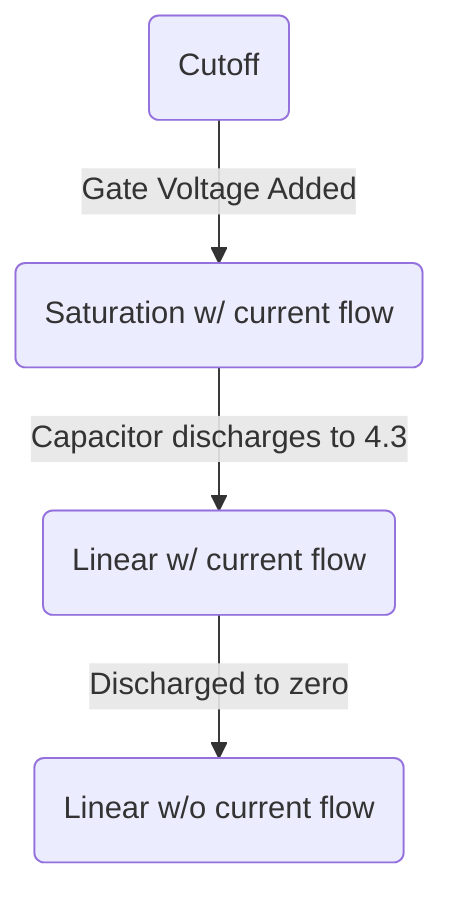
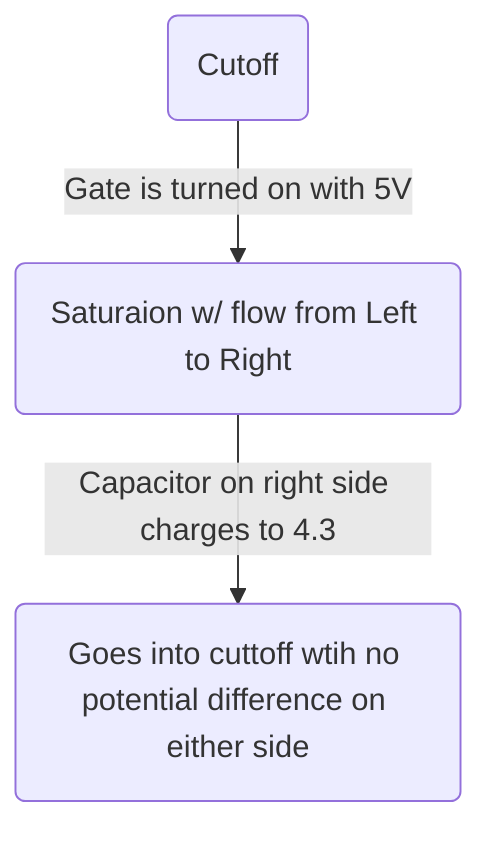
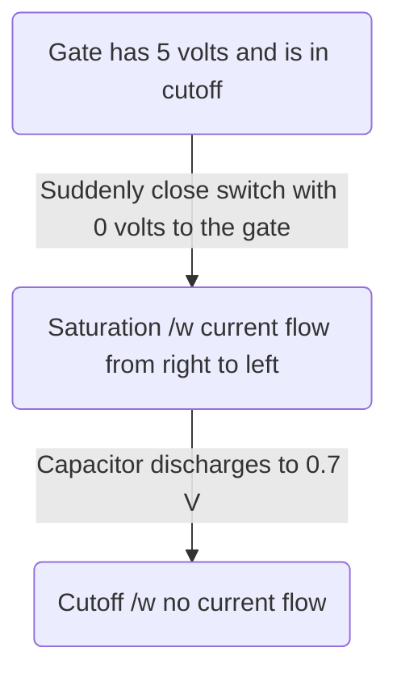
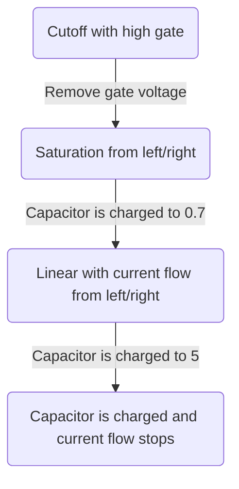

# 1. Introduction / Pre-Class Notes

```ad-abstract
title: Summary
- n-type as normally-open switch
- p-type as normally-closed switch
- encoding logic states
- transistor characteristics
```

## Pre-Class Notes

- Get ready for this. He has annotated notes now and a video if supplementary stuff is needed
- No lab today! it starts next week

### Lecture Part 1

![[cmos-transistors-presentation-notes.pdf]]

### Lecture Part 2

![[08-26-2026-cmos-gates - class-notes.pdf]]
# 2. Lecture & Discussion Notes

## CMOS Types

### N-Type Transistor

![[Pasted image 20260826122412.png]]

- Creates two electric fields, one vertical and one horizontal

#### Carriers of n-type

Between the ground and gate, there are charges that will only conduct across the semiconductor once a charge is applied
- 5 volts is used because most components utilize certain voltages (3.3, 5, 9, etc.)
- Processes also use 5 volt 
- A lot of transistors have a 5V threshold
- Minority carrier electrons
- When the gate goes to 5 volts, the minority charges attract and create a channel

![[Pasted image 20260826122636.png]]

#### Conduction

- There is no horrizontal electric fields and no conduction happens
- Acts as a closed switch
- There is still a small current; however, as it will flow back and forth slightly (in the non-ideal case)
- Source side is where the current flows from
- The drain is where the current flows to

![[Pasted image 20260826122848.png]]

#### Saturation & Other Modes of Operation

```ad-note
Will be discussed furhter in a future lecture
```

![[Pasted image 20260826123212.png]]


#### Summary of Operation

- Gate should be above base by a shreshold for inversion
- **Linear mode**: Gate is above both diffusion ends by a threshold value
	- There is a current flow *sometimes*
- **Saturation mode**: Gate is above only one diffusion end by a threshold value
	- There is a current flow *always*

#### CMOS Quiz 1

```ad-question
For each n-type transistor, determine the following:
1. Mode of operation
2. Direction of current flow
3. Drain side and source side
```

![[Pasted image 20260826123547.png]]

**Transistor 1:**

There is no potential on either side of the circuit, and no current flow

- Cutoff
- N/A
- N/A

**Transistor 2**:

There is a difference on both sides, with the left side having a smaller amount

- Saturation
- Left→Right
- A is the drain, B is the source

```ad-note
Remember that the source for the n-type is where the current flows to
```

**Transistor 3**:

There is not a high enough potential for both sides ($V_{GS} \& V_{GD} < V_{th}$), therefore in cuttoff and no current

- Cutoff
- N/A
- N/A

**Transistor 4**:

Vth is high enough, but both sides have the same potential. There is no potential; however, so no current

- Linear
- N/A
- N/A

**Transistor 5**: 

Gate has high enough potential, and the left side has a higher potential than the right. However, the left side does not have a high enough value to be $V_{G}-V_{th}$, so it is linear

- Linear
- Left → Right
- A is the drain, B is the source

**Transistor 6**:

Gate has enough potenial, with the right side having a higher potential than the left. However, it is not $V_{G}-V_{th}$, so it is linear

- Linear
- Right → Left
- B is the drain, A is the source
### p-type transistor

- Due to the transistor difference, the *majority* carriers are attracted to the gate instead of the minority
- Direction of the current and carries in the opposite of the 

**Operations**:
- Gate should be below the base by a threshold for inversion
- Linear mode: gate is below both diffusion ends by a threshold value
- Saturation mode: Gate is below only one diffusion end by a threshold value

![[Pasted image 20260826124746.png]]

![[Pasted image 20260826124810.png]]

#### CMOS Quiz 2

```ad-question
Find the mode of operation, direction of current flow, and drain side and source side of the p-type transistors
```

![[Pasted image 20260826125236.png]]

**Transistor 1**:
Since the gate is at a higher potential, it is off

- Cutoff
- N/A
- N/A

**Transistor 2**:

Since both sides have a high potential when compared to the gate

- Linear
- From A to B
- A is the source, B is the drain

```ad-note
Source to drain in p-types
```

**Transistor 3**:

The potential is  

- Saturation
- B to A
- B is the source, A is the drain

**Transistor 4**:

The gate is at a low-enough potential, and both sides are above said potential. 

- Linear 
- B to A
- B is the source, A is the drain

### CMOS: N and P Type

```ad-important
CMOS is a combination of both transistor types
```


![[Pasted image 20260826125551.png]]

- The n-type material is added to a p-type substrate, and then two gates are added along side either an n-type or p-type doped sides

### Symbols

![[Pasted image 20260826125759.png]]

## CMOS Design Types

### Pass Transistor Logic

![[Pasted image 20260826130121.png]]

- AND gates are made of two n-type transistors in series
- NAND gates are made of two p-type transistors in parallel

### MOS Capacitances

- In an non-ideal case, the gate and the diffusion regions both have capacitances
- This leads to an effective 3 capacitances on each connection
- Each capacitance is in parallel with their respective branch
- **Parasitic capacitances**: they exist because the structure of the transistor and are not ideal. They cannot be avoided, but can be reduced!

![[Pasted image 20260826130326.png]]

### Strong vs. Weak Signals


| Strong                                          | Weak                                                                                |
| ----------------------------------------------- | ----------------------------------------------------------------------------------- |
| Directly connected to either $V_{DD}$ or ground | Floating nodes that contain capacitances on their own                               |
| Closest to either 0 or $V_{DD}$ as possible     | Can range, with the farther away from either $V_{DD}$ or 0, the worse the signal is |

### Signal Transmission Trhough n-Transistor

#### In terms of a switch

**Initial Condition**:

- The source is near 0

![[Pasted image 20260826131324.png]]
 
**After Switch Action**:
- The source will then rise to $V_{DD}$ regardless of the voltage of the capacitor

**After switch re-action
- The source’s parasitic capacitor will try to drain back towards the switch, but it can’t so it will go to zero

![[Pasted image 20260826131346.png]]

#### In terms of an n-type transistor with a single-sided capacitor

**Initial Condition**
- Gate has a voltage of $0$, so the gate is closed and the transistor is in cutoff

**After Action**:
- 5 volts is added to the gate, which opens it up, and sets the switch into saturation
- Current begins to flow from the drain to the source
- The parasitic drain capacitor is discharging quickly to the source capacitor

**Parasitic capacitance**

- If the capacitor on the source drops to $V_{S}<V_{G}-V_{th}$, the gate will go into linear mode
- It will continue to discharge down to zero *overtime*
- Once it hits zero, it will be in linear with no current flow, since there is a voltage potential difference, but both voltages are at zero

![[Pasted image 20260826132045.png]]



#### N-type transistor with two parasitic capacitor




![[Pasted image 20260826132524.png]]

![[Pasted image 20260826132645.png]]

```ad-note
This is considered poor logic high because there are two floating capacitor nodes, which causes problems with long-term current flow
```

#### IMPORTANT TAKEAWAY

1. N-transistors are a good conductor at a logic of “0” (*low*)
2. N-transistors are a poor conductor at a logic of “1” (*high*)

### Signal Transmission Through p-Transistor

![[Pasted image 20260826133020.png]]

#### One Capacitor



![[Pasted image 20260826133053.png]]

![[Pasted image 20260826133351.png]]

```ad-warning
This is a bad logic "0"/LOW
```

#### Two Capacitors



```ad-note
This is a good "1"/High
```

![[Pasted image 20260826133813.png]]

#### IMPORTANT TAKEAWAY

P-type transistor
- Good conductor of logic “1”
- Poor conductor of logic “0”

### Transmission Quality

Assume a p-type AND gate, we are trying to get 5V from one side to the other

![[Pasted image 20260826134042.png]]

- The first capacitor would go to 4.3 because of the logic limitations
- The second capacitor would go to 4.3 
- This is called **threshold drop** $V_{final}=V_{initial}-V_{th}$


```ad-warning
This is not *resistive drop* since the voltage drops *only once*
```

This would be good if you accept 4.3 as the logic high, BUT WE *CANNOT*. Assume we have the following circuit

![[Pasted image 20260826134538.png]]

- Node $f$ will become $4.3V$, while node $G$ will become $3.6V$ because the gate voltage for the other transistor would become $4.3$
- Afterwards, it will fall into cutoff

```ad-summary
Transmission quality can become very poor as we compound more and more transistors if we use pass transistor logic
```


# 3. Action Items & Follow-Up
- [x] CMOS Quiz 1 ⏫ 📅 2026-08-31 ✅ 2026-08-28
- [x] CMOS Quiz 2 ⏫ 📅 2026-08-31 ✅ 2026-08-28
- [x] Review everything 🔼 📅 2026-08-31 ✅ 2026-08-31