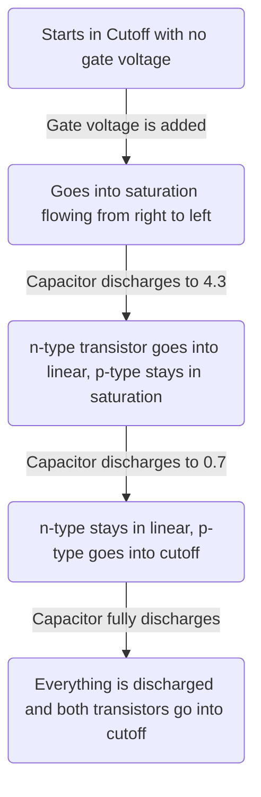
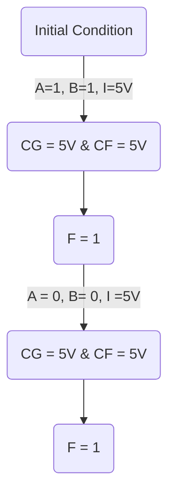

# 1. Introduction / Pre-Class Notes

```ad-abstract
title: Summary
- Transmission Gates
	- Bidirectionality and Charge Sharing
- Multiplexor
- Basic Memory (Q-Gates)
- Fully Complemented Static Gates & Switches
```

## Pre-Class Notes

![[08-31-2026-cmos-gates-with-class-notes.pdf]]

# 2. Lecture & Discussion Notes

## Transmission Gate (T-Gate) Design

### Basics

#### Normally Open T-Gate

- Can be used as both a normally open **AND** as a normally closed switch depending on what is needed
- An n-type and p-type transistor are placed in parallel, with a control signal ($A$) that is *complemented* on the p-type side
- If $A = 0$, T-gate is **open** since \the n-type stays open, when the p-type opens up
- If $A=1$, T-gate is **closed** since the n-type is closed, and the p-type *stays* closed

![[Pasted image 20260831122831.png]]
#### Discharging from High→Low



![[Pasted image 20260831123213.png]]

```ad-important
This makes a T-gate a good conductor of **both** high and low logic! This makes it much better compared to n-type and p-types alone
```

#### Usually-Closed T-Gate

- Instead of complementing on the p-type transistor, you complement the signal on the n-type transistor

![[Pasted image 20260831123452.png]]

### T-Gate Symbols


| Normally Open                        | Normally Closed                      |
| ------------------------------------ | ------------------------------------ |
| ![[Pasted image 20260831123545.png]] | ![[Pasted image 20260831123556.png]] |
#### Transmission Quality

```ad-question
Suppose that we chain two transmission gates that are controlled via $A$ and $B$, and that there are two floating nodes between $A \to B$ and after $B$
```

![[Pasted image 20260831124000.png]]

If both $A$ and $B$ are charged with $5V$, and $5V$ is added to the input of $A$:
- Both floating nodes would go to $5V$

```ad-question
Assume that they are in parallel instead
```

![[Pasted image 20260831124056.png]]

If both $A$ and $B$ are charged with $5V$, and $5V$ is added to the input of $A$:
- Both floating nodes would go to $5V$

```ad-danger
This does not mean it is immediately good at transmission...
```

### Bidirectionality and Charge Sharing

![[Pasted image 20260831124325.png]]

**Initial Condition**: Nodes $G$ and $F$ are set low ($0V$)

#### Scenario 1



![[Pasted image 20260831124922.png]]

```ad-warning
Depending on when it switched (from both high to $A = 0, B =1$), the charge will be left over, causing a $5V$ charge on both nodes and the circuit outputing high
```

#### Scenario 2

This can also happen when $A=1, B=0, I = 0$, as node $G$ will discharge, but node $F$ has nowhere to discharge to


#### Scenario 3

If we instead go to $A=0, B =1, I=0$ after charging both floating nodes, both nodes will go to some voltage depending on the capacitance. Let’s assume that: $C_{G}=C_{F}=C$
- The final voltage would be $2.5V$ due to charge conservation
 
![[Pasted image 20260831130345.png]]

$$
v_{1}c_{1}+v_{2}c_{2}=V_{f}(c_{1}+c_{2})
$$
$$
\boxed{V_{f} = \frac{v_{1}c_{1}+v_{2}c_{2}}{c_{1}+c_{2}}}
$$
$$
\text{If }c_{1}=c_{2} \Rightarrow V_{f}= v_{1}+v_{2}
$$
$$
(5V) = v_{1}+v_{2}
$$
$$
\therefore C_{G}=C_{F}=2.5V
$$
#### Conclusion

This circuit is a **bidirectional circuit** and charge shares between two different gates that have been previously charged, which means that **it is bad at transmission**

### Multiplexor

```ad-note
A valid use of transmission gates
```

- Also known as *steering logic/circuits*
- They don’t do computation themselves
- They move data from one section to another

*Two Input Multiplexor*

![[Pasted image 20260831130622.png]]


| A   | B   | S   | F   |
| --- | --- | --- | --- |
| 0   | 0   | 0   | 0   |
| 0   | 0   | 1   | 0   |
| 0   | 1   | 0   | 0   |
| 0   | 1   | 1   | 1   |
| 1   | 0   | 0   | 1   |
| 1   | 0   | 1   | 0   |
| 1   | 1   | 0   | 1   |
| 1   | 1   | 1   | 1   |

$F=A$ when $S=0$, otherwise $F=B$

*In terms of transmission gates*

![[Pasted image 20260831130808.png]]

```ad-note
$A, B$ must both be strong signals, and $F$ CANNOT be left floating
```

#### Practice Problem - 4-1 Mux

```ad-question
Turn the 4-1 mux into a group of transmission gates
```

![[Pasted image 20260831131122.png]]

*truth table*

| $S_{1}$ | $S_{2}$ | $F$ |
| ------- | ------- | --- |
| 0       | 0       | A   |
| 0       | 1       | B   |
| 1       | 0       | C   |
| 1       | 1       | D   |

![[Lecture 4 - CMOS Design 2026-08-31 14.31.54.excalidraw]]

$$
8 \text{ T-Gates} \times 2 \text{ Transistors/Gate} = 16 \text{ Transistors}
$$

### Simple Memory & Charge Sharing

```ad-note
Assuming $D$ is a strong signal, $clk$ is a switching signal, and $Q$ is a floating node
```

![[Pasted image 20260831131443.png]]

This the equivalent of a **D-Latch**

```ad-warning
The act of accessing the $Q$, the capacitor is discharged slightly, which means the memory is not permanent and will eventually have read errors. This is only a 
```

### Quiz Questions

#### CKT-1

![[Pasted image 20260831131959.png]]

##### Part 1

1. **Node P**: Drain for $t_{1}$
2. **Node Q**: Source for $t_{1}$, Drain for $t_{2}$
3. **Node R**: Source for $t_{2}$


![[Lecture 4 - CMOS Design 2026-09-01 12.01.39.excalidraw]]

##### Part 2

**Node P**: Drain for $t_{1}$
**Node Q**: Source for $t_{1}$, Gate for $t_{2}$
**Node R**: Drain for $t_{2}$
**Node S**: Source for $t_{2}$

![[Pasted image 20260901120425.png]]

#### CKT-2

![[Pasted image 20260831131950.png]]

##### Part 1

*Assuming that $C$ is the same capacitance* we must be worried about **charge**:

Before the swich:
$$
Q_{initial} =  CV_{P}+CV_{Q}+CV_{R}
$$

$$
Q_{initial}=CV_{p}+0+0
$$

$$
Q_{initial}=CV_{p}
$$
After:

$$
Q_{final} = CV_{p}+CV_{Q}+CV_{R}
$$
since all the same capacitance, $V_{p}=V_{Q}=V_{R}$

$$
Q_{final} = 3CV_{f}
$$

$$
V_{f}=\frac{V_{p}}{3}
$$

$$
V_{Q}=V_{R}=\frac{V_{p}}{3}
$$

$$
\boxed{V_{Q}=V_{R}=V_{p}=\frac{5}{3}=1.67V}
$$

##### Part 2


$$
V_{Q}=V_{R}=\frac{V_{inital}}{2}=2.5V
$$
Because the final potential at the gate cannot reach high enough, no current flows and it is in cutoff
$$
V_{S}=5V; V_{R}=0V
$$

#### CKT-3

![[Pasted image 20260831132020.png]]

The **second** circuit is correct! See [[Lecture 4 - CMOS Design#Practice Problem - 4-1 Mux]]
#### CKT-4

![[Pasted image 20260831132031.png]]

##### Sequence 1

the circuit clocks, opening up the transmission gate such that:
$$
V_{D}=V_{P}=5V
$$
Since $A$ and $B$ are closed
$$
V_{Q}=V_{R}=0V
$$

##### Sequence 2

The following circuit is created after $A=1, B=1, CLK=0$:

![[Lecture 4 - CMOS Design 2026-09-01 12.30.20.excalidraw]]

$$
Q=(10f)(5V)= 50fC
$$
Since all the capacitors are the same:
$$
Q=V_{f}C_{total}
$$

$$
V_{f}= \frac{Q_{f}}{C_{total}}= \frac{50fC}{30f}=1.67V
$$

$$
\boxed{V_{f}=V_{p}=V_{Q}=V_{R}=1.67V}
$$


## Issues with T-Gates

- \# of transistors was doubled
- Needs an inverter on either the n-type or p-type ($A$ and $\bar{A}$)
	- This can almost double the # of transistors *again*
- Routing Issues
- Charging Sharing Issues
- Lack of Noise Immunity

```ad-note
They are not used for implementing logic, but rather using for steering functions (multiplexing)
```

```ad-warning
Some Switch-level simulators have trouble simulating transmission gates because they might fail to simulate bidirectionality and charge sharing
```
## Fully Complemented Static CMOS Inverter

### Basics

![[Pasted image 20260831132944.png]]

![[Pasted image 20260831133137.png]]

```ad-important
This is a great quality switch that solves the problems of:
1. Good logical high and lows
2. Transmission Quality (aka. no bidirectionality or charge sharing)
```

```ad-warning
This is at the cost of doubling the # of transistors
```

**When $A = 0$**

- When $A$ is low, p-type will stay closed, and the n-type will remain open
- This is because p-type is the best logic-high transmitter
- This is equivalent to 5V charging the parasitic capacitance

![[Pasted image 20260831133514.png]]

**When $A=V_{DD}$**

- When $A$ is high, the p-type transistor will open, and the n-type will close
- The voltage on the output parasitic capacitance will discharge towards 0 since it is directly connected to the ground

![[Pasted image 20260831133520.png]]

*Logic Table*

| A   | F   |
| --- | --- |
| 0   | VDD |
| 1   | 0   |
```ad-important
This circuit acts as an invertor!
```

This circuit allows $A_{1}$ to control $F_{1}$. From there $F_{1}$ to can drive another $A_{2}$ and further control an $F_2$.

```ad-note
It is static since $F$ is not a floating value and cannot be left floating due to it charging and discharging due to $A$
```

## Fully Complemented Static CMOS NAND

### Basics

![[Pasted image 20260831134321.png]]

```ad-note
Also a static circuit, so $F$ is never floating
```
### Operational Analysis

| A   | B   | F              |
| --- | --- | -------------- |
| 0   | 0   | 1 ($V_{DD}$)   |
| 0   | 1   | 1 ($V_{DD}$)   |
| 1   | 0   | 1 ($V_{DD}$)   |
| 1   | 1   | 0 (Discharged) |

*This is the truth table of the NAND Gate*

```ad-summary
This also acts as a pull-up circuit at the top, and a pull-down circuit at the bottom
- Pull-Up Network (PUN) AND Pull-Down Network (PDN)
- Functional complements of each other
```

```ad-warning
Make sure both of these are neither on or off at the same time
- Becomes a flaoting circuit (both off)
- Becomes a short circuit (both on)
```

## Fully Complemented Static CMOS NOR

*Truth Table*

| A   | B   | F            |
| --- | --- | ------------ |
| 0   | 0   | 1 ($V_{DD}$) |
| 0   | 1   | 0            |
| 1   | 0   | 0            |
| 1   | 1   | 0            |

![[Lecture 4 - CMOS Design 2026-08-31 14.40.45.excalidraw]]
# 3. Action Items & Follow-Up
- [x] Review lab materials for VLSI Lab 1 📅 2026-09-02 ✅ 2026-09-02
- [x] Review Lecture z4 for VLSI 📅 2026-09-02 ✅ 2026-09-01
- [x] *practice problem* [[Lecture 4 - CMOS Design#Practice Problem - 4-1 Mux]] 📅 2026-09-02 ✅ 2026-08-31
- [x] CKT-1 [[Lecture 4 - CMOS Design#CKT-1]] ⏫ 📅 2026-09-02 ✅ 2026-09-01
- [x] CKT-2 [[Lecture 4 - CMOS Design#CKT-2]] ⏫ 📅 2026-09-02 ✅ 2026-09-01
- [x] CKT-3 [[Lecture 4 - CMOS Design#CKT-3]] ⏫ 📅 2026-09-02 ✅ 2026-09-01
- [x] CKT-4 [[Lecture 4 - CMOS Design#CKT-4]] ⏫ 📅 2026-09-02 ✅ 2026-09-01
- [x] *practice problem* Work on NOR [[Lecture 4 - CMOS Design#Fully Complemented Static CMOS NOR]] 📅 2026-09-02 ✅ 2026-08-31
