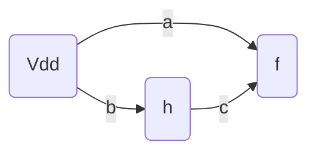
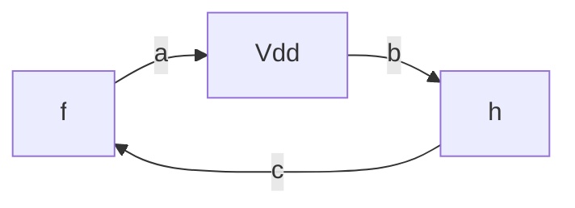
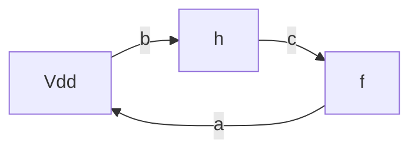
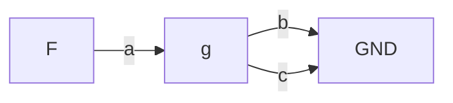
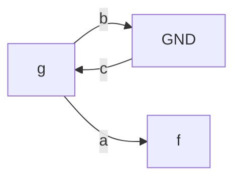
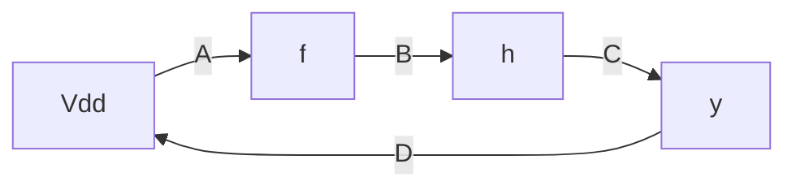
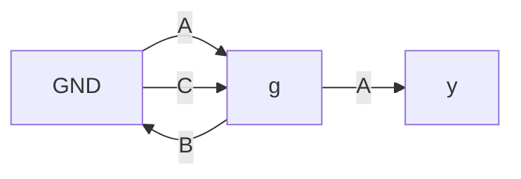

t# 1. Introduction / Pre-Class Notes

```ad-abstract
title: Summary 
- Circuit Topology to Layout
```

## Pre-Class Notes

- Continuing off of the art of layout. Prob will go over more into specific processes for what we are working with
# 2. Lecture & Discussion Notes

## An Approach for Topology to Layout

### Example 1

```ad-question
Implement this circuit topology as a cmos layout given function, circuit, and transistor sizings
```


$$
f = \overline{a(b+c)}
$$

![[Pasted image 20260916122734.png | center]]

#### Step 1: Place your $V_{dd}$ and $GND$ rails

![[Pasted image 20260916122946.png]]

```ad-note
Draw it in the corresponding color. In  this case, it is **blue** since we are on *metal1*
```

#### Step 2: Draw Input Transistors in *Red*

![[Pasted image 20260916123108.png]]

```ad-important
The PMOS transistors and the P-well have to be on the top, while the NMOS transistors and N-well will be on the bottom. The green dotted line separates the two.
```

![[Pasted image 20260916123158.png]]


```ad-note
Make sure that you set the width of the poly to the width of the transistor
```
#### Step 4: Add the P-Well and N-Well

```ad-danger
Make sure you set the width of the P-well and N-well to the width of the transistors
```

![[Pasted image 20260916123457.png]]

#### Step 5: Place the Connections & Output

Every cross represents a contact. We don't need to write the name of the contact since it is assumed based on what materials it is connecting


```ad-summary
For this type of topology, we would like to put the output to the middle so that we can connect the p-well and the n-well together
```

```ad-warning
In this case, we need to pull out the diffusion between B and C longer so that they can connect without metal
```


![[Pasted image 20260916124519.png]]

#### Step 6: Consider Constraints & Space Efficiency

For the discontinuity in the top p-diff, there must be a distance between both p-diffs to ensure tolerances. 

![[Pasted image 20260916125413.png]]

```ad-question
Is there any way we can improve this? Can we draw it as a single diffusion?
```

We need to make the p-side of the circuit to also have a continuous traversal like shown in the n-side below:

![[Pasted image 20260916125622.png]]

![[Pasted image 20260916125706.png]]

We will instead go from $F$ to $a$, $a$ to $b$, and then $b$ to $c$

**Better Solution** (continuous diffusion on both sides instead of just one)
![[Pasted image 20260916130044.png]]

## Euler Paths

```ad-summary
An graph algorithm that makes it easier to turn circuits into layouts 
- Make sure that each path covers each edge *exactly once*\
- Ensures **continuous diffusion**
```

```ad-note
Typically done by Layout Generators
```

**P-Graph**:
- Represents the circuit nodes as *nodes* in a graph instead
- Transistors are represented as *edges*






**N-Graph
- Same, but for the n-path instead






```ad-warning
To get the p-graph and the n-graph to match up, we have to have the **same transistor order**!
```

In this case, we are using the b→c→a path

![[Pasted image 20260916131713.png]]

```ad-important
If you find two matching euler paths, it g**uarantees continous diffusions** on both sides of the CMOS layout!
```

### Euler’s Does Not Always Work

For this transistor path:


You *cannot* create an euler’s path without either repeating a side or having discontinuity!

**ALSO**: matching Euler’s Path are not guaranteed

```ad-summary
Continuity on either side is not guaranteed, but it should be possible in 90% of cases.
```

### Example 1

![[Pasted image 20260916132403.png]]

**P-Graph**


**N-Graph**


*Double continuity exists!*

![[Pasted image 20260916132915.png]]

### Practice: 4-Input NAND

### Practice: Complex Gate

## Typical Layout Densities

![[Pasted image 20260916133156.png]]


## Standard Cells

```ad-summary
We want to aim for a standard height with a variable width on our layout cells.
```

- Bus connects to neighboring cells
- Well connects to neighboring cells
- True for both the top and bottom

![[Pasted image 20260916133317.png]]

```ad-warning
The n-well and the p-well do not exactly meet in the middle as seen before. There is actually some space placed for wiring (see the blue in the graph above)
```

## Multi-Gate Designs

```ad-question
Make a layout plan for the three-NAND gate design below:
```

![[Pasted image 20260916133546.png]]

### Horizontal Stackings

#### Cell #1

Going from the first gate to the second gate, we want to use the second metal layer to break up the gates. This way we can also avoid both $V_{dd}$ and $GND$ shorting over the metal.

![[Pasted image 20260916133802.png]]

#### Cell #2

![[Pasted image 20260916134003.png]]

When we need connections between neighboring cells, we will place metal 1 strips between the poly and the metal 2 layers

#### Cell #3

![[Pasted image 20260916134155.png]]

### Vertical Stacking

![[Pasted image 20260916134602.png]]

```ad-important
These alternating rows allows you to share multiple $V_{dd}$ and $GND$ wires with multiple standard cells, which can reduce complexity and help order the design better.
```

## Handmade Designs

Done very rarely. Only when clear design constraints require specific sizing.
# 3. Action Items & Follow-Up
- [ ] Review Lecture 8 for VLSI 📅 2026-09-18
- [ ] *Practice* VLSI 4-Input NAND Euler [[Lecture 8 - Topology-to-Layout Methodologies#Practice 4-Input NAND]]📅 2026-09-18
- [ ] *Practice* VLSI Complex Gate Euler [[Lecture 8 - Topology-to-Layout Methodologies#Practice Complex Gate]] 📅 2026-09-18