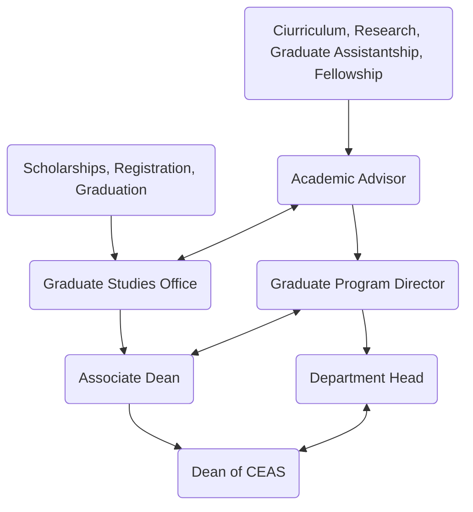

Date: 19th August 2026
Date Modified: 19th August 2026
File Folder: Orientation & Seminar
#Oreintation #university-of-cincinatti 

# Introduction

## Office Staff

```ad-info
title: Speaker
**Name:** Julie Steimle
**Position**: Graduate Studies Office for CEAS
```


- **Dr. Art Helmicki**: Assocaite Dean for Graduate Studies
- **Amanda McLaughlin**: Associate Director, Career Development
- **Allison Reusch**: Sr. Academic Advisor
	- Computer Science & Engineering, PhD

# Bearcat ID Cards

```ad-important
ORDER THEM ONLINE!
- Pickup at 4 Edwards Center (Pub Safety near the courts)
```

# Dates & Deadlines


| Event/To Do                        | Date                     |
| ---------------------------------- | ------------------------ |
| CEAS                               | Today                    |
| Classes Begin                      | Aug. 24th                |
| Last day to add a class (*online*) | Aug. 30th                |
| Drop deadline (no W grade)         | Sept. 7th                |
| Withdraw with no refund (with W)   | Sept. 8th                |
| Final day to withdraw              | Nov. 20th                |
| Classes end                        | Dec. 4th                 |
| Final exams                        | Dec. 6-12th              |
| Holidays                           | Sept. 7; Nov. 11, 26, 27 |
| Reading Days                       | #comebacklater           |
# Health Insurance

- Automatically added
- **Questions**: studins@ucmail.uc.edu

# Course Registration

- Talk to advisor to check
- Always keep your advisor up-to-date about academic progress and research
- Must be registered every year
	- At least *1 credit hour*
- Students recieve an RA/GA/TA and are using CEAS facilities **must be full time**
- 

```ad-warning
Must be within the college for set degree requirements
- Needs to be **formally requested**
- Form within CEAS portal under "Approval for Courses Outside CEAS"
- Approved by advisor and the main office
- **Could kill your GIA**
```

# CEAS Student Portal

```ad-note
Available after 2 weeks after classes start
```

**Main forms**:
1. Change Forms
	- Advisor change
	- Status, program, or requirement change
2. Graduate Study Forms
3. Graduation Forms
4. Traveling Stipend for Conferences

# Office of College Computing - Mantei Center 636

- Open 8am-5pm
- ceas-userhelp@listserv.uc.edu
- *some* are 24/7
- **printers**

# GIA

- Appears as the *”Graduate Incentive Scholarship”*
- Tuition scholarship funded by the University
- Policy guidelines
	- Must be signed and abided by
- 15 credit hours minimum!
- No more than 18

# Graduation

- MUST complete an *online application* in the term you wish to gradaute
- Early in the semester!

# Contact Graph



# Orientation Reminders

- [ ] ⏫ Complete the online Check-in → https://www.ceas3.uc.edu/CeasStudentPortal/uploadacceptoffer
- [ ] Register and get the GIA award

# Amanda McLaughlin - Career Development

- Career Fiar prep
- Resume
- etc.
- **Coursera**
- Monthly CEAS grad email

```ad-warning
Make sure you check your email a lot!
```

## Career Fair Dates

- Part-Time Job Fair: Sept. 3rd 1pm-4pm
- Business Day: Sept. 15th 10am-3pm
- Engineering & IT Day 1: Sept. 16th 10am-3pm
- Eingeering & IT Day 2: Sept. 17 10am-3pm

## Networking Events

- Augsut 19th Coffee 8-9:30am 100 Broadway St.
- August 20th: Agentic AI 3-5pm 3080 Exploration Ave. 
- Midwestcon 2026: Sept. 8-11th *Free general pass with volunteer work*

```ad-important
Make sure to foster relationships whenever possible
```

