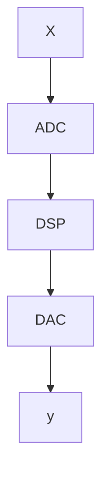

Date: 21st August 2023
Date Modified: 21st August 2023
File Folder: Digital Signal Processing
#DSP

```ad-abstract
title: Today's Topics
collapse: open

- Syllabus
- Introduction
- Sampling

```

```ad-note
title: Homework
- [ ] Add picture to canvas
```

# Syllabus

Office Hours:
- M: 1-3pm
- F: 12-3pm

Attendance will be taken

HW every other week

# Introduction

**Signals**: Functions that carry information

```ad-example
- Audio
- Video
- Image
- Speech
```

## Two General Types of Signals

True for time-based signals
### Continuous Time Signals
- Defined at every instance of time
- Uses the notation $X(t)$


```functionplot
---
title: Continuous Example
xLabel: 
yLabel: 
bounds: [-10,10,-10,10]
disableZoom: false
grid: true
---
y=sin(x)
```

### Discrete Time Signals
- Signals defined at discrete points of time
- Denoted by $X[n]$
- Can be converted form continuous to discrete using processing

### Digital Signal
- Simply a single whose domain (time) and amplitude (voltage) are discrete valued set of numbers


## Analog to Digital Conversion

- Converts an analog signal (continuous signal) uses sampling (continuous to discrete) then quantization (discrete to digital) to a digital signal

```ad-important
This is done because digital signals are easier to process than continous and discrete signals
```

#### Analog to Digital Pipeline



```ad-note
The ADC performs both the "sampling" and "quantization"
```

### Sampling

- Converts the continuous $X(t)$ into a discrete $X[n]$ 
- Helps due to it needing to be in a digital representation

```ad-summary
The process of converting a continuous-time signal to a discrete-time signal by taking "samples" at discrete instances of time.
```

- Often taken uniformly
	- Regular time intervals that are evenly spaced
- The time interval between samples is called the "sampling interval" denoted by $T$s

#### Sampling Frequency

- The number of samples per second
- Denoted by:
$$ fs = \frac{1}{Ts}$$
```ad-note
Becareful of oversampling (too complicated) and undersampling (not enough information)
```


