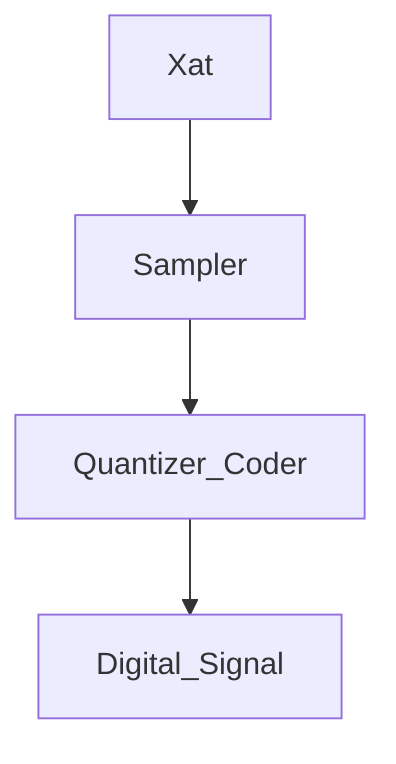

Date: 23rd August 2023
Date Modified: 23rd August 2023
File Folder: Digital Signal Processing
#DSP

```ad-abstract
title: Today's Topics
collapse: open

- ADC
- Uniform Sampling
- Nyquist Theroem

```

```ad-important
DSP System converts an analog continuous input into a digital signal of set values back to an analog continuous output.
```

# Analog to Digital Converter (ADC)




## Uniform Sampling

Creates a relationship between the discrete time signal ($n$) and the continuous time signal ($t$) where:
$$X(n) = X_a(nT) for -\infty<n<\infty$$ Where the following are true:
- $T$ is the time interval (sampling period)
- $Fs = \frac{1}{T}$ (Sampling Frequency)

![[CamScanner 08-24-2023 20.15_1.jpg]]


```ad-important
You must always have two sampels per cycle in order to capture all the necessary information from a continuous to a discrete signal
```

```ad-note
The **sampling** parameters ($Ts$ and $Fs$) are different from a **signal** parameter ($T$ and $S$)
```

```ad-important
title: Nyquist Theorem
color: 255, 255, 0
The samping frequency must be stirctly **more than twice** the frequency of the signal
- Makes sure that there is enough discrete information to reconstruct the signal
- Given a continuous time signal $X(t)$, $X(t)$ can be perfectly reconstructed form its sample if the sampling rate $Fs$ using this theorem
$$Fs > 2F_{B}$$

```ad-note
All real world, useful signals can be represented based on their frequency
- Maintaining this frequency is key
```

```ad-summary
title: Note
If $X_t$ is sampled at a rate of $Fs$ sample per second in $Hz$, then;
$$X(n) = X(nTs) where Ts = Fs$$
```

```ad-example
Suppose that the signal is $$X(t) = \frac{7}{2}cos(2\pi t)$$ The signal has a sample rate of $fs = 8Hz$. Determine the set of samples $X[n]$ at sample instance $0\le n \le 4$
```ad-check
title: Solution
- Find $Ts$
	- $Ts = \frac{1}{Fs} = \frac{1}{8}$
- Replace $nTs$ with $t$ the original equation
	- $X(n)= \frac{7}{2}cos(2\pi nTs)$ 
	- $X(n)= \frac{7}{2}cos(2\pi n(\frac{1}{8}))$
	- $X(n)= \frac{7}{2}cos(\frac{\pi n}{4})$
- Create the samples by incrementing $n$ (Figure 2)
```

### Figure 2: Incrementing n


| n   | $cos(\frac{\pi n}{4}$ | $\frac{7}{2}cos(\frac{\pi n}{4})$ |
| --- | --------------------- | --------------------------------- |
| 0   | 1                     | 7/2                               |
| 1   | $\frac{\sqrt{2}}{2}$  | $-7 \frac{\sqrt{2}}{4}$           |
| 2   | 0                     | 0                                  |
| 3   | $-\frac{\sqrt{2}}{2}$ | $-7 \frac{\sqrt{2}}{4}$           |
| 4   | -1                    | -7/2                              |

![[CamScanner 08-24-2023 20.15_2 (1).jpg]]

```ad-example
Determine the minimum sampling rate requried to avoid aliasing
$$X_{a(t)} = 3\cos (100 \pi t)$$
```ad-check
title: Solution
- Recall that $Fs$ needs to be twice the $F_B$
- Find $F_{B}$ by dividing out $2\pi$ from the $\cos$
- $Fs > 2F_{B} = Fs > 100$ 
- The $Fs \ge 100$ to avoid aliasing 
```

```ad-example
color: 180, 100, 180
Suppose that the signal is sampled at rate $Fs = 200Hz$. What is the discrete time singal obtained after sampling?
```ad-check
title: Solution
- Recall $X(n) = X_a(nT_s)$
- Find $Ts$
	- $Ts = \frac{1}{Fs} = \frac{1}{200}$
- Replace $Ts$ with $t$
	- $X(n) = 3\cos (100 \pi (\frac{1}{200}))$
	- $X(n) = 3\cos (\frac{\pi}{2}n)$
```


