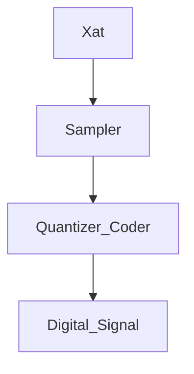

Date: 23rd August 2023
Date Modified: 23rd August 2023
File Folder: Digital Signal Processing
#DSP

```ad-abstract
title: Today's Topics
collapse: open

- Topic1
- Topic2
- Topic3

```

```ad-important
DSP System converts an analog continuous input into a digital signal of set values back to an analog continuous output.
```

# Analog to Digital Converter (ADC)




## Uniform Sampling

Creates a relationship between the discrete time signal ($n$) and the continuous time signal ($t$) where:
$$X(n) = X_a(nT) for -\infty<n<\infty$$ Where the following are true:
- $T$ is the time interval (sampling period)
- $Fs = \frac{1}{T}$ (Sampling Frequency)

#comebacklater Insert Figure 1


