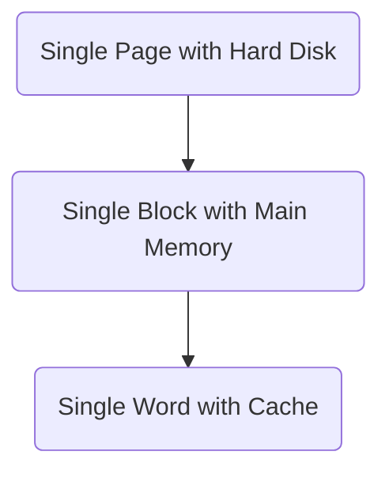

Date: 4th December 2024
Date Modified: 4th December 2024
File Folder: Week 14
#Circuits

```ad-abstract
title: Today's Topics
collapse: open

- Topic1
- Topic2
- Topic3

```

# Virtual Memory

Gives the illusion of a bigger memory. 
- Main memory (DRAM) acts as cache for hard disk
- Slow, Large, Cheap

![[Pasted image 20241204110228.png]]

![[Pasted image 20241204110256.png]]

![[Pasted image 20241204110524.png]]
```ad-warning
There is not a way to pick out a single word in memory. We grab pages of memory and load it into physical memory from virtual memory
```



## Properties & Terms

**Virtual Addresses**
- Programs use virtual addresses
- Entire virtual address space stored on a hard drive
- Subset of virtual address data in DRAM
- CPU translates virtual addresses into *physical addresses* (DRAM)
- Data not in DRAM fetched from hard drive

**Memory Protection**
- Each program has own *virtual to physical mapping*
- Two programs can use same virtual address from different data
- Programs don’t need to be aware others are running
- One program (or virus) can’t corrupt memory used by another

| Cache        | Virtual Memory      |
| ------------ | ------------------- |
| Block        | Page                |
| Block Size   | Page Size           |
| Block Offset | Page Offset         |
| Miss         | Page Fault          |
| Tag          | Virtual Page Number |
```ad-important
Physical memory acts as a cache for virtual memory
```

![[Pasted image 20241204111401.png]]
```ad-note
Most accesses *hit* in physical memory. However, programs have **large capacity** of virtual memory
```

## Definitions

**Page Size**: Amount of memory transferred form hard disk to DRAM at once

**Address Translation**: Determining physical address form virtual address

**Page Table**: Lookup table used to translate virtual addresses to physical addresses
# Address Translation

## Example

**System**:
- Virtual memory: $2 \mbox{ GB} = 2^{31} \mbox{ bytes}$
- Physical memory size: $128 \mbox{ MB} = 2^{27} \mbox{ bytes}$
- Page Size: $4 \mbox{ KB} = 2^{12} \mbox{ bytes} \Rightarrow$ 12-bits of page offset (3 hex digits). These *do not change*
- Number of Physical Pages: $\frac{2^{27}}{2^{12}}= 2^{15}$ Physical Pages $\Rightarrow$ 15-bits for the physical page number (PPM)
	- $0x0000 \rightarrow 7FFF$

$$27 = \mbox{PPM} \rightarrow \boxed{15} + \boxed{12} \leftarrow \mbox{ Page Offset}$$

*Virtual Pages*: $\frac{2^{31}}{2^{12}}=2^{19} \mbox{ Pages} \Rightarrow$ VPN = **19**
- $00000 \rightarrow 7FFFF$

$$31 = \mbox{VPN} \rightarrow \boxed{19} + \boxed{12} \leftarrow \mbox{Page Offset}$$


![[Pasted image 20241204112009.png]]

![[Pasted image 20241204113152.png]]

```ad-question
What is the physical address of virutal address `0x247C`?
```

- VPN = `0x2`
- VPN `0x2` maps to PPN `0x7FFF`
- 12-bit page offset: `0x47C`
- Physical Address = `0x7FFF47C`

```ad-question
What is the physical address of the virtual address`7FFFD345`
```

- VPN = `7FFFD`
- VPN `0x7FFFD` maps to PPN `0x0000`
- 12-bit page offset: `0x345`
- Physical address = `0x0000345`

# Page Table

Stores the entry for each virtual page. Contains:
1. **Valid Bit** `1` if page is in physical memory
2. **Physical Page Number**: Where the page is located
3. One Entry for *each* virtual page ($2^n$ entries)

## Example 1

![[Pasted image 20241204113912.png]]
## Example 2


