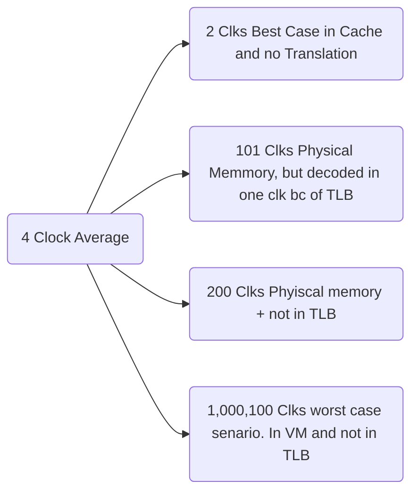

Date: 6th December 2024
Date Modified: 6th December 2024
File Folder: Week 14
#ComputerArc 

```ad-abstract
title: Today's Topics
collapse: open

- Topic1
- Topic2
- Topic3

```

# Translation Lookaside Buffer (TLB)

```ad-summary
title: Defintion
Small cache of most recent page translations
- Reduces number fo memory accesses for *most* loads/sotres from 2 to **1**
```

**Page Table Accesses**: High temporal locality
- Large page size, so consecutive loads/stores likely to access same page

**TLB**:
- *Small*: Accessed in < 1 cycle
- Typically *16-512 entries*
- *Fully Associative*
- $> 99 \%$ hit rates typical
- *Reduces number of memory accesses*

## Example: 2-Entry TLB

![[Pasted image 20241206111114.png]]

# Examples

## Exercise 8.20

```ad-question
Consider a virtual memorys system that can address a total of $2^{32}$ bytes. You have unlimited ahrd drive space but are limited to only $8Mb$ of semiconductor (physical) memory. Assume that virtual and physical pages are each $4 Kb$ in size.
1. How many bits is the physical address?
2. What is the maximum number of virtual pages in the system?
3. How many physical pages are in the system?
4. How many bits are the virutal and phsyical page numbers?
5. Suppose that you come up with a direct mapped scheme that mpas virtual pages to physical pages. The mapping uses the least significant bits of the virutal page number to determine the phyiscal page number. How many virtual pages are mpaped to each phsycial page? Why is this 'direct mapping' a bad plan?
6. Clearly, a more flexible and dynamic scheme for translating virtual addresses into physical addresses is required than the one described in part (e). Suppose that you use a page table to store mappings (translations from virtual page number to physical page number). How many page table entries will the page table contain?
7. Assume that, in addtiion to the physical page number, each page table entry also contains some status informaiton in the form of a valid bit ($V$) and a dirty bit ($D$). How many bytes long is each page table entry? (Round up to an integer number of bytes.)
8. Sketech the layout of the page table. What is the total size of the page table in bytes?
```

### Part 1-4

Page Size: $4k = 2^{12} \mbox{ bytes}$
Physical Memory: $8M = 2^{23} \mbox{ bytes}$
Physical Address = $23 \mbox{ bits} \Rightarrow \begin{matrix} 12 \mbox{ LSB: page offset} \\ 11 \mbox{ MSB: phsyical page number} \end{matrix}$

$\frac{2^{32}}{2^{12}}=2^{20} \mbox{ virtual pages} \Rightarrow \mbox{virtual page number} = 20 \mbox{ bits}$

$\frac{2^{23}}{2^{12}} = 2^{11} \mbox{ physical pages}$

$\frac{2^{20}}{2^{11}}=2^9= 512 \mbox{ virtual page for one valid physical page}$

![[Pasted image 20241206112823.png]]

$$2^{20} \times 13 \mbox{ bits}$$

## Exercise 8.22 $\star$

```ad-question
You decide to speed up the virtual memory system of Exercise 8.20 by using a translation lookaside buffer (TLB). Suppose that your memory system has the characteristics shown in the table below. The TLB and cache miss rates indicate how often the requested entry isnot found. The main memory miss rate indicates how often page faults occur.
1. What is the average memory access time of the virutal memory system before and after adding the TLB? Assume that the page talbe is always resident to physical memory and is never held in the data cache.
2. If the TLB has 64 entries, how big is the TLB (in bits)? Give numbers for PPN, VPN, and valid bits of each entry.
3. Sketch the TLB
4. What size SRAM would you need to build for the TLB? Depth x width?
```

### Part 1

**Without TLB**:
$$AMAT = t_{MM}+[t_{cache}+MR_{cache}(t_{MM}+MR_{MM}t_{VM})]$$
$$AMAT = 100 + [1 + 0.02(100+0.000003(1,000,000))] = 103.06 \mbox{ cycles}$$

**With TLB**:

$$AMAT = [t_{TLB} + MR_{TLB}(t_{MM})] + [t_{cache} + MR_{cache}(t_{MM} + MR_{MM}t_{VM})]$$
$$AMAT = [1+0.0005(100)] + [1+0.02(100+0.0000003 \times 1,000,000)]  = 4.11 \mbox{ cycles}$$

*Without Averages*



### Part II

\# bits per entry = valid bit + tag bits + pyshcial page number:
- 1 valid bit
- tag bits = VPN = 20 bits
- phsyical page number = 11 bits

Thus, \# bits per entry = $1+20+11=32 \mbox{bits}$

Total size of the TLB = $64 \times 32 \mbox{ bits} = 2048 \mbox{ bits}$

### Part III

![[Computer Architecture - Week 14 Day 3 2024-12-06 11.45.42.excalidraw]]

### Part IV

$$1 \times 2048 \mbox{ bit SRAM}$$

## Exercise 8.24

![[Pasted image 20241206114847.png]]
# Virtual Memory Summary


