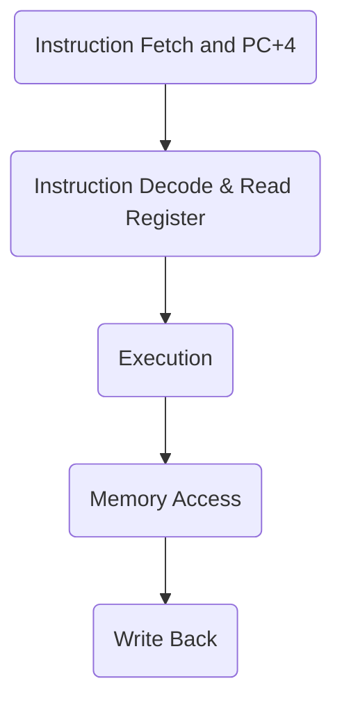

Date: 16th October 2024
Date Modified: 16th October 2024
File Folder: Week 8
#Circuits

```ad-abstract
title: Today's Topics
collapse: open

- Topic1
- Topic2
- Topic3

```

# Multicycle RISC-V Processor

## Single Vs. Multicycle

**Single-Cycle**:
+ Simple
+ Cycle time limited by longest instruction (`lw`)
+ Separate memories for instruction and data 
+ 3 adders/ALUs

```ad-warning
Very time-consuming for load word because:
$$T_{c\_single} = t_{pcq\_PC} + 2t_{mem} + t_{RF\mbox{read}} + t_{ALU} + t_{mux} + t_{RF\mbox{setup}}$$
```

**Multicycle Processor**: addresses these issues by breaking instructions into *shorter steps*
- Shorter instructions take fewer steps
- Can re-use hardware
- Cycle time is faster

```ad-note
title: Remember
For single cycle processors:


```ad-example
**Pros and Cons of Multicycle**
- Higher Clock Speed
- Simple instructions run faster
- reuse expensive hardware on multiple cycles
- Sequencing overhead paid many times :(
```

For instance, a branch instruction needs only the first three, so it should be done in clock cycles.

*Clock Cycles per Instruction*:
- Branch: 3 cycles
- Load: 5 cycles
- Everything else: 4 cycles

## Multicycle State Elements

Replace separate Instruction and Data memories with a single unified memory

![[Pasted image 20241016112341.png]]

## The Multicycle Datapath

![[Pasted image 20241016113028.png]]

### Branch Instruction

**IF (Step 1)**:
- Read Instruction
- PC=PC+4
- oldPC

**ID/RF (STEP 2)**:
- ALUout = oldPC+imm
- A = t4
- B = t5

```ad-warning
Most dangerous part
```

**Ex (Step 3):**
- *If* A=B
	- Set PCwrite to high
	- PC = ALUOut
- Else
	- Set PCwrite to low
	- PC = PC+4

```ad-note
Regardless of what is chosen, ResultSrc will be set to 00
```

### AND Instruction

**IF (Step 1)**:
- Read Instruction
- PC=PC+4
- oldPC

**ID/RF (STEP 2)**:
- ALUout = oldPC+imm
- A = t4
- B = t5

**Ex (STEP 3):**
- ALUout = A and B

**Mem (*Skipped*)**

**WB (STEP 4)**:
- Take ALUout by making resultSrc = 00
- Make registerWrite high and AdrSrc low
- Writes back to t6 


