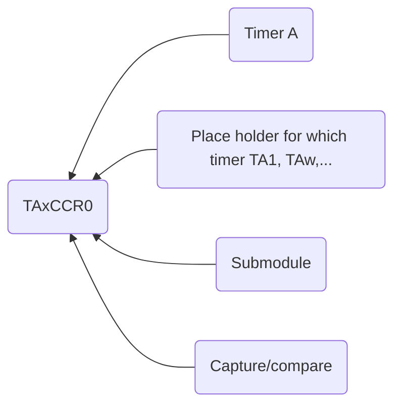

Date: 16th October 2024
Date Modified: 16th October 2024
File Folder: Week 8
#Electronics

```ad-abstract
title: Today's Topics
collapse: open

- Topic1
- Topic2
- Topic3

```

# Timers - Periodic Interrupts with $Timer A$ modules

## Objectives

Use *Timer A* modules to:
- Generate periodic interrupts
	- Run multiple threads (tasks)
	- Set their priority
- Generate parallel PWM signals
	- With different duty cycle using different timers independent with different duty cycles

## Timer A Module Introduction

```ad-summary
title: Definition
You can configure 4 *independent* Timer A modules:
- `TA1.x`
- `TA2.x`
- `TA3.x`
- `TA4.x`
```

Each timer also has *four submodules*:
- `TAx.1`
- `TAx.2`
- `TAx.3`
- `TAx.4`

## Capture/Compare

Each of these timers have two modes: *capture* and *compare*

**Capture**: Measures the time it takes for an event to happen on a pin
- Timing how long for an input to go high
- Frequency measurement

**Compare**: Triggers an event after a pre-defined period of time
- PWM Generation

```ad-example
These are comparable to a *stopwatch* and a *timer*
```

## Behavior

These timers work similarly to SysTick

**Steps**:
1. Load `TAxR` with value `TAxCCR0`
2. Count down till you hit 0
3. Reset `TAxR` with `TAxCCR0`
4. Go back to step 1

```ad-note
Each module has one 16-bit timer and seven associated coapture/compare registers.
```

`TAxCCR0` $\Rightarrow$ Capture and Compare Register


## Other Configuration Options

Four possible clock sources:
- `SMCLK`: Sub master clock (CPU speed)
- `ACLK`: Auxiliary cloick (Slower than CPU speed)
- `TAxCLK`: External clock on `TAxCLK`
- `INCLK`

## Timer A Registers

```ad-warning
IN SLIDES
```


