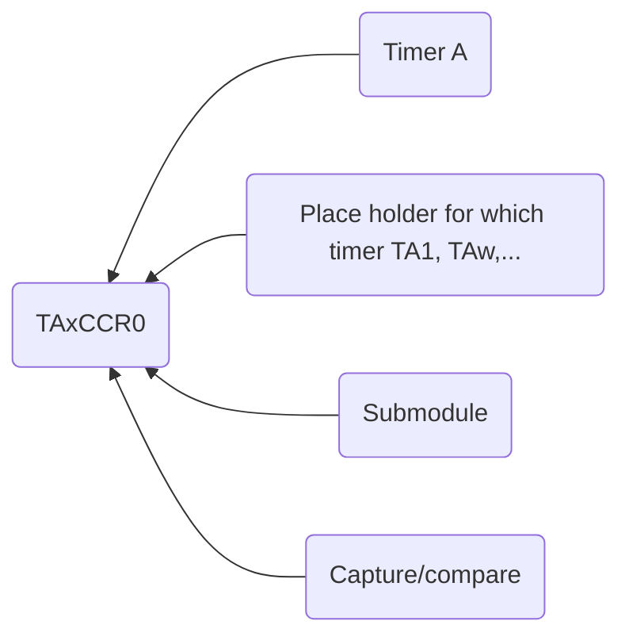

Date: 16th October 2024
Date Modified: 16th October 2024
File Folder: Week 8
#Electronics

```ad-abstract
title: Today's Topics
collapse: open

- Topic1
- Topic2
- Topic3

```

# Timers - Periodic Interrupts with $Timer A$ modules

## Objectives

Use *Timer A* modules to:
- Generate periodic interrupts
	- Run multiple threads (tasks)
	- Set their priority
- Generate parallel PWM signals
	- With different duty cycle using different timers independent with different duty cycles

## Timer A Module Introduction

```ad-summary
title: Definition
You can configure 4 *independent* Timer A modules:
- `TA0.x`
- `TA1.x`
- `TA2.x`
- `TA3.x`
```

Each timer also has *four submodules*:
- `TAx.1`
- `TAx.2`
- `TAx.3`
- `TAx.4`

## Capture/Compare

Each of these timers have two modes: *capture* and *compare*

**Capture**: Measures the time it takes for an event to happen on a pin
- Timing how long for an input to go high
- Frequency measurement

**Compare**: Triggers an event after a pre-defined period of time
- PWM Generation

```ad-example
These are comparable to a *stopwatch* and a *timer*
```

## Behavior

These timers work similarly to SysTick

**Steps**:
1. Load `TAxR` with value `TAxCCR0`
2. Count down till you hit 0
3. Reset `TAxR` with `TAxCCR0`
4. Go back to step 1

```ad-note
Each module has one 16-bit timer and seven associated coapture/compare registers.
```

`TAxCCR0` $\Rightarrow$ Capture and Compare Register


### Other Configuration Options

Four possible clock sources:
- `SMCLK`: Sub master clock (CPU speed)
- `ACLK`: Auxiliary cloick (Slower than CPU speed)
- `TAxCLK`: External clock on `TAxCLK`
- `INCLK`: Global External Clock

Has two stage clock divider (ID=1,2,4,8) plus (TAIDEX=1,2,3,4,5,6,7,8)
- Can count either up OR up then down depending on the mode

## Timer A Registers

![[ERTA - Week 8 Day 2 2024-10-21 13.10.16.excalidraw]]

## Timer A Schematic

![[ERTA - Week 8 Day 2 2024-10-21 13.20.32.excalidraw]]

### Clock & Prescale

| TASSEL | Selected Clock | \|  | ID  | Prescale |     |
| ------ | -------------- | --- | --- | -------- | --- |
| 00     | TAxCLK         | \|  | 00  | /1       |     |
| 01     | ACLK           | \|  | 01  | /2       |     |
| 10     | SMCLK<br>      | \|  | 10  | /4       |     |
| 11     | INCLK          | \|  | 11  | /8       |     |

$$T_{new} = T_{old}*2^{ID}*(\mbox{TAIDEX}+1)$$

### ID and TAIDEX

Two registers used that can modify the default clock:
- `ID`: Can divide the timer source by 2, 4, 8
- `TAIDEX` can *further* divide the timer source by 2,3,4,5,6,7, or 8

```ad-example
How do you make a $2 \micro s$ clock period from a $12MHz$ signal?
```

![[Pasted image 20241023133730.png]]

### Timer Range

Timer range is the length of each full cycle:

$$\mbox{range} = T * \mbox{resolution}$$
```ad-note
Resolution is the bit resolution of the counter
```

```ad-example
What is the range of a clock with a $2\micro s$ period on a 16-bit clock? 
```ad-check
title: Solution
$$\mbox{Range} =  T * \mbox{resolution}$$
$$=2*10^-6*16 = 0.13s$$
```

## Counting Modes

*Three Modes*:
- Up
	-  Up to value specified by $CCRy$, roll over to `0x0000`, and back up to $CCRy$, etc.
- Up/Down
	- Up to value in $CCRy$, count down to `0000`, back up to value in $CCRy$, etc.
- Continuous
	- Up to `0xFFFF`, rolls over to `0x0000`, back up to `0xFFFF`, etc.

### Controlling the Modes

| MC  | Mode Control                                      |
| --- | ------------------------------------------------- |
| 00  | Stop                                              |
| 01  | Up mode: Timer counts up to $CCRy0$               |
| 10  | Continuous: Timer counts up to 0xFFFF             |
| 11  | Up/Down: Timer counts between $CCR0$ and `0x0000` |

| OUTMOD | ON match to TAxCCRy | On match to TAxCCR0 |
| ------ | ------------------- | ------------------- |
| 000    | OUT bit value       |                     |
| 001    | Set                 |                     |
| 010    | Toggle              | Reset               |
| 011    | Set                 | Reset               |
| 100    | Toggle              |                     |
| 101    | Reset               |                     |
| 110    | Toggle              | Set                 |
| 111    | Reset               | Set                 |

```ad-important
`OUTMOD` is responsible for making different waveforms and duty cycles based on TAxCCRy and TAxCCR0
```

![[061515_1836_pwm22.webp]]

```ad-note
Set -> Pin Goes High
Reset -> Pin Goes Low
Toggle -> Reverse the Pin
```

## Periodic Interrupts Initialization

For Module $X$, submodule y
- Halt the timer (`MC`=00)
- Set the timer lcock and prescale
- Set submodule y to compare, arm interrupt (`CAP`)
- Set the TAxCCRy to the interrupt period minus 1
- Set the interrupt priority in the correct NVIC priority register
- Enable the interrupt in the NVIC interrupt enable register
- Reset the timer and start it in up mode
- Enable interrupts (in the main program after all devices initialized)

## Generate Independent PWM with Timers

With different duty cycle using different timers independently (two DC motors for robot R/L wheels)