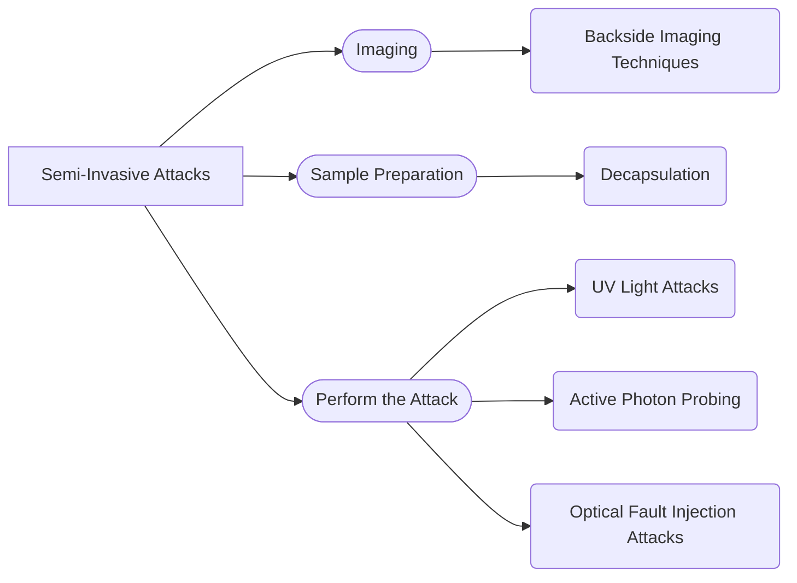

Date: 28th October 2024
Date Modified: 28th October 2024
File Folder: Week 10
#Electronics

```ad-abstract
title: Today's Topics
collapse: open

- Topic1
- Topic2
- Topic3

```

```ad-note
title: Homework
- [ ] test
```

# Semi-Invasive Attacks



## Sample Preparation

Decapsulation of the chip to prepare it for attacks
- Typically uses backside decapsulation to prevent the use of chemicals

## Imaging

Down to $0.8 \micro m$ technology, you could see all the major elements of a microcontroller

Can be observed with infrared light from rear-side

Backside imaging is also useful to extract the Mask ROM content

![[Pasted image 20241028140919.png]]

![[Pasted image 20241028140932.png]]

### Reading the Logic State of CMOS Transistors

Red low power leaser beams ionize active areas
- Power off imaging identifies active areas
- Power on imaging distinguishes between closed and opened transistor channels

## Optical Fault Injection Attacks

```ad-summary
title: Definition
Illumination of a target transistor causes it to conduct, thereby inducing a transient fault
```

Such attack are:
- Practical
- Do not require expensive laser equipment
- Any individual bit of SRAM in microcontroller can be set or reset.

### Changing SRAM contents

![[Pasted image 20241028141311.png]]

Focusing the light spot from the lamp on the area shown by the white circle caused the cell to change from `1` to `0`, with no change if the state was already `0`.

By focusing the spot on the area shown by the black circle, the cell would change from `0` to `1` and will *stay high*.

### Non-volatile Memory Modificaiton

```ad-important
EPROM, EEPROM, and Flash memory are even more sensitive to fault-injeciton attacks
```

These attacks can be sued to disable *security fuses*

```ad-warning
These attacks do not work on modern chips built in smaller sizes
```


