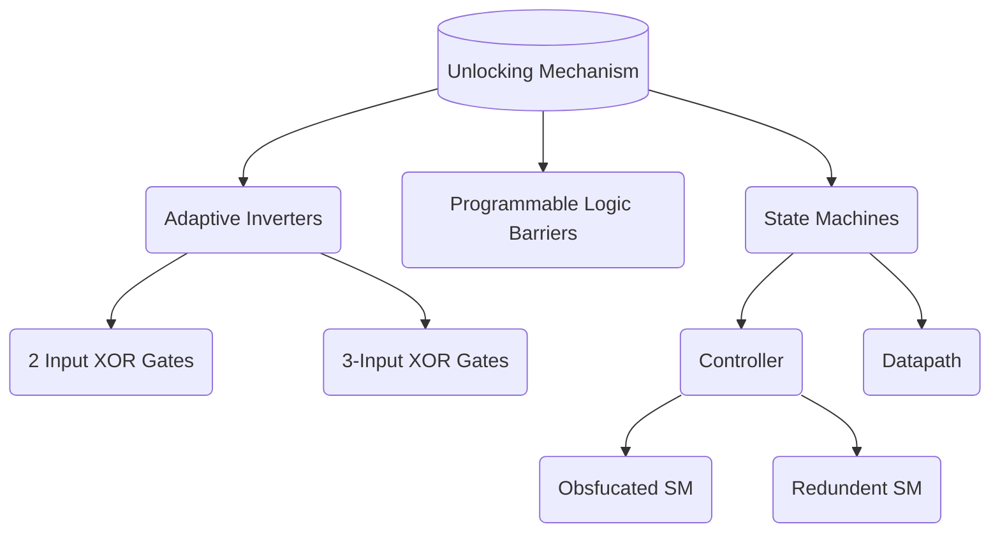
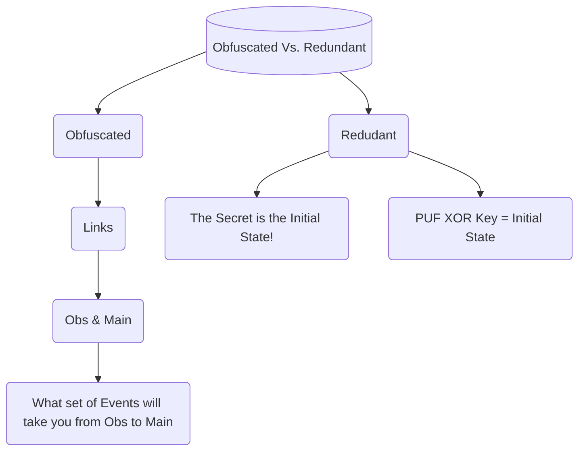
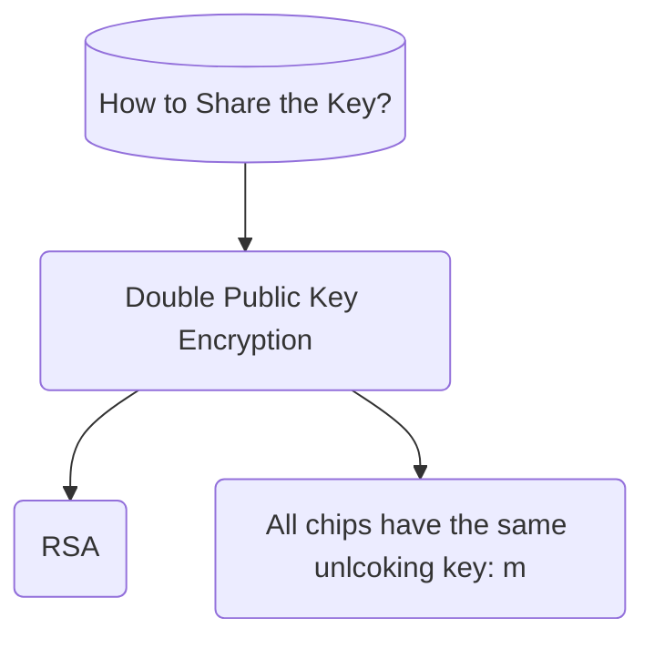

Date: 18th November 2024
Date Modified: 18th November 2024
File Folder: Week 13
#Electronics

```ad-abstract
title: Today's Topics
collapse: open

- Topic1
- Topic2
- Topic3

```

# Presentation #2

```ad-summary
Based around **Hardware Metering**, which helps to unlock chips and prevent overproduction, recycling, etc.
```







**Chip**: $B$
- Public ($e_B, n_B$)
- Private ($d_B, n_B$)

**IP**: $A$
- Public: $(e_A, n_A)$
- Private $(d_A, n_A)$

*IP Side*
$$c_1 = m^{d_A}\mod n_A$$
$$c_2 = c_1^{e_B} \mod n_B$$

*Chip Side*

$$c_1 = c_2^{d_B} \mod n_B$$
$$m = c_1^{e_A}\mod n_A$$

