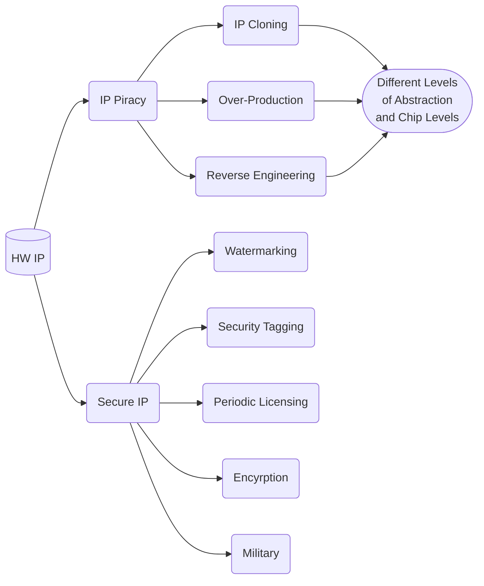
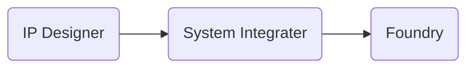

Date: 20th November 2024
Date Modified: 20th November 2024
File Folder: Week 13
#Electronics

```ad-abstract
title: Today's Topics
collapse: open

- Watermarking of HW IPs/Secure IP
- Digital vs. IP Watermarking

```

# Watermarking of HW IPs/Secure IP

## Contents



![[Pasted image 20241120140408.png]]
## Hardware Intellectual Property (*HW IP*)



**Why HW IP?**:
- Design Reuse
- SoC
- FPGA

```ad-question
*What qualifies as an HW IP?*
- HDL code, GDSII, netlist, layout, tehcnique, ...
```

#### Lexicon

**Soft IPs**:
- HDL Codes
**Firm IPs**:
- Placed RTL design
- Fully placed netlist
**Hard IPs**:
- GDSII file

![[Pasted image 20241120140958.png]]

## IP Piracy

### Vulnerabilities

**ICs**: Reverse Engineering

**Hard IPs:**
- Overproduction
- Reverse Engineering
- Cloning of FPGA Bitstream

**Firm and Soft IPs**:
- Overusage
- Cloning
- Reverse Engineering

### Threats

| IP Overusage                | IP Modification                                                      | IP Cloning                     | Overproduction |
| --------------------------- | -------------------------------------------------------------------- | ------------------------------ | -------------- |
| Use more than contracted to | Modify an IP form 3PIP vendor, sella s new IP to other SoC itegrator | Use of HW IPs without license. | By Foundry     |

**Reverse Engineering**:
- By 3rd party system integrator
- *On Hardware: is often **legal**
	- Often used to determine infringement
	- Often banned in software EULA
- *Types*
	- In order to make cloning possible
	- Also is crucial in attacking secure IP designs
- *Methods*
	- I/O Analysis
	- Decap, Delayer, SEM
	- Thermal Imaging

# Secure IP

## Approaches to Secure IP

### Prevention/Protection

**Chemical**: Use chemicals or self-destruct devices that are used to protect secrets

**Obfuscation**

**Expiration of Service**: Periodic Licensing or Trojan Insertion

**Encryption**: FPGA Bitstream

### Detection/Identification

Watermarking and Security tagging
## Design Goals

**Robustness**:
- Higher predictable performance
- More design flexibility

**Overhead**:
- Less Risks
- Acceptable Constraint

```ad-warning
**Tradeoff**:
- Pre-Processing: more robustness, mroe overhead
- Post-processing: less overhead, less robustness
```

## One-Time Programmable FPGA

- No encryption and on-site battery is needed
- Configuration data is permanently burned in chip
- Based on Antifuse technology

*Limitations*:
- Expensive
- Inflexible
- Difficult to Test

## Watermarking

```ad-summary
Performed on data and insets a unique signature into the data. Data carries a unique identifier
$$\space$$

**Invasive**: The data is altered by the watermark
```

![[Pasted image 20241120142002.png]]
![[Pasted image 20241120142044.png]]

#### Digital vs. IP Watermarking

```ad-example
**Cartographer's Watermark**: "Trap Streets" can be used on maps. However, this cannot enter navigational data lest hurt the functionality
![[Pasted image 20241120142350.png]]
```

```ad-summary
title: Defintion
**IP Watermarking**: Perfromed on the IP instead. *Noninvaise* since the data cannot be altered otherwise the funciton will be altered
```

# IP Watermarking

**Principles**:
1. Must not *alter* the functionality of the IP Core
2. *Performance degradation* should be unnoticeable
3. Should be *hard* to detect or remove
4. *Goal*: High probability of authorship

## Additive Watermarking

**Method**:
- Done at source code level, independent from layout contraints
- Implanted into functional logic so as to prevent removal

*Pros*:
- Strength adjustable
- Hard to discover or remove
- Easy to read in stego key

*Cons*:
- Could potentially incur area overhead
- Could degrade perofrmance

## Don’t Care Condition-Based Watermarking

```ad-summary
Funciton blocks have unneeded input combinaitons:
- Add Outputs to these inptu combinations
```

Force some Don’t Cares (`x`) to either `0` or `1`.

```ad-example
*Original Function*: $f(a, b, c,d ) = \bar a b \bar c + \bar a b d + b \bar c d$
To Assert $\bar a \bar b \bar c \bar d = T \Rightarrow f(a, b, c, d) = \bar a b \bar c + \bar a b d + b \bar c d + \bar a \bar b \bar c \bar d$
```

![[Hardware Security - Week 13 Day 2 2024-11-20 14.40.53.excalidraw]]
## Constraint-Based Watermarking

Author’s Signature → A set of constraints
- Watermarking constraints in addition to functional constraints
- More constraints, higher probability of authorship

Choice of constraint must not impact performance

![[Pasted image 20241120143224.png]]

```ad-example
- Combinational Logic Blocks
- Path TIming Constraints

![[Pasted image 20241120143457.png]]
```

### Pros/Cons 

**Constraining CLB Block**:
- - Easy to discover through reverse engineering
- - Easy to remove from bitstream
- + No performance degradation and minimal area overhead

**Constraining Path Timing**:
- + Sub path can also be sued
- + Hard to detect or remove
- + No performance degradation, minimal area overhead

## Place-and-Route Watermarking

Region and Grouping Constraints:
- Constrain the physical placement of standard cells
- Can cause performance degradation when not used properly

Row Placement Constraints
- Deliberately place standard cells in even or odd rows of layout with a grid abstraction

*Advantage*:
- + Negligible area overhead
- + Strong proof of authorship easily attainable
- Removal or circumvention will most likely render the IP Core useless

*Disadvantage*: Not applicable to soft IP

## Power Analysis Watermarking

Adding Components that draw power at certain frequencies
- *Extraction*: Monitor the power supply pin on the IC
- Dynamic power consumption magnitude will be higher at certain frequencies.

**Advantage**: Tough to remove

**Weakness**:
- Large area overhead
- Power consumption overhead

## Testing- Based Watermarking

Add watermark to test the circuitry at functional level
- *Extraction*: Switch to scan more, scan out the signature

*Advantage*: Hard to remove

*Disadvantage*: High overhead

## Other Methods

1. Apply Watermark as Header
2. Pseudorandom Bit Insertion
3. XOR the Watermark and Test Bits


