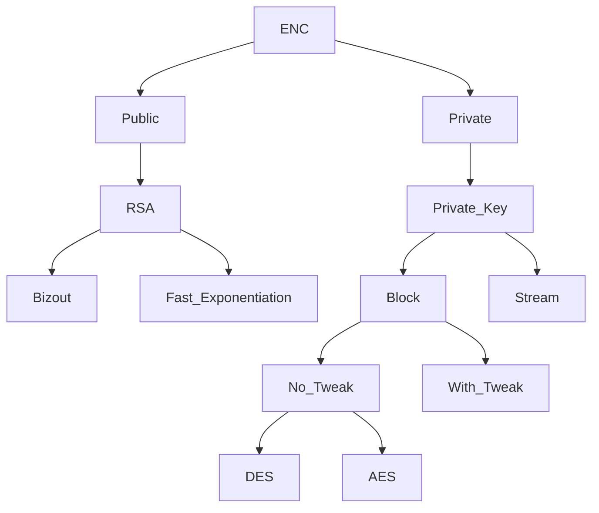
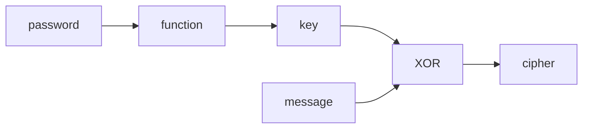
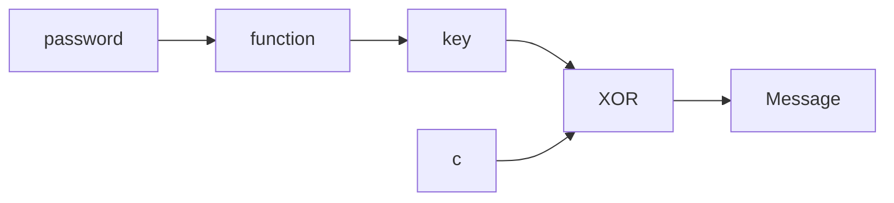

Date: 20th September 2024
Date Modified: 20th September 2024
File Folder: Week 4
#Electronics

```ad-abstract
title: Today's Topics
collapse: open

- Encryption & Decryption

```

# Encryption and Decryption 

```ad-warning
Ultimately, ALLLL of these techniques are weak to power analysis.
```

## Background

### Overview


### Basics

```ad-summary
Encryption techniques must be invertible for them to be decrypted. Typically, these are made with doortrap one way functions, where a key can be used to encrypt and decrypt a function
```

```ad-important
From the most basic level, the XOR gate is the primary component of most invertible functions
```

![[Hardware Security - Week 4 Day 3 2024-09-20 14.07.51.excalidraw]]

$$c = m \oplus k \Rightarrow \begin{bmatrix} m \mbox{ for } k = 0 \\ m \mbox{ for } k = 1\end{bmatrix}$$

$$m = c \oplus k$$

### Substitution Box

![[Hardware Security - Week 4 Day 3 2024-09-20 14.10.08.excalidraw]]

```ad-important
Substituion boxes are often not secret, but it makes it *much* more difficult to get the reverse function from the forward funciton. It is used to confuse the attackers
```

### Permutation

```ad-summary
Takes the amount of high bits and swaps them around
```


![[Hardware Security - Week 4 Day 3 2024-09-20 14.14.19.excalidraw]]

```ad-important
Diffuses the situation by making all the bits swap around, which makes it more difficult for an attacker to bring it back
```

## Galois Field

```ad-important
Is used in MANY different applications:
- AES: GF-256
```

```ad-note
Is part of the finite field category
```

![[Hardware Security - Week 4 Day 3 2024-09-20 14.24.10.excalidraw]]

| Galois Field | Bit 1 | Bit 2 | Bit 3 |
| ------------ | ----- | ----- | ----- |
| 0            | 0     | 0     | 0     |
| $\alpha^0$   | 1     | 0     | 0     |
| $\alpha^1$   | 0     | 1     | 0     |
| $\alpha^2$   | 0     | 0     | 1     |
| $\alpha^3$   | 1     | 1     | 0     |
| $\alpha^4$   | 0     | 1     | 1     |
| $\alpha^5$   | 1     | 1     | 1     |
| $\alpha^6$   | 1     | 0     | 1     |
```ad-important
This creates a set from $0 \rightarrow \alpha^6$
```

### Operations

```ad-note
Galois defined both addition and multiplicaiton for his field
```

*Addition* is done through bit-by-bit XORing and the answer is reversed based on the table.

$$\alpha^3 + \alpha^5= \alpha^2$$
**Multiplication** is done through adding exponents and then taking the $\mod 7$ of it.

$$\alpha^3\times \alpha^5 = \alpha^8 = \alpha^1$$
## Advanced Encryption Standard (AES)

Can be broken down into:
- Byte-wise confusion
- Byte-wise permutation
- Bit-wise XORing for each byte with a key based on the key scheduler
- Data Mixing in *Galois Field 256* (Input/Output) and *Galois Field 16* (Matrix)

```ad-important
This above is done multiple times based on the key scheduler.
```

## Stream Techniques

```ad-warning
Is only being XORed with a key. It is not very secure because it must be done *fast*
```





## RSA

### Bizout

Can get decryption and $n$ from encryption and $n$

$$y = ax_o+bx_1 \space \space \space \forall x_0, x_1, y \in \mathbb{Z}$$
$$\mbox{GCF}(x_0, x_1)=ax_0+bx_1$$
$$1 = ax_0+bx_1$$
$$1 \mod x_1 = ax_0 \mod x_1 + bx_1 \mod x_1$$
$$\boxed{ax_0 \mod x_1 = 1}$$

### Fast Exponentiation

$$c = m^e \mod n$$
$$m = c^d \mod n$$


