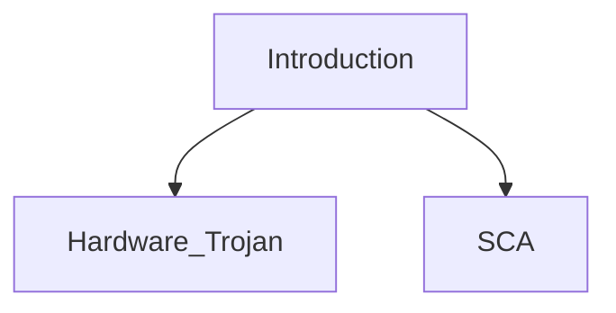

Date: 27th September 2024
Date Modified: 27th September 2024
File Folder: Week 5
#Electronics

```ad-abstract
title: Today's Topics
collapse: open

- Electromagnetic Power Analysis
- Dual Logic (DRP)

```

![[lecture 9(1).pdf]]

# Electromagnetic Power Analysis

```ad-summary
EM radiation is correlated to the switching activities of CMOS gate circuits. Inductive probes are used to capture the EM radiation caused by switching activities of CMOS gate circuits inside the chips. The probe tiself should be small enoguht o enable accurate location.
```

## EMA Signal

Raw signals (TIA: Transfer into accumulator instruction)
- Power is less noisy
- BUT EM signatures are *sharper*

![[Pasted image 20240927140831.png]]

## Spatial Positioning & Density

Horizontal cartography (XY plane)

![[Pasted image 20240927141006.png]]

```ad-note
Pinpoints the *instruction* related areas
```

![[Pasted image 20240927141015.png]]

```ad-important
Spectral density distribution of the chip surface, which is correlated to the functional modules distribution
```
## Advantages & Disadvantages over PA

**Advantages**
- Local information more “data correlated”
- EMA bypasses current smoothers
- EMA goes through HW countermeasures

**Drawbacks**:
- More complicated
- Geometrical scanning can take long
- Low level and *noisy*

## Countermeasures

**Software (crypto routines)**:
- Coding techniques
- Same as anti DPA/SPA (*data whitening…*)

**Hardware (chip designers)**
- Confine the radiation
- Blur the radiation
- Reduce the radiation
- Cancel the radiation

## Source of Side-Channel Leakage in Microcontroller

![[Pasted image 20240927142930.png]]

- Memory-store instructions
- Memory-load instructions
- Arithmetic instructions
- Control-flow instructions

# Correlation Power Analysis

Two *important* aspects of a practical CPA:
- **The selection of the power model**: The power model is chosen so that it has a dependency on a part of the secret key. A good candidate is the output of the substitution step.
- **The definition of the Attack Success Metric**: *Measurement to Disclosure (MTD)*; the more measurements that are required to successfully attack a cryptographic design with side-channel analysis, the more secure that design is.

## Practical Hypothesis Tests

![[Pasted image 20240927143922.png]]

# Dual Logic

```ad-summary
Is based around either doubling amount of software or the amount of *hardware* to double the security
```

## Digital Logic Review

All functionality at the gate level can be created using NAND or NOR gates:

$$y = \bar{AB} = \bar{A} + \bar{B}$$

## Dual Logic Principles (*Dual Rail Precharge (DRP)*)

Unlike normal gates, it assumes that every gate will be made of two gates such that there will always be four inputs and two outputs such that:

![[Hardware Security - Week 5 Day 3 2024-09-27 14.18.58.excalidraw]]

```ad-note
MUCH like how flip-flops are made
```

![[Pasted image 20240927142044.png]]

```ad-important
That means there is *no major power variation*
```

## Virtual Secure Coding: Porting DRP into software

The power dissipation from the direct operation always has a complementary counterpart from the complementary operation. The sum of these two is a constant.

![[Pasted image 20240927142650.png]]

# Review Flowchart




