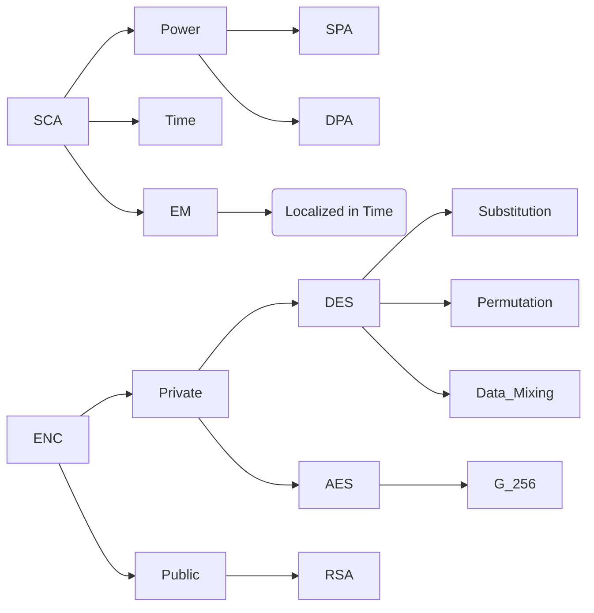

Date: 30th September 2024
Date Modified: 30th September 2024
File Folder: Week 6
#Electronics

```ad-abstract
title: Today's Topics
collapse: open

- Topic1
- Topic2
- Topic3

```

# Chapter 8 Review

## Overview



```ad-important
title: RSA Review
$$c = m^e \mod n$$
$$m = c^d \mod n$$
$$n=pq$$
$$\phi(n)=(p-1)(q-1)$$
$$GCD(e, \phi(n)) = 1$$
$$ed \mod \phi(n) = 1$$
```

```ad-example
title: DEA Review
![[Hardware Security - Week 6 Day 1 2024-09-30 14.13.25.excalidraw]]
```

## Questions

![[Review of chapter 8 and class discussion questions.pdf]]


