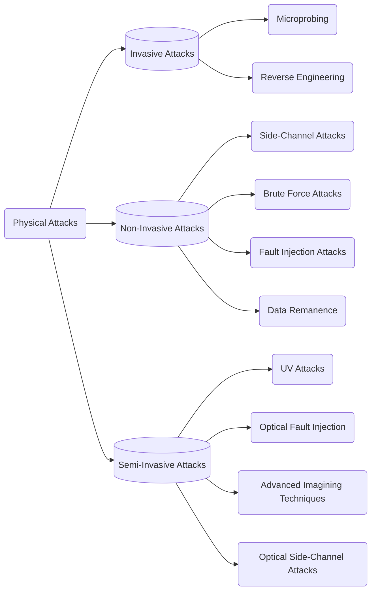

Date: 23rd October 2024
Date Modified: 23rd October 2024
File Folder: Week 9
#Electronics

```ad-abstract
title: Today's Topics
collapse: open

- Topic1
- Topic2
- Topic3

```

# Chapter 10: Physical Attacks and Countermeasures

## Classification of Physical Attacks




## Non-Invasive attacks

```ad-summary
Do not require *de-capsulation* or *de-layering* of the device, so it is non-destructive
```

Do not require any initial preparation of the device under test
- Easily reproducible, so they are not expensive
- Can take a lot of time to find an attack on any particular device.

```ad-note
Does not leave tamper evidence, so the users may not be aware of the attack
```

![[Pasted image 20241023141156.png]]

## Invasive Attacks

**Expensive to Perform**:
- Require expensive equipment
- Knowledgeable attacks
- Significant amount of time
- Almost unlimited capabilites to extract ifnormation from chips and understand their funcitonality
- Leave Tamper evidence/destroys the device
- Getting mroe demanding as complexity increases

**Tools**:
- IC soldering/desoldering station
- simple chemical lab and high-resolution opitcal microscope
- Wire bonding machine, laser cutting, microprobing
- Oscilloscope, logic analyzer, singal generator
- Scanning electron microscope and focused ion beam workstation

![[Pasted image 20241023141531.png]]

### Sample Preparation

Starts with either a partial or full *decapsulation* of the chip to expose the die.

```ad-summary
title: Definiton
**Decapsulation**: The process of the removal of the chip package.
- It can be done easily by anyone who has low level chemistry knowledge
- Only need to do some practice on a dozen chips
```

**Deprocessing** is the opposite process of the chip fabrication
- It has two main applications:
	1. Removing passivation layer to expose metal layers for microprobing attack.
	2. Gaining access to the deep layers to observe internal structure of the chip

Three basic methods:
- Wet chemical etching
- Plasma etching, also known as dry etching
- Mechanical polishing

#### Manual Decapsulation

![[Pasted image 20241023142024.png]]

![[Pasted image 20241023142035.png]]

![[Pasted image 20241023142126.png]]

Decapsulation can be done form the rear side of the chip
- Access to the chiop die can be established without using any chemical
- It requires to mill down to the copper plate, which can be then removed mechanically.

#### Automated Decapsulation

For large quantities, automated decapsulation systems can be used
- Very little skill or expereience is needed
- *very expensive*: areound $15,000 for the machine
- Also, they consume ten times more acid than manual decapsulation, so the disposal of the waste should be done in proper way.

![[Pasted image 20241023142419.png]]

### Reverse Engineering

Try to understand the *structure* of the device ant its *functionality*:
- Finding transistors and interconnections
- All the layers of the chip are removed one by one in reverse order and photographed to determine the internal structure of the chip
- Eventually, be processing obtain information, circuit netlist can be created and used to simulate the device.

```ad-warning
Tedious and time-consuming process
```

For smartcards and microcontrollers, both *structural* AND *program-code* reverse engineering is required.

#### Imaging

**Optical Imaging**:
- Works on chips down to $0.18 \micro m$ feature size, an optical microscope with a digital camera can be used

**Scanning Electron Microscopy (SEM)**:
- For semiconductor chips fabricated with $0.13 \micro m$ or smaller, with good resolution up to around $10nm$

![[Pasted image 20241023144040.png]]

### Memory Extractions

**From Mask ROMs**
- Only possible for certain types of Mask ROM memory
- NOR Mask ROM can sometimes be read by removing a certain number of metal layers
- However, often needs detailed reprocessing


![[Pasted image 20241023144210.png]]

### Microprobing

- Used for both *Confidentiality* and *Integrity* violations eaves dropping on signals inside a chip
- Can be sued for extraction of secret keys and memory contents
- Injection of test signals and observing reaction
- Laser cutter to remove passivation and cut metal wires

```ad-note
The most important tool for microprobing attacks is microprobing station which consist of a microscope, stage, device test socket, micormanipulators and probe tips. By the means of microscope, attacker sees the itnernal strucutre of the chip and using micromanipulator and microscope, attacker moves a probe tip with submicron precision to the deseried signal wire.
```

**Microprobing is applied to the internal CPU data bus**
- Difficult to observe the whole bus all at once
- There are a limited amount of probes
- Two to four probes are used to observe data signals which are combined as a whole trace later

#### Laser Cutting

```ad-summary
Used to remove passivation layer to observe the metal layer
```

Has the following:
- Laser head mounted on camera port of a microscope
- Submicron-precision stage to move the sample

```ad-warning
If we remove the whole passivation layer, there is a higher chance of short-circuiting. Small layers are removed for every trace needed.
```

![[Pasted image 20241025140936.png]]

#### Focused Ion Beam Workstation

FIB stations can be used to create test points, imaging, and repairing of devices that are much more dense.

![[Pasted image 20241025141036.png]]

![[Pasted image 20241025141104.png]]

![[Pasted image 20241025141132.png]]

### Chip Modification

Used to disable security protection circuitry:
- By cutting one of the interal metal interconnection wires
- By completely destroying the circuit associated with the security protection using a laser cutter

```ad-warning
Chip modification always required at least partial reverse engineering of the chip to find the point for possible attack
```

![[Pasted image 20241025141341.png]]

## Semi-Invasive Attacks

- Relatively new
- Gap between non-invasive and invasive attacks
- Similar to invasive as you need to de-package the device
- However, does not need expensive tools

```ad-example
UV light is used to disable security fuses in EPROM for many years
```

![[Pasted image 20241023141521.png]]


