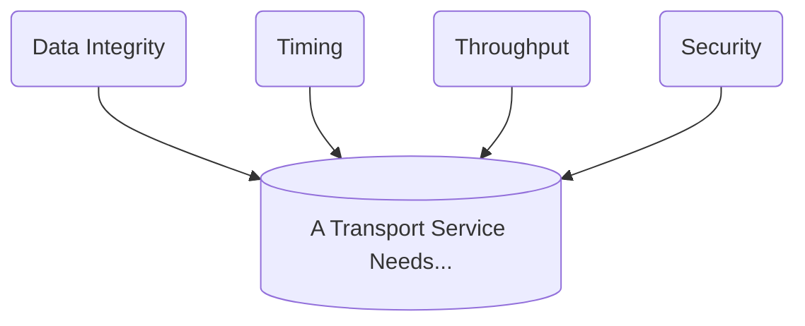

Date: 18th November 2024
Date Modified: 18th November 2024
File Folder: Week 13
#networks

```ad-summary
title: Today's Topics
- Topic 1
- Topic 2
- Topic 3
```

# Client Sever, P2P, SSL, TLS, HTTP

## Network Applications

```ad-summary
title: Definition
Network software applications that utilize the Internet or other network hardware infrastructure to perform useful functions.
```

These applications have been the driving force behind the Internet’s success, motivating people in homes, schools, governments, and businesses to make the Internet an integral part of their daily activities.

Write programs that run on different ends systems that communicate with each other over the network.

## Architectures

The application architecture is designed by the application developer and dictates how the application is structured over the various end systems.

Either uses:
- Client-Sever Architecture
- Peer-To-Peer Architecture

### Client-Sever Architecture

**Server**:
- Always-on Host
- Permanent IP address
- Data centers for scaling

**Clients**:
- Communicate with server
- May be intermittently connected
- May have dynamic IP addresses
- Do *not* communicate directly with each other

![[Pasted image 20241118090916.png]]

**Server Transmission**: Must *sequentially* send (upload) $N$ file copies

$N$ is the number of clients. Each client must download file copy

![[Pasted image 20241118091244.png]]

### Peer-To-Peer (P2P) Architecture

- *no* always-on server
- Arbitrary end systems directly communicate
- Peers request service from other peers, provide service in return to toher peers

```ad-important
*Self Scalability*: New peers birng new service capacity, as well as new service demands
```

- Peers are intermittently connected and change IP addresses

![[Pasted image 20241118091030.png]]

**Distribution TIme**: The time to get a copy of the file to all $N$ peers

```ad-question
HOw much time does it take to distribute file (size $F$) from one server to $N$ peers?
- Peer upload/download capacity is a limited resource
```

![[Pasted image 20241118091128.png]]

![[Pasted image 20241118091327.png]]

## Processes Communication

```ad-summary
title: Defintion
**Process**: A program that is running within an end system (host)
```

**Inter-process communication**: Used to connect two processes together on the *same* host

```ad-important
Processes in different hosts communicate by exchanging *messages*
$$\quad$$
A sending rpocess creates and sends messages into the network; a receiving process receives these emssages and possibly reponds by sending messages back.
```

| Client-Server                                          | P2P                                                                           |
| ------------------------------------------------------ | ----------------------------------------------------------------------------- |
| *Client Process*: Process that initiates communication | Applications with P2P architectures have client processes & server processes  |
| *Server Process*: Process that waits to be contacted   |                                                                               |
### Addressing Processes

Each process must have an *identifier* to get messages:
- Host device has unique 32-bit IP address


```ad-question
Does IP address of host on which the process runs suffice for identifying the process?
```

*NO*, many processes can be running on the same host

**Identifier**: Includes both *IP Address* and *port numbers* associated with process on host

### Application Layer Protocol Defines…

1. *Types of messages exchanged*: Request, response
2. *Message Syntax*:  What fields in messages & how fields are defined
3. *Message Semantics*: Meaning of information in fields
4. *Rules* for when and how processes send & respond to messages

| Open Protocols | Proprietary |
| -------------- | ----------- |
| HTTP, SMTP     | Skype       |

## Transport Protocols

### What Does a Transport Service Need?



**Data Integrity**:
- Some apps require 100% reliable data transfer (file transfer)
- Other apps can tolerate loss (audio)

**Timing**:
- Some apps require low delay to be “effective”

**Throughput**:
- Some apps require minimum amount of throughput to be “effective”
- Other apps make sue of whatever throughput they get

**Security**:
- Encryption and Data Integrity

| Application           | Data Loss     | Throughput                                 | Time Sensitive            |
| --------------------- | ------------- | ------------------------------------------ | ------------------------- |
| File Transfer         | No loss       | Elastic                                    | No                        |
| E-Mail                | No Loss       | Elastic                                    | No                        |
| Web Documents         | No Loss       | Elastic                                    | No                        |
| Real-Time Audio/Video | Loss-Tolerant | audio: 5kbps-1Mbps <br>video: 10kbps-5Mbps | Yes, 100’s of miliseconds |
| Stored Audio/Video    | Loss-Tolerant | Same as above                              |                           |
| Interactive Games     | Loss-Tolerant | Few Kbps up                                | yes, few secs             |
| Text messaging        | No Loss       | Elastic                                    | Yes, 100’s miliseconds    |
### Services of Transport Protocols

| TCP                                                                      | UDP                                                                                                           |
| ------------------------------------------------------------------------ | ------------------------------------------------------------------------------------------------------------- |
| *Reliable Transport* between sending and receiving process               | *Unreliable Data Transfer*                                                                                    |
| *Flow Control*: Sender won’t overwhelm receiver                          | *Does **NOT** Provide* Reliability, flow control, timing, throughput guarantee, security, or connection setup |
| *Congestion Control*                                                     |                                                                                                               |
| *Connection Oriented*                                                    |                                                                                                               |
| *Does* **NOT** *Provide*: Timing, minimum throughput guarantee, security |                                                                                                               |

### Securing TCP

**SSL**: Provides encrypted TCP connection
- Data Integrity
- End-Point Authentication

*When an application uses SSL*: The sending process passes cleartext data to SSL socket; SSL in the sending host then encrypts the data and passes the encrypted data to the TCP socket.
- Encrypted data travels over the Internet to the TCP socket in the receving process
- The receiving socket passes the encrypted data to SSL< which decrypts the data
- SSL passes the cleartext data through its SSL socket to the receiving process.

#### SSL and TLS

```ad-warning
All SSL version is now deprecated. We now use **TLS**
```

| SSL (Secure Sockets Layer)                                    | TLS (Transport Layer Security)                                                                |
| ------------------------------------------------------------- | --------------------------------------------------------------------------------------------- |
| Supports older algorithms with known security vulnerabilities | Uses advanced encryption algoirthms                                                           |
| MD5 algorithm, OUTDATED for MAC generation                    | Uses Hash-Based Message Authentication Code (HMAC) for more complex cryptography and security |

```ad-note
**Forward Secretcy (FS)**: A cyrptographic secuirty feature that protects sensitive data by frequently changing the keys used to encrypt and decrypt information
```

## Web and HTTP

```ad-summary
- *Web page* consists of *objects*
- Object can be HTML file, JPEG image, Java applet, audio file,...
- Web pages consists of *base HTML-file* which includes *several referenced objects*
- Each boejct is addressable by *URL*
```

![[Pasted image 20241118094256.png]]

### HTTP Overview

**HTTP: Hypertext Transfer Protocol**: Web’s application layer protocol client/server model

*Client*: Browser that requests, receives, and displays Web objects

*Server*: Web server sends objects in response to requests

![[Pasted image 20241118094415.png]]


**Uses TCP**:
- Client Initiates TCP connection to server, port `80`
- Server accpets TCP connection from client
- HTTP messages exchanges between browser and Web server
- TCP connection closed

![[Pasted image 20241118094513.png]]

```ad-important
There are *two* types of HTTP connections:
- *Non-Persistent*
- *Persistent*
```

### Non-Persistent HTTP

```ad-summary
At most one object sent over TCP connection, where the conneciton is then closed. Downloading multiple objects requires multiple connections
```

![[Pasted image 20241118094618.png]]

![[Pasted image 20241118094626.png]]

```ad-note
$$\mbox{Non-Persistnet HTTP Reponse Time}= 2\mbox{RTT} + \mbox{File Transmission Time}$$
```

### Persistent HTTP

```ad-summary
Multiple Objects can be sent over a single TCP conneciton between client, server
```

