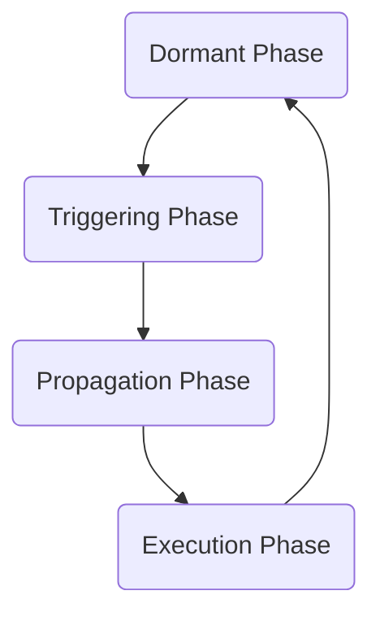
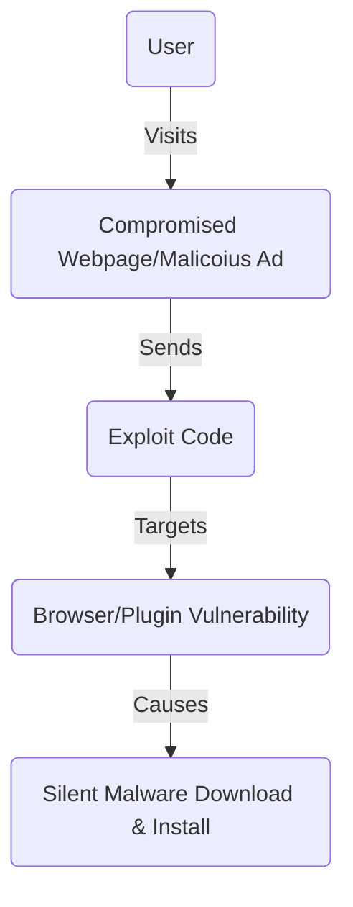

Date: 7th April 2025
Date Modified: 7th April 2025
File Folder: Week 11
#computersecurity

```ad-abstract
title: Today's Topics
collapse: open

- Topic1
- Topic2
- Topic3

```

# Software Engineering

## Malware

```ad-summary
title: Definition
Malcious software is any software devleoped to compromise the confidentiality, integrity, or availability of data. Malware can be used to steal, modify, or deny user data.
```

![[Malware-classification.png | center]]

### Malware Propagation

How is malware spread from one computer to another:
1. **Infected Content**: 
	- Viruses - self-replicate and spread within an infected dev ice or through infected email attachments or links
2. **Vulnerability Exploits**:
	- Worms - Self-replicate and spread to other devices over a network
3. **Drive-by Downloads**: Unintentional downloads of malicious code form compromised websites
4. **Social Engineering**:
	- Spam - Unsolicited bulk email
	- Trojan Horses - Program or utility containing harmful hidden code
	- Mobile Phone Trojans - Trojans that target smartphones

#### Viruses

```ad-summary
Piece of software that infects programs by modifying the program, replicates and infects other contents and spread thorugh the network environment
```

*Three Main Components*:
1. **Infection Mechanism**: How it spreads and propogates
2. **Trigger**: Event or conditon that determines when the payload is activated or delivered
3. **Payload**: What the virus does. Tries to cause damage or be benign but have activity overtime.

##### Virus Phases



#### Worms

```ad-note
- Autonomous
- Exploits Flaws
- Crates Luanchpads
- Carries Payload
```

![[3-s2.0-B9780124158153000042-f04-02-9780124158153.jpg | center]]

#### Worm Replication

**User-assisted/Shared Channels**:
- E-mail or instant messenger
- File-sharing

**Network Service Exploitation**:
- Remote execution
- Remote file access or transfer
- Remote Login

#### Drive-By Downloads

Exploits *browser/plugin vulnerabilities* when a user visits a compromised/malicious webpage, forcing malware download/installation without user consent.
- Usually does not self-propagate
- Spreading requires more users to visit the infected page



## Payload Classification

1. **System Corruption**: Payloads that damage or disrupt the system/data
	- Data destruction
	- Ransomware
	- Real world damage
	- Logic bomb
2. **Attack Agent**: Turns the infected computer into a tool that the attacker can use for *other malicious activities*
	- Bots
3. **Information Theft**: *Stealing sensitive information* from the user or the system
	- Keyloggers
	- Spyware
4. **Stealthing**: *Hiding the malware’s presence* on the system and ensuring the attacker *maintains access* over time
	- Backdoors
	- Rootkits

### System Corruption Examples
#### Example 1: Chernobyl Virus (CIH)

**Year**: 1998, nickname “Spacefiller”

**Type**: *Parasitic Virus* (infected executable files), *memory resident*

**Trigger**: April 26h, the anniversary of the Chernobyl nuclear disaster

**Infection**: Attached itself to an .exe file on Win 95 and 98

**Spread**: Infected file transfer on a new machine and running it. It would then infect other executables on that machine

**Payload**:
- Overwrote the first megabyte of the hard drive with zeros
- Attempted to overwrite the system BIOS firmware. ON success, the computer won’t boot

**Motivation**: Make a point that security measures could be bypassed

**Impact**: Incredibly destructive for its time

#### Example 2: Klez Worm

**Year**: October 2001

**Type**: *mass-mailing worm*, primarily infecting Windows systems

**Trigger**: Typically triggered on the 13th day of odd-numbered months and 6th day of even month

**Spread**: Emailing copies of itself to contacts found in user’s address book and in files on the system

**Payload**:
- Overwrote the files on the hard drive with zeroes
- It can stop and delete some anti-virus programs running on the system

**Motivation**: Unknown; inference from behavior - damage, data loss, no financial goals

**Impact**: Massive data loss for victims

#### Example 3: PC Cyborg

**Year**: 1989; the first-ever ransomware; also called AIDS Trojan

**Type**: Trojan Horse

**Trigger**: Number of system reboots (90th boot)

**Spread**: Via physical mail on floppy disks sent to the mailing list of subscribers

**Motivation**: Attributed to Dr. Joseph Popp. Potentially financial gain, claimed goal of funding AIDS research, possible revenge after job rejection, or mentally instability.

**Payload**:
- Hid directories and encrypted filenames on the C: drive using symmetric encryption
- Demanded payment ($189 or $378) be mailed to a PO Box in Panama for a “license” to restore access

**Impact**:
- Significant disruption and data access issues
- Establish the concept of ransomware
- Limited spread due to physical distribution, generated significant media attention and analysis

#### Example 4: WannaCry

**Year**: May 2017

**Type**: Ransomware Crypto-worm

**Trigger**: NO trigger; encryption began shortly after successful infection/propagation. Spread was continuous

**Spread**: Primarily via network vulnerability exploit; used the EternalBlue exploit targeting the SMBv1 protocol in unpatched Microsoft Windows systems. Scanned networks automatically o find and infect vulnerable machines without user interaction.

**Payload**:
- Encrypted a wide variety of file types on Windows computers using strong encryption
- Demanded ransom in *Bitcoin* via a ransom note with a countdown timer.
- Threatened price increases or permanent loss of decryption key after deadlines

**Motivation**:
- Financial gain
- Widespread disruption/chaos

**Impact**:
- Massive global disruption affecting hundreds of thousands of computers across ~150 countries
- Crippled numerous organizations, including hospitals, telecom companies, logistics, car manufactures

#### Example 5: Stuxnet Worm

**Year** Discovered 2010, likely developed two to five years later

**Type** Highly sophisticated computer worm

**Trigger**: Detecting specific Siemens Step7 PLC software managing specific models of frequency converter drives used in U enrichment centrifuges

**Infection**: Primarily USB flash drives, exploited a Windows Shell .LNK zero-day vulnerability to cross airgaps

**Spread**: Exploited vulnerabilities like Print Spooler, SMB, and Siemens WinCC database flaws

**Payload**:
- Gathered intelligence about the specific industrial control system environment.
- Subtly altered the freuqency of the centrifuge motors controlled by the targeted PLCs, cuasing them to spin too fast or too slow, inducing stress and leading to physical damage/failure over itme.
- It hid the sabotage by replaying previously recorded normal sensor data back to the operators, making the system appear to be functioning correctly

**Motivation**: Probably a state-sponsored cyberweapon with the geopolitical goal of sabotaging and slowing down Iran’s nuclear enrichment program.

### Botnet

Malware that compromises a device, turning it into a remotely controlled “zombie” used for malicious tasks


![[674e151a41368d4d2bdf765b_63fe170e62c192dc2240bef1_181.3.png]]

**Command & Control Server**
- A central server that the bots connect to receive instructions form the Botmaster and sometimes send stolen data back

*Performs the Following Tasks:
- Launch DDoS
- Send Spam emails
- Click fraud
- Data theft
- Bitcoin mining
- Spreading Malware
- Chatterbots
- Filesharing
- Spyware

#### Examples

**Mirai**:
- Uncovered in 2016
- Against IoT devices
- Responsible for massive DDoS attack via IoT bots
- Attacked Dyn which took down Netflix, Twitter, GitHub Reddit

**3ve**
- Carried out ad fraud using nearly 2 million PCs
- It clicked on ads on over 10,000 fake websites
- Raked in an estimated $30 million before taken down by FBI

**Mantis**:
- Infected around 5000 servers
- Launched unprecedented 26 million RPS DDoS attack using HTTPs protocol against ISP, media, telecommunciaitons, finacne, and gaming websites
- Using powerful servers allowed Mantis botnet to carry out HTTTPS attacks that require far more computational resources to execute

#comebacklater 
