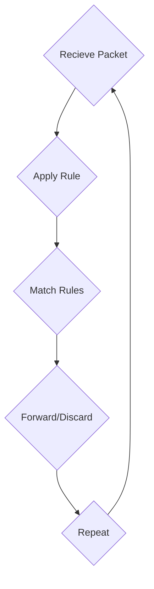

Date: 28th April 2025
Date Modified: 28th April 2025
File Folder: Week 14
#computersecurity

```ad-abstract
title: Today's Topics
collapse: open

- Topic1
- Topic2
- Topic3

```

# Firewalls Day 2

## Packet-Filtering Firewall

**Discard Policy**:
- Prohbiit unless permitted
- Conservative
- Controlled
- User Visibility

**Forward Policy**:
- Permit unless prohibited
- Easier to Manage
- Easier to Use
- Less Secure



```ad-example
![[Pasted image 20250428140828.png]]
```

### Advantages and Weaknesses

**Advantages**:
- Simple
- Typically transparent to users and are very fast

*Weaknesses*
- Cannot prevent attacks that employ application-specific vulnerabilities or functions
- Limited logging functionality
- Do not support advanced user authentication
- Vulnerable to attacks on TCP/IOP protocol bugs
- Improper configuration can lead to breaches

### Attacks Against Packet Filtering

**IP Address Spoofing**
- Transmits packets from outside with the source IP address as the address of an internal host.
- Facilitates DDoS and MiTM attacks

```ad-important
title: Countermeasure
Discard packets with an inside source address. Implemented at the router external to the firewall
```

**Source Routing Attack**:
- An IP option that allows the sender of a packet to specify the path the packet must take the reach its destination
- Attackers abuse this feature by crafting packets with a specified source route
- Facilitiates secuirty bypass, network reconnaissance, and traffic interception
- Disabled by default

```ad-info
title: Countermeasure
Discard all packets that use the soruce routing option
```

## Stateful-Inspection Firewall

Tightens the rules for TCP traffic by creating a directory of outbound TCP connections
- An entry for *each* currently established connection
- Packet filtering can allow incoming traffic to high numbered ports only for those packets that fit the profile of one of the entries in this directory

Reviews packet information, but also records information about TCP connections
- Keeps track of TCP sequence numbers to prevent attacks that depend on the sequence number
- Inspects data for protocols like `FTP`, `IM`, and `SIPS` commands

```ad-example
![[Pasted image 20250428142135.png]]
```

## Application-Level Gateway

Must have proxy code for each application
- May restrict application features supported
- Tend to be more secure than packet filters
- *Disadvantage*: The addition processing overhead on each connection

![[maxresdefault.jpg | center]]

## Circuit-Level Gateway

Sets up two TCP connections, one between itself and a TCP user on an inner host and one on an outside host
- Relays TCP segments form one connection to the other without examining contents
- Security function consists of determining which connection will be allowed.

**Typically Used when Insider Users are Trusted**
- May use application-level gateway inbound and circuit-level gateway outbound
- Lower overheads

![[b.png | center]]

## Firewall Basing

1. **Bastion Host**: A server acting as a secure gateway
2. **Host-Based**
3. **Network-Based**

### Bastion Hosts

- System identified as a critical strong point in network’s security
- Servers as a platform for application-level or circuit-level gateways
- Acts as a secure gateway

Common characteristics:
- **Hardened Security**: Configured to withstand attacks
- **Controlled Entry Point**: Users must connect to the bastion first
- **Single Purpose**: Each proxy can restrict features, hosts accessed
- **Strong Authentication and Monitoring**: Access tightly controlled, need MFA, logged and monitored
- **Location**: Placed in a DMZ or outside a firewall

## Example Firewall Configurations

### Basic Example with DMZ

**DMZ**: An isolated perimeter network segment placed between the internal network and the Internet
- *Purpose: To securely host public-facing services while protecting the internal network

**Benefits**:
- Adds an extra layer of secuirty
- Isolates public services
- Improves access control and monitoring

*Internal Firewall Purpose*:
1. Adds more stringent filtering capability
2. 2-way protection w.r.t DMZ
3. Protect portions of internal network from each other

![[Pasted image 20250428143641.png]]

## Firewall Topologies

1. **Host-Resident**: Includes personal firewall software and firewall software on servers
2. **Screening Router**: Single router between internal and external networks with stateless or full packet filtering
   
   ![[Pasted image 20250428144253.png]]
   
3. **Single Bastion T**: Has a third network interface on bastion to a DMZ where externally vsible servers are in place
   
   ![[Pasted image 20250428144247.png]]
   
   4. **Double Bastion Inline**: DMZ is sandwiched between bastion firewalls
 ![[Pasted image 20250428144317.png]]
 5. **Double Bastion T**: DMZ is on a separate network interface on the bastion firewall

![[Pasted image 20250428144415.png]]

1. **Distributed Firewall Configuration**: Used by large businesses and government organizations

![[Pasted image 20250428144526.png]]

## Intrusion Prevention System

- Extension of IDS
- Capability to block or prevetn detected malciious activity
- Host-based, network-based, distributed
- Can use anomaly, signature/heuristic for detection

## Summary

![[Pasted image 20250428144640.png]]

