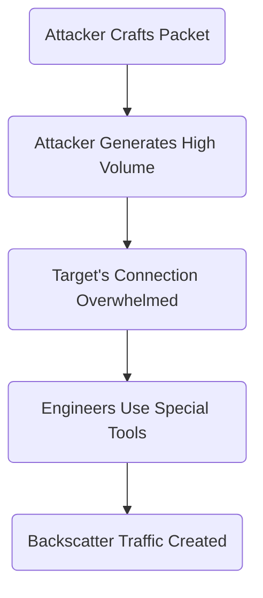
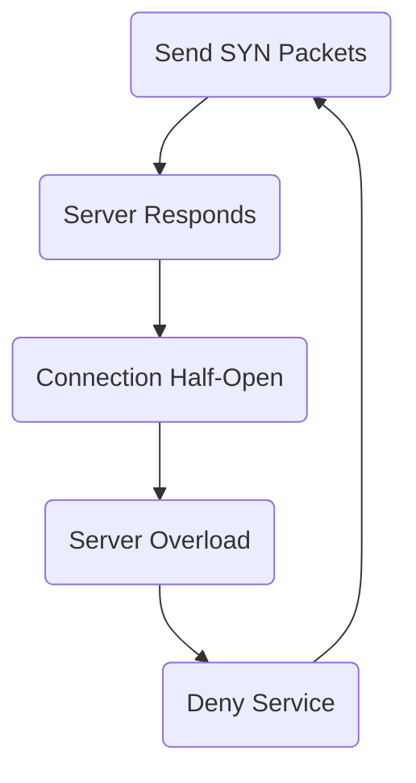

Date: 7th May 2025
Date Modified: 7th May 2025
File Folder: Week 15
#computersecurity

```ad-abstract
title: Today's Topics
collapse: open

- Topic1
- Topic2
- Topic3

```

# Denial-of-Service Attacks

## Introduction

```ad-summary
title: Definition
An action that prevents or impairs the auhtorized use of netowrks, systems, or applciations by exhausting resources such as CPU, memory, bandiwth, and disk space
```

**Three Main Categories**:
1. *Network Bandwidth*:
	- Relates to the bandwidth of the network links connecting a sever to the Internet
	- For most organizations, this is their connection to their ISP
2. *System Resources*: Aims to overload or crash the network handling software
3. *Application Resources*: Typically involves a number of valid requests, each of which consumes significant resources and thus limited the ability of the sever to respond to request from other users.

## Types of Attacks

1. **Protocol Based**
	- Ping of Death
	- Smurf DoS
	- SYN floods
	- Fragmented packets
- **Application-Layer**
	- GET/POST floods
	- Low-and-Slow attacks
- **Volume-based**
	- Spoof-Packet Floods
	- ICMP floods
	- UDP floods

## Classic DoS Attacks

**Flooding ping command**:
- Aim is to overwhelm the capacity of the network connection to the target organization
- Traffic can be handled by higher capacity links on the path, but packets are discarded as capacity decreases
- Source of the attack is clearly identified unless a spoofed address is used
- Network performance is noticeably affected

## Source Address Spoofing



### SYN Spoofing


![[Pasted image 20250507143743.png | center]]

## Flooding Attack

Intent is to overload the network capacity on some link to a server
- Classified based on what protocol is used
- Virtually any type of network packet can be used

**Types**:
1. *ICMP*
	- Ping flood using echo request packets
	- These packets are typically allowed because the ping tool is useful for network diagnostics
2. *UDP*
	- Uses UDP packets directed to some port number
3. *TCP/SYN*
	- Sends CP packets
	- Total volume of packets is the aim the attacker rather than the system code
4. *HTTP*
	- Attacks that hit webservers

## DDoS Attacks

Uses multiple systems to generate atacks
- Attacker uses a flaw in an OS or a common application to gain access and install programs on it (zombie)
- Large collections of such systems under control of one attacker can be created, forming a *botnet*

![[Pasted image 20250507144146.png]]

## Defenses

```ad-warning
Cannot be prevented entirely as high traffic volumes may be legitimate
```

Four lines of defense against DDoS attacks
- **Attack Prevention and Preemption**
- **Attack Detection and Filtering**
- **Attack source traceback and identification**
- **Attack Reaction**

### Prevention

- Block spoofed source addresses
- Filters to ensure path back to the claimed source address is the one being used by the current packet
- Modified TCP connection handling code

### Responding
- Identify type of attack
- Have ISP trace packet flow back to soruce
- Implement contingency plan
- Update incident response plan

