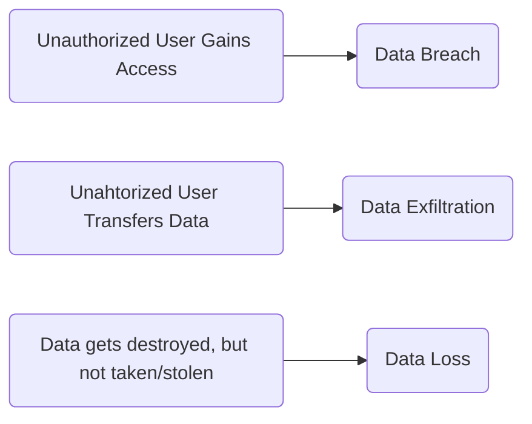

	Date: 27th January 2025
Date Modified: 27th January 2025
File Folder: Week 2
#computersecurity

```ad-abstract
title: Today's Topics
collapse: open

- Computer Security Concepts

```

# Computer Security Concepts

## Opening Scenario: *A Business Trip to South America Goes South*

```ad-summary
title: Scenario
A 10-person consulting firm sent a small team ot South America to complete a client project. During their stay, an employee used a buisness debit card at a local ATM. A month after returning to the US, the firm received overdrafted notices form their bank. They identified fraudulent withdrawals of $13,000, all originating from South America. There was an additional $1,000 overdraft fee.
```

**Attack**: The criminals installed an ATM skimmer device to record card account credentials.

**Response**: The bank account was closed immediately. Their attempts to pursue reimbursement from the bank were unsuccessful. They were then charged an extra $1,000 overdraft fee from the firm owner’s account

**Impact**: The entire cash reserve was depleted and the firm owed $15,000

### Three Fundamental Questions

1. What assets do we need  to protect?
2. How are those assets threatened?
3. What can we do to counter those threats?

Should have used *two* business accounts:
- one for receiving and making small payments
- An actual large holdings account
## CIA Triad

![[Computer Security Week 2 - Day 1 2025-01-27 14.23.03.excalidraw]]

![[Pasted image 20250129140421.png]]
## Key Security Concepts

1. Confidentiality
2. Integrity
3. Authenticity
4. Availability
5. Accountability

![[sec-concepts.png]]

## Levels of Impact


| Low                                                                                                                         | Moderate                                                                                                                       | High                                                                                                                                 |
| --------------------------------------------------------------------------------------------------------------------------- | ------------------------------------------------------------------------------------------------------------------------------ | ------------------------------------------------------------------------------------------------------------------------------------ |
| Loss could be expected to have a limited adverse effect on organizational operations, organizational assets, or individuals | The loss could be expected to have a serious adverse effect on organizational operations, organizational assets, or indviduals | The loss could be expected to have a catastrophic adverse effect on organizational operations, organizational assets, or individuals |

## Computer Security Challenges

1. Is it simple?
2. Potential attacks on security features
3. Physical and logical placement of these features
4. Proper funcitoning of the security mechanism
5. Attacker needs to find a single weakness
6. Security should be included in the design rpocess
7. It requires regular and constant monitoring
8. Security as an impediment to efficient and user-friendly operations

## Definition of Cybersecurity

```ad-summary
title: Definition by NIST
Measures and controls that ensure confidentiality, integrity, and avialability of information system assets including, hardware, software, firmware, and information being processed, stored, and communicated
```

## Countermeasures

![[Pasted image 20250129141110.png]]

## Vulnerability

```ad-summary
title: Definition
A weakness or flaw in a system's design, implementation, operation, or management
```

```ad-example
A rotuer with a defualt password is a vulnerability resulting from poor implementation.
```

### Other Terms

A **threat** is any event that can potentially impact a system negatively through unauthorized access, destruction, disclosure, modification of data, and/or denial of service.

A **threat actor** is a person or group who exploits a vulnerability

An **attack** is any kind of malicious activity that attempts to collect, disrupt, deny, degrade, or destroy information system resources or the information itself.

A **data breach** is the exposure of data to an unauthorized user.

**Data Loss** is the loss of access to data.

**Data exfiltration** is the unauthorized transfer of data

An **attack vector**, or threat vecotr, is a path or means by which an attack is realized.



### Computer Vulnerabilities

1. Weak Authentication
2. Lack of Access Control
3. Errors in Programs
4. Finite or insufficient resources
5. Inadequate Physical Protection


### Kinds of Threats

![[Pasted image 20250129142532.png]]

### Kinds of Attacks 

**Attacks**:
1. Active
2. Passive
3. Insider
4. Outsider

**Types of Attackers**:
1. Hacker
2. State Actor
3. Advanced Persistent Threat (APT)
4. Hacktivist
5. Phishers and Malware Developer

| Security Hacker | Permission      | Intention     | Motivation        | Legality                        |
| --------------- | --------------- | ------------- | ----------------- | ------------------------------- |
| White Hat       | Authorized      | Non-Malicious | Finanical         | Legal                           |
| Gray Hat        | Semi-authorized | Non-Malicious | Improved Security | Illegal (in most jurisdictions) |
| Black Hat       | Unauthorized    | Malcicious    | Profit            | Illegal                         |

### Further Breaking Down Attacks

![[Pasted image 20250129143234.png]]

### Computer Security Scope

![[Pasted image 20250129143841.png]]

## Attack Surface

```ad-summary
Consists of the reachable and exploitable vulnerabilities in a system.
```

![[Pasted image 20250129143923.png]]
## Security **Requirements**

1. Access Control
2. Awareness and Training
3. Audit and Accountabillity
4. Certification, Accreditation and Security Assessments
5. Configuration Management
6. Contingency Planning
7. Identification and Authentication
8. Incident Response
9. Maintenance
10. Media Protection
11. Physical and Environmental Protection
12. Planning
13. Personnel Security
14. Risk Assessment
15. Systems and Services Acquisition
16. System and Communication Protection
17. System and Information Integrity

## Fundamental Security Design Principles

![[Pasted image 20250129144745.png]]

## Computer Security Strategy

![[Pasted image 20250129145055.png]]


