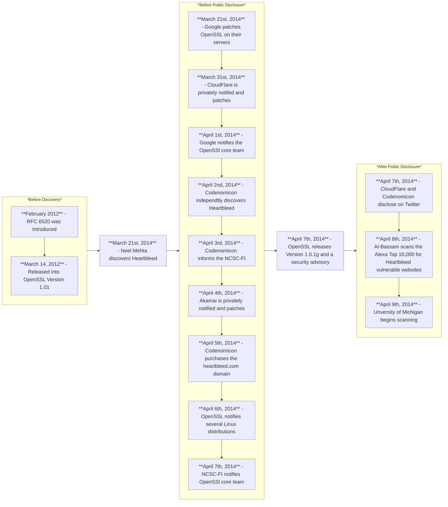

Date: 27th February 2025
Date Modified: 27th February 2025
File Folder: Week 6
#computersecurity

## Author Information

```ad-summary
**Name**: Ethan Berei
**Date**: March 5th, 2025
**Chosen Vulnerability**: Heartbleed Flaw (OpenSSL)
```
## Introduction

When it comes to the world of cybersecurity, it is often rare for a security issue to be widespread across almost all systems. Typically, attacks are specifically target a small number of victims by exploiting a common attack surface that they share. However, sometimes the attack surface can be mutual across a large number of systems, leading to widespread vulnerabilities. Many classical cyber attacks, such as the Morris Worm and ILOVEYOU viruses, affected millions of individual systems over their time and caused billions in damages [1]. However, between the years of 2012-2014, there was a vulnerability that affected the confidentiality of two-thirds of TLS-encrypted website traffic, instant messaging, emails, virtual private networks (VPNs), and more [2].

OpenSSL is a robust and open-source toolkit that focuses on both general-purpose cryptography and secure communication [3]. It is licensed under the Apache License, which means it is free-to-use anywhere. The **Heartbleed Vulnerability** gave the opportunity for systems protected by OpenSLL software to have their system’s memory leaked [4]. Attackers had the power to view sensitive communications, take data from services, and use the likeness of services and users for their own gain. Major vendors were made aware of the vulnerability in the on April 7th, 2014 and affected a minimum 17% of all SSL servers for around two years[5-6].

Based on the potential for vulnerabilities like Heartbleed, it is evident that the need for cybersecurity solutions spans past the need of professionals but also for society as a whole. Individuals could have their sensitive information leaked. Companies could risk a financial loss or a loss of reputation that would collapse them. And in the case of Heartbleed, the critical infrastructure behind having a confidential and safe Internet was placed at risk through a seemingly harmless bug.  The report deliberates on how the attack was abused, the impact of the vulnerability worldwide, how using the attack can be ethically harmful to society, and the proposed security recommendations can be used to prevent a similar failure in the future.

## Attack Analysis

 In the TLS/SSL protocol, which are used to secure almost all Internet connections today, there is a component that is known as the *heartbeat*. It is a critical process where two computers exchange encrypted messages during downtime in the connection to ensure that the connection is still healthy. The first computer will send a heartbeat request to the other, which the receiver responds with a file of the requested size. This encrypted message can be of variable sizes of up to 64 kilobytes to ensure validity of the connection and reduce the opportunity of corruption. However, this variable size is instrumental in how the exploit works. In vulnerable versions of the OpenSSL library, the implementation of the heartbeat failed to check if the request was actually as long as it was advertised. Therefore, a malicious actor could purposefully send a heartbeat request that has been tampered to pretend that it is longer than it actually is. To prove it’s validity, the receiver would then allocate an amount of memory that leaks into other sections of the memory buffer. The receiver would then send back it’s heartbeat response that contained both the original request’s message and a copy of part of the memory buffer that it was not meant to send back. . **Figure 1** below illustrates both a benign and a malicious example:

![[Project 1 - Understanding Real-World Cyber-Attacks and Analyzing the Societal and Ethical Impact of Cybersecurity Solutions 2025-03-03 14.44.58.excalidraw]]
<center> <b>Figure 1</b>: Normal Heartbeat Vs. Heartbleed Exploit</center>

Heartbleed is attributed from a simple implementation mistake in it’s programming that was not caught for years. Specifically, a single line of code can be attributed to causing the error: `memcpy(bp, pl, payload`). This is command that is used to quickly copy data from one file/variable to another. `bp` is the target address, while `pl` is the destination address. The `payload` represents the length of the data. However, since the package never attempted to check if `pl` is the length designated by `payload`, this command could simply be changed to leak data from the other system. In the revised version (past version 1.0.1g of the OpenSSL library), the program now does two separate checks. The first check is to make sure that the payload length is not zero, which could lead to a lack of authentication. The second check directly addresses the Heartbleed exploit by ensuring that the received payload is always equal to the size it advertises. If either are detected, the packet is dropped [5].

When compared to other attacks against cryptography, this one is particularly dangerous for multiple reasons. It allowed any user to read a portion of the memory buffer. In the worst case, the attacker does not contain anything useful and just discards the data. However, there is a chance that the exploit leaks data such as usernames, passwords, and even SSL private keys. With these credentials, a malicious attacker can log into accounts to cause damage or even impersonate someone’s digital signatures [5]. The attack was also easy to exploit by someone who had limited understanding of cybercrime since only a single line of code had to be altered alongside the primitive knowledge of reading the returning packet [6]. 

The timeline of the exploit started on March 14, 2012, when OpenSSL introduced the RFC 6520 extension (the formal name for the heartbeat protocol) into *Version 1.0.1* of their library. OpenSSL would release a few patches to their system over the following years but left their heartbeat implementation untouched for around two years. It was on March 21st, 2014 when a cybersecurity employee at Google, Neel Mehta, found the bug when he was doing a line-by-line audit of OpenSSL’s codebase. He immediately went to patch their own servers, and in response, Google would privately inform OpenSSL on April 1st. On April 2nd, a private security form by the name of Codenomicon would find the same exploit on April 2nd and report it to the Finland’s national security center. This led to a massive leak of knowledge across the globe, which made OpenSSL have to act fast. On April 7th, 2014, they officially pushed their statement on the issue shortly before the release of *Version 1.0.1g*, which patched the Heartbleed exploit. Many parties, such as CloudFlare, Facebook, and Akamai were given plenty of notice of the vulnerability while many Linux distributions only got 24 hours to prepare their patches. Plenty of other OS distributors and other companies had no idea that the exploit was a problem until the public disclosure as well [5-7]. **Figure 2** below shows a simplified flowchart of events:


<center> <b>Figure 2</b>: Heartbleed Timeline Summary</center>

When looking back to the security solutions that were in place, the Heartbleed vulnerability is one of the few mainstream vulnerabilities that did not have countermeasures or security solutions that were placed ahead of time. Based on the theory, heartbeat signals are computationally secure as long as they are implemented properly. The vulnerability itself was so ingrained in the TLS/SSL handshake that used OpenSSL as backend that there was not much counterplay outside of either not implementing the heartbeat handshake or a defense by depth approach, which would be too computationally intensive for a stream-based standard. However, a way to mitigate such an attack otherwise is to rely on the least common mechanism property, which many companies broke by choosing to only use the OpenSSL library for their website encryption. Also, many TLS implementations at the time failed to use *forward secret cipher suites*. Forward secrecy prevents attackers from subverting the confidentiality of the communications by the use of the session key. Around the time of the attack; however, only 34% of connections use forward secrecy, which left Heartbleed to run rampant [6].
## Impact Assessment

In terms of the impact, the Heartbleed vulnerability is often considered one of the most devastating cyber-attacks both in terms of the eight OpenSSL vulnerabilities and the list of vulnerabilities from the past decade [5-6].  Firstly, it affected a large number of HTTPS servers at the time. According to the Common Vulnerabilities and Exposures (CVE) database [8], Heartbleed has been referenced by 129 different vendors as either a warning, an exploit, or sent out on the vulnerability mailing list. As an example, the Oracle Corporation, known most fondly for owning the Java SE platform, has a security alert posted online that states how some Oracle products might be vulnerable to the Heartbleed vulnerability if they used OpenSSL under certain circumstances as some of their products might have used it for either symmetric or asymmetric encryption instead of for it’s TLS/SSL capabilities [9]. Out of all the HTTPS servers at the time, 17% were confirmed to have been affected by the Heartbleed exploit [5] .However, based on the multiple assumptions such has how many sites supported either the heartbeat extension or ran on vulnerable web servers, it was estimated that a maximum of 55% of the HTTPS sites from the top 1 million were vulnerable [6]. Also, through the use of port-scanning across server products and the top websites at the time, Durumeric *et al* [6] compiled a list of vulnerable previously vulnerable entities. Their results can be found in both **Table 1** and **Table 2** below:


| Web Servers      | Mail Servers | Database Servers | XMPP Servers | Other Servers  |
| ---------------- | ------------ | ---------------- | ------------ | -------------- |
| Apache (mod_ssl) | Sendmail     | MySQL            | Ejabberd     | OpenVPN        |
| Nginx            | Postfix      | PostgreSQl       | Jabberd14    | OpenLDAP       |
| Lighttpd         | Qmail        | MongoDB          | Jabberd2     | Stunnel        |
| Tomcat           | Exim         |                  |              | Openswan       |
| Google GWS       | Courier      |                  |              | Telnetd-ssl    |
| LiteSpeed        | Dovecot      |                  |              | OpenDKIM       |
| IBM Web Server   | Cyrus        |                  |              | Proftpd        |
| Tengine          | Zimbra       |                  |              | Bitcoin Client |
<center> <b>Table 1</b>: Vulnerable Server Products [6]</center>

| Site       | Vulnerable? | \|  | Site      | Vulnerable? | \|  | Site        | Vulnerable |
| ---------- | ----------- | --- | --------- | ----------- | --- | ----------- | ---------- |
| Google     | **Yes**     | \|  | Bing      | *No*        | \|  | Wordpress   | **Yes**    |
| Facebook   | *No*        | \|  | Pintrest  | **Yes**     | \|  | Huff. Post  | ?          |
| Youtube    | **Yes**     | \|  | Blogspot  | **Yes**     | \|  | ESPN        | ?          |
| Yahoo      | **Yes**     | \|  | Go.com    | ?           | \|  | Reddit      | **Yes**    |
| Amazon     | *No*        | \|  | Live      | *No*        | \|  | Netflix     | **Yes**    |
| Wikipedia  | **Yes**     | \|  | CNN       | ?           | \|  | MSN.com     | *No*       |
| LinkedIn   | *No*        | \|  | Instagram | **Yes**     | \|  | Weather.com | ?          |
| eBay       | *No*        | \|  | Paypal    | *No*        | \|  | IMDB        | *No*       |
| Twitter    | *No*        | \|  | Tumblr    | **Yes**     | \|  | Apple       | *No*       |
| Craigslist | ?           | \|  | Imgur     | **Yes**     | \|  | Yelp        | ?          |
<center> <b>Table 2</b>: Vulnerability of the Top 30 US HTTPS-Enabled Websites [6]</center>

The impact also goes broader into other applications as well. Many printers, firewalls, VPN endpoints, NAS devices, video conferencing systems, and security cameras also used OpenSSL in a way that can make them vulnerable to the Heartbleed bug. This opened up avenues where a typically safe server architecture, such as a Microsoft IIS server, could be vulnerable if they used any other communication protocols that have the Heartbleed vulnerability [6]. For example, a client for Edgescan was convinced that Heartbleed would not affect their Windows-based servers. However, attackers leveraged a firewall that was still using OpenSSL 1.0.1 that sat in front of their Microsoft Servers and found a vacation request form going out from their email client with exact name, place, and the time the email was submitted [10].

When it came to patching the vulnerability and reissuing certificates, the some server managers were quick to react, while others. All of the top 10 websites were patches within a day after the exposure, but 11.5% of the HTTPS servers in the top 1 million months after were still vulnerable [6]. They found that many of the servers were patched the week of, but the patch rate quickly dropped off after two weeks. Additionally, after the vulnerability went live, a lot of companies had to revoke their digital certificates out of the fear of their private key being leaked by Heartbleed. Therefore, the certificate authorities across the globe had to scramble to generate and verify new certificates for tens of thousands of websites, which put major strain on websites trying to get new certificates and the workers at the office. **Figure 3** below illustrates this jump in revocations after  Heartbleed being disclosed:

![[Pasted image 20250303201249.png]]
<center> <b>Figure 3</b>: Revocations after Heartbleed [6] </center>

When it came to how much attack activity was experienced, it was shocking to realize that the amount of malicious traffic before the exploit was made public was almost non-existent. Four honeypot networks by Lawrence Berkeley National Laboratory (LBNL) were setup to try and catch any possible attacks that might happen against them. According to LBNL, there was no evidence of any exploit attempt from February 2012 to April 7th, 2014.  Even though this does not prove that no other scanning attacks related to Heartbleed occurred elsewhere, it provides substantial evidence that many or all of the attacks occurred after the disclosure. After disclosure; however, a different picture was painted. LBNL observed 5948 attempts from 692 different hosts. Out of all of these attempts, seven attackers completed 103 exploit attempts against 12 different hosts [6].

Both financial burdens were felt alongside possible legal trouble to the OpenSSL team. Steve Pate from *Security Magazine* estimates that even delivering certificate revocation lists on such a large magnitude could cost several hundreds-of-thousands of dollars. He states that the common estimate of $500 million that has been thrown around by other companies is on the low side [11]. An article written by the *InfoLawGroup* shortly after the vulnerability went live states that having Heartbleed on a system is a liability that can lead to legal trouble. For example, having Heartbleed can expose private information of individuals, which goes against obligations put out by HIPAA (Health Insurance Portability and Accountability Act), many state-level breach notice laws, but not liable under federal breach laws since it is a vulnerability. However, the law also states that both state and federal laws can be enacted if a company does not notify their users about the breach via a notification and immediately patch the exploit and certificates as soon as possible [12]. Regardless of all of this, OpenSSL faced no legal ramifications still to this day since it was an implementation error rather than a malicious change.

Overall, the impact of the Heartbleed vulnerability was both immense in terms of it’s global, financial, and societal consequences. Even still to this day, there is an estimated 34,000 devices in the United States alone that are still vulnerable to Heartbleed [10]. The implemented security solutions would completely counteract the bug, but server admins had to go out of their way to both change their digital certificates and update the OpenSSL library to get the benefits of the fix. Any server who neglected the security solutions could be impersonated or risk a data breach any day now. The lack of action that OpenSSL can take directly on these stragglers plus the looming fear of an attack happening today makes Heartbleed a vulnerability that should not be estimated.

## Ethical Implications

When it comes to the ethical implications around Heartbleed, there are multiple views to be seen by the side of the attackers, the organization, and the end-users. From the side of the attackers, the ethics around their actions can be ever-expanding depending on what angle it is taken at. To simplify the case, three types of hackers will be focused on: white hat, gray hat, and black hat. White hat hackers get explicit permissions from a client to test their sever for any vulnerabilities and patch them in return for a service fee. Gray hat hackers will hack a server without permission, but will report them to an owner either recreationally or for their own personal gain. Black hat hackers will break into a system without a owner’s permission for their own personal gain in ways such as stealing data or causing data to the organization. In the case of the Heartbleed vulnerability, it is unfortunate to know that most hackers were out for stealing personal data discretely. The way the attack is used cannot be backed by any ethical practices as it goes directly against the right of privacy that are both held by the company and the end users on their servers. Similarly, the two original reporters of the bug seemed to have white hat intentions, but the Google security official only told his company first. Without the push from the Codenomicon group telling their national security institution, there was a good chance that the attack would have been kept from the public for much longer. To become more ethically inline, Google’s security expert should have reported his findings to the authorities as well, which might have prevented more damage from happening [13].

It is also within the responsibilities of an organization to uphold ethical excellence in such a data-breach-related vulnerability. Due to the complexity of such a situation, there are three different approaches that are typically taken to simplify how organizations should take responsibility: contractual view, due care theory, deep pockets view. The contractual view states that the ethical duties held by a company are purely held by legal obligations set by contracts. Due care theory holds that it is critical for an organization to understand that a customer can be vulnerable. Reasonable precautions and understanding deficits is a requirement by organizations. From the deep pockets view, it mandates that companies have a strict liability principle that makes them assume responsibility regardless of who is at fault. When it comes to the Heartbleed vulnerability, such a breach should hold the due care theory as the company cannot be held liable for a vulnerability that was out of their control. However, there are also a few corporate ethical impacts that also need to be addressed. It is often difficult for a company to exactly measure the impact caused by a data breach, so they often underestimate a breach’s impact and overlook long-term ethical implications. They tend to focus on the immediate financial consequences of the event rather than for the ethical safety of their users [14].

When it comes to the implemented security solutions, there are very little ethical considerations. After patching the bug and replacing digital signatures, the new version of OpenSSL works just like it did before and provides a safe way for TLS/SSL communications for Internet traffic. However, there is a potential bias when it comes to how the fix was pushed out. As stated before in the timeline, only certain Linux distributions and other larger companies were given private disclosure of the bug before the public. This allowed some companies to be prepared for the public disclosure by having the bug patched before anyone knew. This is ethically questionable as it gave some companies an advantage when it came to fixing the simple issue using their own patches. Their own patch implementations could also enable other attack surfaces to be in play, which can further put their customers at risk.

Looking at both the IEEE Code of Ethics [15] and the ACM Code of Ethics and Professional Conduct [16], it is clear that there are some ethical violations. Under the IEEE Code, the Heartbleed vulnerability goes against the I(1) & I(3) which are as follows:

```ad-quote
title: IEEE Code of Ethics
**Section I, Subsection 1**:

"To hold paramount the safety, health, and welfare of the public, to strive to comply with ethical design and sustainable development practices, to protect the privacy of others, and to disclose promptly factors that might endanger the public or the environment;"

**Section I, Subsection 3**:

"To avoid real or perceived conflicts of interest whenever possible, and to disclose them to affected parties when they do exist;"
```

Since the security expert and Google failed to disclose the Heartbleed violation right away to the necessary parties (OpenSSL, servers affected, official national/international authorities, and the public) even when it had their own patch for the issue ready, that group was in direct violation of the IEEE Code of Conduct as it says clearly that disclosure is key to staying morally correct. In a similar vein, there are also violations in the ACM Code of Ethics in sections 1.1., 1.2, 1.6, 1.7, and 3.1 which are as follows:

```ad-quote
**Section 1, Subsection 1**:
"This principle, which concerns the quality of life of all people, affirms an obligation of computing professionals, both individually and collectively, to use their skills for the benefit of society, its members, and the environment surrounding them. This obligation includes promoting fundamental human rights and protecting each individual's right to autonomy. An essential aim of computing professionals is to minimize negative consequences of computing, including threats to health, safety, personal security, and privacy. When the interests of multiple groups conflict, the needs of those less advantaged should be given increased attention and priority.

Computing professionals should consider whether the results of their efforts will respect diversity, will be used in socially responsible ways, will meet social needs, and will be broadly accessible. They are encouraged to actively contribute to society by engaging in pro bono or volunteer work that benefits the public good.

In addition to a safe social environment, human well-being requires a safe natural environment. Therefore, computing professionals should promote environmental sustainability both locally and globally."

**Section 1, Subsection 2**
"In this document, "harm" means negative consequences, especially when those consequences are significant and unjust. Examples of harm include unjustified physical or mental injury, unjustified destruction or disclosure of information, and unjustified damage to property, reputation, and the environment. This list is not exhaustive.

Well-intended actions, including those that accomplish assigned duties, may lead to harm. When that harm is unintended, those responsible are obliged to undo or mitigate the harm as much as possible. Avoiding harm begins with careful consideration of potential impacts on all those affected by decisions. When harm is an intentional part of the system, those responsible are obligated to ensure that the harm is ethically justified. In either case, ensure that all harm is minimized.

To minimize the possibility of indirectly or unintentionally harming others, computing professionals should follow generally accepted best practices unless there is a compelling ethical reason to do otherwise. Additionally, the consequences of data aggregation and emergent properties of systems should be carefully analyzed. Those involved with pervasive or infrastructure systems should also consider Principle 3.7.

A computing professional has an additional obligation to report any signs of system risks that might result in harm. If leaders do not act to curtail or mitigate such risks, it may be necessary to "blow the whistle" to reduce potential harm. However, capricious or misguided reporting of risks can itself be harmful. Before reporting risks, a computing professional should carefully assess relevant aspects of the situation."

**Section 1, Subsection 6**:

"The responsibility of respecting privacy applies to computing professionals in a particularly profound way. Technology enables the collection, monitoring, and exchange of personal information quickly, inexpensively, and often without the knowledge of the people affected. Therefore, a computing professional should become conversant in the various definitions and forms of privacy and should understand the rights and responsibilities associated with the collection and use of personal information.

Computing professionals should only use personal information for legitimate ends and without violating the rights of individuals and groups. This requires taking precautions to prevent re-identification of anonymized data or unauthorized data collection, ensuring the accuracy of data, understanding the provenance of the data, and protecting it from unauthorized access and accidental disclosure. Computing professionals should establish transparent policies and procedures that allow individuals to understand what data is being collected and how it is being used, to give informed consent for automatic data collection, and to review, obtain, correct inaccuracies in, and delete their personal data.

Only the minimum amount of personal information necessary should be collected in a system. The retention and disposal periods for that information should be clearly defined, enforced, and communicated to data subjects. Personal information gathered for a specific purpose should not be used for other purposes without the person's consent. Merged data collections can compromise privacy features present in the original collections. Therefore, computing professionals should take special care for privacy when merging data collections."
**Section 3, Subsection 1**:
"People—including users, customers, colleagues, and others affected directly or indirectly—should always be the central concern in computing. The public good should always be an explicit consideration when evaluating tasks associated with research, requirements analysis, design, implementation, testing, validation, deployment, maintenance, retirement, and disposal. Computing professionals should keep this focus no matter which methodologies or techniques they use in their practice"
```

As every of these subsections lay out, reducing harm and preventing strife to the common person should be held paramount regardless of the issue at hand. It is clear that Google once again is at fault ethically. They decided to keep the whole issue private for their own personal gain for almost two weeks. It was not until the pressure from Codeinomicon where they decided to inform more people and still decided to tell only certain stakeholders about the bug. This bias gave a greater heads up over other companies and left others in the dark, which left their servers vulnerable for longer.

## Security Recommendations

In terms of how to prevent a similar cyber-attack in the future, there are a few recommendations that can be taken. Firstly, utilizing both the least common mechanism and the defense in depth principles can be used. In this attack, one of the main reasons why Heartbleed was so dangerous is due to how simple TLS/SSL is and how widespread the use of OpenSSL was across multiple different servers. This implementation generally goes against both the least common mechanism and the defense in depth principles because a large number of servers used the same TLS/SSL implementation and relied on it exclusively to create secure connections across the web. A multi-level system should be considered in the future through the use of different implementations across multiple servers and different levels of security at the TLS level are needed to avoid a single failure point like this in the future.

There is also the suggestion of increasing the work-staff for the OpenSSL project and having audits of the code base more often to decrease the odds of a vulnerability occurring like this again. At the time of the vulnerability, OpenSSL was being maintained by one main engineer and only a small handful of other volunteers. Additionally, the vulnerability was available for 2 years and was only found when independent groups did audits of the code. It is clear that the lack of support and over-extension of the head engineer can lead to problems like this again in the future. In the future, more contributors should be on this project alongside continuous audits to make sure that another vulnerability comes around again.

All of these recommendations  align with the professional codes of conduct. Using these two recommendations keeps the public safer than it was before and decreases the odds of a single company privateering a vulnerability like in the case of Heartbleed.

## Conclusion

Overall, the Heartbleed vulnerability had severe global, financial, and ethical consequences, exposing critical weaknesses in cybersecurity infrastructure. The widespread reliance on OpenSSL left numerous systems vulnerable, with some still unpatched today. Organizations struggled with patching delays, certificate revocations, and financial burdens, while attackers exploited the flaw post-disclosure. The lack of immediate transparency from key stakeholders, such as Google’s security team, highlights the ethical shortcomings in handling such vulnerabilities. Ethical frameworks like the IEEE and ACM Codes of Ethics stress the need for prompt disclosure and responsible security practices to protect users and organizations alike.

To prevent similar incidents, cybersecurity must adopt robust engineering solutions, including multi-layered security mechanisms and routine audits. Increasing support for projects like OpenSSL and enforcing ethical responsibility in vulnerability disclosures are essential to safeguarding digital infrastructure. Cybersecurity professionals must prioritize public welfare over corporate interests, ensuring that security measures align with ethical standards. In a world where digital threats evolve rapidly, the responsibility to uphold transparency, accountability, and proactive defense remains critical.

## Resources

[1] D. Schrader, “The largest and most notorious cyber attacks in history,” Netwrix, https://blog.netwrix.com/biggest-cyber-attacks-in-history 
[2] N. Stone, “Global State of Exposure: Openssl vulnerabilities,” Bitsight, https://www.bitsight.com/blog/global-state-exposure-openssl-vulnerabilities 
[3] “What is OpenSLL?,” OpenSSL Library, https://openssl-library.org/
[4] Synopsys, Inc, “The Heartbleed Bug,” Heartbleed Bug, https://heartbleed.com/ 
[5]  S. Sharma, L. Constantin, and H. Solomon, “The Heartbleed Bug: How a Flaw in OpenSSL Caused a Security Crisis,” CSO Online, https://www.csoonline.com/article/562859/the-heartbleed-bug-how-a-flaw-in-openssl-caused-a-security-crisis.html
[6] Z. Durumeric _et al._, “The Matter of Heartbleed,” _Proceedings of the 2014 Conference on Internet Measurement Conference_, Nov. 2014. doi:10.1145/2663716.2663755
[7]  “Vulnerabilities,” OpenSSL Library, https://openssl-library.org/news/vulnerabilities/index.html#CVE-2014-0160
[8]“CVE-2014-0160,” Common Vulnerabilities and Exposures (CVE), https://www.cve.org/CVERecord?id=CVE-2014-0160
[9] Oracle, “OpenSSL Security Bug - Heartbleed / CVE-2014-0160,” Oracle Security Alerts, https://www.oracle.com/security-alerts/opensslheartbleedcve-2014-0160.html
[10] J. Robustelli, “Heartbleed: 10 Years of heartache,” Edgescan, https://www.edgescan.com/heartbleed-10-years-of-heartache/ 
[11] S. Pate, “Measuring the aftershocks of Heartbleed,” Security Magazine RSS, https://www.securitymagazine.com/articles/85506-measuring-the-aftershocks-of-heartbleed 
[12] “FAQs concerning the legal implications of the Heartbleed vulnerability,” InfoLawGroup LLP, https://www.infolawgroup.com/insights/2014/04/articles/breach-notice/faqs-concerning-the-legal-implications-of-the-heartbleed-vulnerability 
[13] E.-C. University, “Navigating the Moral Ambiguity in the Ethics of Hacking,” EC-Council University , https://www.eccu.edu/blog/cybersecurity/the-ethics-of-cybersecurity-debating-the-gray-areas/
[14] Hilary G. Buttrick *et al*, “The Skeleton of a Data Breach: The Ethical and Legal Concerns,” Richmond Journal of Law and Technology, https://jolt.richmond.edu/2016/12/02/the-skeleton-of-a-data-breach-the-ethical-and-legal-concerns/
[15] “IEEE Code of Ethics,” IEEE, https://www.ieee.org/about/corporate/governance/p7-8.html
[16] “ ACM Code of Ethics and Professional Conduct,” ACM, https://www.acm.org/code-of-ethics 