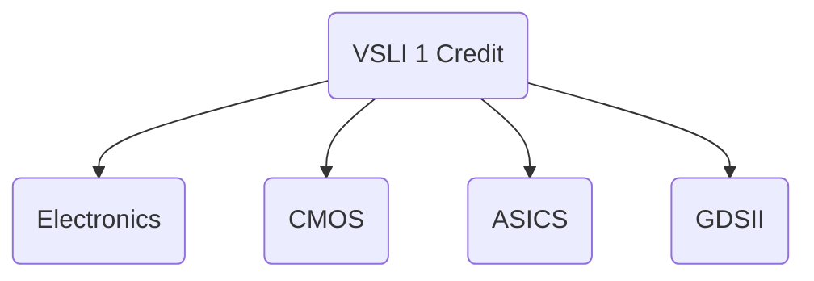
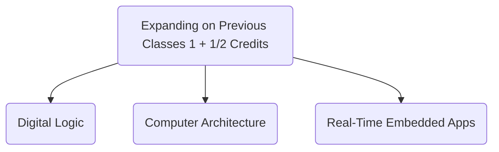
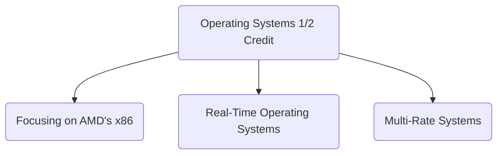

Date: 24th January 2025
Date Modified: 24th January 2025
File Folder: Week 1
#hwsw

```ad-abstract
title: Today's Topics
collapse: open

- Topic1
- Topic2
- Topic3

```

# Class Background






```ad-note
Multi-Rate Systems utilize multiple clocks at different rates to run different components simultaneously
```

# Syllabus

![[SP25 ECCS 3241 embedded hardware software codesign -FH.pdf]]

## Grading Scale


| Item             | % of Final Grade |
| ---------------- | ---------------- |
| Homework         | 15%              |
| Lab              | 15%              |
| Midterm Exam     | 25%              |
| Final Exam       | 30%              |
| Research Project | 15%              |

# Brief History of Embedded Hardware-Software Codesign

## Introduction

**1958**: First integrated circuit
- Flip-flop using two transistors
- Built by Jack Kilby at Texas Instruments

**2010**:
- Intel Core i7 $\micro$processor
	- 2.3 *Billion* transistors
-  64 Gb Flash Memory
	- 16 *Billion* transistors

## Growth Rate

53% *compound* annual growth rate over 50 years
- Driven by the miniaturization of transistors

```ad-note
No other technology has grown so fast in such a "short" amount of time
```

## Annual Sales

~$10^{19}$ transistors manufactured in 2008
- 1 billion transistors for *each* human on the planet

## Invention of the Transistor

Used to be vacuum tubes that were large, expensive, power-hungry, etc.

**1947: First point contact transistor**

## Transistor Types

Bipolar transistors:
- npn or pnp silicon structure
- Small current into very thin base layer controls large currents between emitter and collect

MOSFETs
- nMOS and pMOS
- Voltage applied to insulated gate controls current between source and drain
- Low power allows very high integration

```ad-note
Moved to CMOSs since the 1980s to reduce power consumption on idle.
```

## Feature Size

To uphold Moore’s Law, the size must shrink by 30% every 2-3 years: Feature size in $\micro$m

![[Pasted image 20250124114245.png]]

## 4004: The First Micro Processor

- Made in 1971

**Characteristics**
- 10 $\micro$m process
- 2300 transistors
- 400-800 kHz
- 4-bit word size
- 16-pin DIP package

**Masks Hand Cut from Rubylith**
- Drawn with color pencils
- 1 metal, 1 poly
- Diagonal lines


