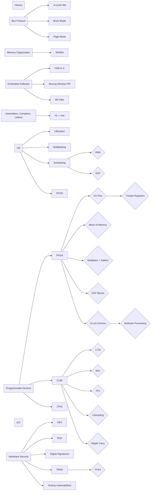

Date: 28th April 2025
Date Modified: 28th April 2025
File Folder: Week 14
#hwsw

```ad-abstract
title: Today's Topics
collapse: open

- Topic1
- Topic2
- Topic3

```


# Class Overview


```mermaid
flowchart LR
A(History)
B(Bus Protocol)
B-->B1[4-Cycle SM]
B-->B2[Burst Mode]
B-->B3[Page Mode]
C(Memory Organization)
C-->C1[SRAMs]
D(Embedded Software)
D-->D1[FSM in C]
D-->D2[Moving Window FIR]
D-->D3[IIR Filter]
E(Assemblers, Compliers, Linkers)
E-->E1[HL-> exe]
F(OS)
F-->F1[Utilization]
F-->F2[Multitasking]
F-->F3[Scheduling]
F-->F4[RTOS]
F3-->F31{RMS}
F3-->F32{EDF}
G(Programmable Devices)
G-->G1[FPGA]
G-->G2[CLBs]
G-->G3[JTAG]
G1-->G11{I/O Pins}-->G111{Tristate Registers}
G1-->G12{Block of Memory}
G1-->G13{Multipliers + Adders}
G1-->G14{DSP Blocks}
G1-->G15{CLock Division}-->G151{Multirate Processing}
G2-->G21{LUTs}
G2-->G22{Mux}
G2-->G23{FFs}
G2-->G24{Cascading}
G2-->G25{Ripple Carry}
H(IOT)
I(Hardware Security)
I-->I1[AES]
I-->I2[RSA]
I-->I3[Digital Signatures]
I-->I4[TRNG]
I-->I5[Testing Vulnerabilities]
I4-->I41{PUFs}
```


