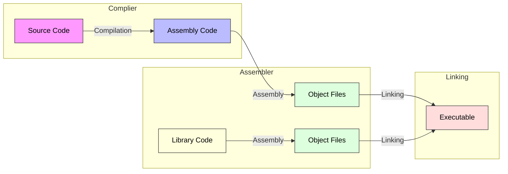

```ad-summary
title: Author Information

**Name:** Ethan Berei
**Date:** 2/17/25
**Notes:** This paper might be long, but I had a blast writing it
```
# Introduction

Throughout the entirety of my undergraduate education, the importance of how a computer system uses the assembler, the linker, and the compiler to turn a high-level programming into machine code has been stressed extensively. Specifically in this class, we discussed how linkers can combine several modules into a single executable module and how they set labels for the modules. Compliers are programs that convert high-level language code into assembly code through parsing, symbol table generation, semantic analysis, optimizations, and code generation to effectively assign registers and reduce power draw of the assembly-level code. Throughout this assignment, the role of each of these programs separately in more detail and how they work together to create efficient machine code. Understanding the interactions between each of these three programs can give insight into how even on weak/basic hardware, these programs can make the hardware viable.

# The Roles

## The Complier

A complier, by definition, is a tool that translates a program from one language to another. Typically, it takes high-level languages, such as C or Java, and turns them into lower-level assembly, such as ARM or RISC-V. From a beginner’s perspective, compliers can be daunting to understand due to their complexity [1]. However, the three sources that will be referred to throughout this section try to break down the confusion around compliers [1-3].  In particular, the tokenizer, the parser, the parse tree, the interpreter, and the code generators are explained and further broken down into their smaller parts.

At a high-level, a simple complier can be broken down into the front end, the intermediary, and the back end. At the front end, a tokenizer drives the the input stream division, which allows snippets of high-level code to be placed into the different stages of the compiler. The parser then handles the understanding of the language’s grammar, such as syntax errors, so it can be taken to the intermediate stage. The parse tree, aka the intermediate code layer, is independent of the language being used and pushes the code to the interpreter and the code generators in the back end. The interpreter runs the program and the code generator turns the high-level code into assembly with the help of the interpreter. [3]

### The Tokenizer

The first step of any complier is the tokenizer. The job of the tokenizer is to break-up the incoming input stream into sections and assign them a token such that they can be properly read and cataloged so the parser can grab tokens at its will. The main code block for a simple tokenizer can be found below in Figure 1:

```pascal
token_type_enum = (glob_res_word, 
					con_res_word,
                   reserved_sym,
                   identifier, 
                   string_type,
                   int_type, 
                   real_type);

record Token_Type is
  begin
    infile        : text;
    cur_str       : array [1..80] of char;
    cur_str_len   : integer;

    cur_line      : integer;
    cur_pos       : integer;

    type_of_token : token_type_enum;
    read_string   : char [1..30] of char;
    cap_string    : char [1..30] of char;
    int_val       : integer;
    float_val     : real;
    glob_res_word : glob_res_word_type;
    con_res_word  : con_res_word_type;
    res_sym       : res_sym_type;
  end; (* Token *)
```
<center> <b> Figure 1: </b> Tokenizer Data Structure Written in Pascal [3]</center>

Within each token, it stores a set of values that describe the token much like how headers on network packet store information about the packet. Each one of these fields and their purposes are laid out:
- `infile`: The input source (the unaltered text file)
- `cur_str`: A buffer holding the current line being processed
- `cur_str_len`: The length of the current line.
- `cur_line` & `cur_pos`: Keep track of the token’s location in the file (line number and position).
- `type_of_token`: A *enumeration* that is used to classify the token
- `read_string` & `cap_string`: The token exactly as it appears in the source and it’s uppercase version
- `int_val` & `float_val`: Stores the numeric values of the token as numbers
- `glob_res_word`, `con_res_word`, `res_sym`: Enumerations that hold reserved words and symbols

By using all of these values, the tokenizer is able to taken the input file and store the information of it such as it’s value, type, position, and case. This is critical for the rest of the system as it allows the source code to be broken up into chunks so the rest of the system can buffer on it if necessary. There is a specific method to how the tokens are manipulated, but it is out of the scope of this paper.
### The Parser

At a far-away view, the main two goals of the parser is to detect any syntax errors within the source file and build the parse tree for the intermediate stage of the complier. To recognize a token, all the parser needs to do is have a small section that takes in a number from a tokenizer. Below shows the data structure for the parser as well as the procedure:

```pascal
{ Grammar for Expression Definition }
S :== EXPRESSION
EXPRESSION :== TERM | TERM { [+,-] TERM] }
TERM :== FACTOR | FACTOR { [*,/] FACTOR] }
FACTOR :== number | '(' EXPRESSION ')'

{ The Parser Data Structure}
TYPE
exp_type_enum = (exp_add, exp_sub, exp_mul, exp_div);

expression_type_ptr = ^expression_type;

expression_type = record
  exp_type    : expr_type_enum;
  value       : real;
  left_expr   : expression_type_ptr;
  right_expr  : expression_type_ptr;
  single_expr : expression_type_ptr;
end;

{ The Parse Procedure}
procedure parse_expression (var exp expression_type
                            var token token_type);

var
  temp_node : expression_type_ptr; 

begin
  parse_term (exp, token);
  advance_token (token);
  while (token.type_of_token = res_sym and
         ((res_sym = sym_add) or
           res_sym = sym_subtract))) do
    begin
      new (temp_node);
      if (token.type_of_token = sym_add) then
        ^temp_node.exp_type := exp_add
      else
        ^temp_node.exp_type := exp_sub;

      ^temp_node.left_expr := exp;
      exp := temp_node;

      advance_token(token);
      parse_term(exp.right_expr, token);
    end; {   while (token.type_of_token = res_sym and
                    ((res_sym = sym_add) or
                      res_sym = sym_subtract))) }

end; { procedure parse_expression }
```
<center> <b> Figure 2: </b> Parser Data Structure & Procedure Written in Pascal [3]</center>

The grammar expression section of the code defines how mathematical expressions are structured. It follows the basic understanding of mathematical hierarchy, with numbers and parentheses coming first, and addition or subtraction coming last. In this particular implementation, they use the following three types:
- **Expression**: consisting of one or more *terms*, separated by `+` or `-`
- **Term**: consists of one or more *factors*, separated by `*` or `/`
- **Factor**: A *number* or an *expression side parentheses*

The parsing procedure handles how to turn a sequence of tokens into a parsing tree by looking at expressions, terms, and factors and their dependencies using the **recursive descent parsing algorithm**. In the code above, we are assuming that `parse_term` and `parse_factor` are defined elsewhere, but they handle the multiplication/division and parenthesis before `parse_expression` handles addition/subtraction and placing the nodes onto the parse tree. At the end of this code, the output of the parser should give a parsing tree like the ones below in Figure 3:

![[cmpgif03.gif]]
<center> <b>Figure 3:</b> Parse Tree Examples using Recursive Descent Parsing Algorithm [3] </center>

Depending on the base language, you then have to worry about how to store variables, constants, and more. This is often the most complicated part as it determines how effective the complier is in the later rounds. On the other hand, variable declarations are much easier as it just contains a name and a reference to it’s type. Sometimes binary search trees might be used to speed up the variable lookups. After that, the source code should be turned into a parsing tree with the variables, expressions, terms, and factors all stored in their proper locations. At this point, they are ready for the intermediate level.

It is important to note that the parser can be very different depending on the implementation. For example, the *D. Sarkar et al.* [2] suggests a micropass complier that performs small specific tasks that can simplify the parser down into more simple blocks. It provides a record-structured input that utilizes subsequent passes of the complier so that syntax errors can be more specific.

### The Intermediate Layer

Out of all the layers of a complier, the intermediate layer often has the most customizability. In terms of the simple Pascal complier, this layer only consists of the parse tree incremented on by the parser [3]. However, other compliers may choose to add error-correction, a transformer, or other structures between to improve the accuracy of the parser before it gets interpreted and transformed into the other language [1].

### The Interpreter

After the parser completes the parse tree, the hardest part of the complier has been completed. From there, it is the interpreter’s job to interpret each type of code structure. This includes while loops, if-statements, and also the expressions, terms, and factors made by the parser. This procedure will then be repeated recursively for each main code statement. An example for how an if statement may be interpreted can be found below:

```pascal
procedure interpret_if_statement (if_stat : if_rec_ptr;
                                  Context : Proc_Rec_Ptr);

begin
  if (interpret_boolean_expression(if_stat.Boolean_Exp)) then
    interpret_statement(if_stat.True_Path)
  else
    if (if_stat.Boolean_Exp <> Nil) then
      interpret_statement(if_stat.False_Path);
end; {procedure interpret_if_statement}
```
<center> <b>Figure 4:</b> If-Statement Code Block for an Interpreter in Pascal  [3] </center>

### Code Generation

Much like the interpreter, the code generation step behind it is simple and straightforward. It is much like the interpreter, but it instead writes the code out based on the parser tree to other destination language. An example for how an if statement may be written is shown below:

```pascal
procedure output_if_statement (outfile   : text;
                               statement : code_struct_ptr;
                               Context   : Proc_Rec_Ptr);

begin
  write (outfile, 'if (');
  output_expression (outfile,
                     if_stat.Boolean_Exp,
                     Context);
  write   (outfile, ') then');
  writeln (outfile);
  output_statement (if_stat.True_Path);
  if (if_stat.false_path <> Nil) then
    begin
      write   (outfile, 'else');
      writeln (outfile);
      output_statement (if_stat.False_Path);
    end; {if (if_stat.false_path <> Nil)}
end; {procedure output_if_statement}
```
<center> <b>Figure 5:</b> If-Statement Code Block for a Code Generator in Pascal  [3] </center>

Expressions are handled in a simple three step order: generate code for the left operand, write the operator, and then generate code for the right operand. Similar rules are followed for terms and factors. 

However, if converting to assembly, a few more parts need to be considered. Firstly, the separation between global and local variables must be considered. Global variables are given explicit memory addresses, while local variables are given allocation on the *stack* with each function getting its own space. The stack frame for each function call is then generated with the proper return address, function parameters, and local variables. Larger expressions, such as one using double operands, are broken down into binaries and temporary variables are assigned temporary registers. Further optimizations are made, which differ from complier implementations. For example, some compliers clear registers for each statement, while others hold onto values as long as  possible.
## The Assembler

By definition, an assembler is a system software tool that translates assembly language into machine code. This machine code is a string of binary instructions (ones and zeros) that the CPU is able to understand. When comparing both languages, assembly is not only human-readable, it uses mnemonics instead of binary opcodes to represent it’s instructions. Assemblers are critical for program development since writing in ones and zeros has a high chance of error. Also, since assembly allows for symbolic programming and labels, it makes it easy to read and maintained why being able to provide **macro operations** at more advanced levels. This section of the paper primarily references a book by D. Salomon titled *Assemblers and Loaders* [4]. It might be an older source, but many of the concepts found in it are used in modern assemblers today. Below is the 

### Types of Assemblers

As assemblers have grown and evolved over the years, many different variations have came to fruition. Figure 6 below shows a brief history of how various types of assembly and their assemblers have came to fruition:

![[Pasted image 20250217094426.png]]
<center> <b> Figure 6: </b> Phases in the Historical Development of Assemblers [4] </center>

At this level, there are **eight** different types of assemblers that can be considered. Each of them are categorized based on their functionality and the way they process assembly language programs. The nine variations are as follows:

1. **One-Pass Assembler**: The most simple version that reads the source code once and translates it into machine code. It is one of the fastest variations, but can fail at understanding references (such as labels or variables that are not explicitly defined).
2. **Two-Pass Assembler**: It takes what works with the one-pass solution and expands it. Specifically, it finds the proper labels and turns them into addresses on the first pass. Then, on the second pass, it replaces the references with actual values and does the rest of the conversions. It brings more flexibility with the cost of time.
3. **Resident Assembler**: A type of assembler that is loaded directly into ROM. Unlike the rest, it is a simple and typically only supports a handful of operation codes and no macro instructions. It is used primarily in embedded systems or firmware.
4. **Macro Assembler**: A more modern take on an assembler that can use macro-instructions, which allow repeated code sequences to be defined once that can be expanded later. It is much like create functions within assembly. It can help reduce redundancy and improves the assembly readability at the cost of time-to-assemble and complexity.
5. **Cross-Assembler**: An assembler that runs on one computer but generates machine code for another. It is typical for embedded systems to use this type of assembler as normal computers can be used to “flash” the ROM on an embedded system to reduce their cost. However, it comes at the drawback that an embedded system has to rely on another computer to be updated.
6. **Meta Assembler**: Unlike other variants, these assemblers can handle multiple different instructions sets for different architectures. This makes them highly customizable and flexible, but comes at the cost of implementation complexity due to every architecture being different from each other. 
7. **Disassembler**: A tool that can be used to turn machine code back into assembly. It is not used often, but has it’s place in debugging, reverse engineering, and malware analysis.
8. **Micro-Assembler**: A type of assembler that creates microinstructions that direct control a CPU’s signals at a lower level than traditional machine code. It can be highly efficient, but is difficult to implement and code in.

All of these types of assemblers are chosen based on their usage application. Primarily, the more complex assemblers are used on more powerful hardware, while the weaker assemblers are used by real-time embedded devices to reduce any possible intrusiveness caused by the assembler.  

### Assembler Overview

#### One-Pass Assembler

From a high-level, a simple assembler contains six main parts. The parts as laid out as follows:
1. **Source File**: The main input file containing the assembly instructions.
2. **Symbol Table**: A table that stores labels and their corresponding memory addresses. This allows a programmer to use real worlds for jump and branching instructions. It start empty, and is then added to as labels are found in the source code.
3. **Opcode Table**: Maps mnemonics to their machine code equivalents. For example, the `ADD` keyword will mirror to a string of values.
4. **Directive Table**: Contains pseudo-instructions that control assembly flow. For example, in RISC-V assembly there is an instruction called `jal label`, which is equivalent to `jalr x0 label`. This table is responsible for matching each of these instructions up.
5. **Object Code Area**: Stores the generated machine code before output.
6. **Error Handling Unit**: Detects and reports syntax and semantic errors.

Each one of these parts lives separately and do not interact without the help of a few programs and procedures. The main program is where most of the action happens and acts as the main control circuit for the whole assembler.  The table search procedures act as a buffer and searcher between the main program and the tables. The location counter acts as a program counter and keeps track of the current line, while the pass indicator acts as a return address for linking instructions. The main layout of the one-pass assembler can be found below:

![[Pasted image 20250217103318.png]]
<center> <b> Figure 7: </b> High-Level Block Diagram of Single-Pass Assembler [4] </center>

The general flow of a one-pass assembler is as follows. It reads the current line of assembly that matches the location counter. It will then, in series, check against a set of conditionals in-series. It checks if it is at the end-of-line character, if proper labels are defined, and if a symbol is used. If it is the end of line, it sends out the necessary errors and ends the program. If it finds any labels, it will then search for the labels in the symbol table and replace it with an address when necessary. It will then scan the line and find any symbols that are necessary. At this point, it will either find a symbol or not. If there is no symbol, it generates a machine code line using the necessary values. Otherwise, it tries to find a symbol in the table and determines if it needs to be converted or not. It will then go back and create a machine code line. This set of conditionals will loop until the end of the program is reached, for which at this point the assembler quits.

#### The Two-Pass Assembler

The the name states, the two-pass assembler focuses on splitting the load into to separate runs. In the first run, it looks for *only* label definitions, which is then collected and assigned values in the symbol table. With the symbol table being completed, the assembly code is then read a second time, with a focus on assembling the instructions with a completed. 

Even though it seems like the second pass does all the work, the first pass tends to work more intensely as it has another important job to do: **determine instruction sizes and types**. The first pass must look at mnemonics and sometimes other part of the assembly instructions. This critical information is then stored in an *intermediate file* as it This information makes the second pass’ job much more simple.  Typically, a list of records is stored in the intermediate file and can contain the following: a type, an position value for the line, a pointer to the opcode table or directive table, and a copy of the source code.


<center> <b> Figure 8: </b> High-Level Block Diagram of the First-Pass of a Two-Pass Assembler [4] </center>


<center> <b> Figure 8: </b> High-Level Block Diagram of the Second-Pass of a Two-Pass Assembler [4] </center>

### Symbol Table

As discussed before, the symbol table holds and manages labels, variables, and constants and their translated memory addresses or values during assembly. Specifically, it typically supports two operations: **insertion** and **lookup**. During the insertion process, any symbol/value pair are stored.  Afterwards, the value is fetched from the table and replaced at a later time. The most common error that symbol tables try to solve is forward referencing, where a symbol is called before it is defined, and is especially dangerous in one-pass assemblers. Two-pass assemblers solve this issue during their second pass after they already filled their symbol table in the first pass.

To implement a symbol table, they use typical searchable data structures that store the symbols with their addresses or values. In particular, the structure is chosen by trying to find a balance between the insertion time and the sorting time. Table 1 shows the different types of data structures that can be used for symbol tables:

<center> <b> Table 1: </b> Different Data Structures used for the Symbol Table and their Time Complexities [4] </center>

| Data Structure                  | Insertion      | Searching      |
| ------------------------------- | -------------- | -------------- |
| Linear Array                    | $O(1)$         | $O(N)$         |
| Binary Search in a Sorted Array | $O(N)$         | $O(\log n)$    |
| Linked List with Buckets        | $O(N+k)$       | $O(N/k)$       |
| Binary Search Tree              | $O(h)$         | $O(\log n)$    |
| Hash Table                      | $O(1)$ average | $O(1)$ average |

## The Linker

### Overview

The primary job of a linker is to convert multiple object files (aka. machine code files) into executables and shared libraries [5]. In the past, the linker was not even around and post-dated even programs like compliers. Typically, assembly was converted directly into an executable. However, as the need for larger programs that consisted of multiple objects (the birth of object-oriented programming in high-level languages) and the idea of using libraries, it made more sense to gather a bunch of parts together that can be used to create a single file to save on time and coding resources. Throughout this section, the primary resource is a twenty-part blog by Ian Lance Taylor, an open-source software legend that has written the main Go-based frontend for GCC, linkers, and a from of unix-to-unix copying protocol (UUCP)  and is a core software researcher at Google [5].

### Basic Data Types

A linker typically recognizes three types of basic data types: *symbols*, *relocations* and *contents*. Symbols were discussed in great detail during the assembly section. **Contents** are the virtualization of memory that is defined by its size, array of bytes, and a type and are made of the machine code. **Relocations** are the computations that occur on the contents that typically connect the symbols to the contents. By applying these operations, data types are created and simplified. With these three data types, a linker will read the contents, concatenate them all together by their type, and applies the relocations before outputting. 

### The Operations

From a high-level, the basic job of a linker can be broken down into five main steps:
1. **Read** the input object files to determine the length of *contents* of the file and the *symbols* within.
2. **Build** a symbol table containing both defined and undefined symbols.
3. **Decide** where all the *contents* should go in the output executable file.
4. **Apply** the*relocations* on the *contents *of the file and **output**.
5. **Write Out** the complete symbol table with the final values of the symbols.

This five step process is able to be accomplished through the usage of two main processes: **symbol resolution** & **relocation**

#### Symbol Resolution

The main duty of symbol resolution is to take the defined symbols, which are labels and variables that are defined within an object file, and connect them to undefined symbols that are in other files. The main goal with this step is to connect the two files together such that they are able to work together to create a single file that works together. Particularly, both files are searched for different symbols and a brand-new symbol table is created for all the files involved. From there, the undefined symbols are matched with their corresponding definitions to create a single cohesive program. Figure 9 below illustrates an example of two programs that have both defined and undefined symbols that are then combined using `gcc`’s object file inputs and outputs:

```c
//file1.c
void hello(); //Declaration (undefined symbol)
int main() {
	hello();  //Call to another funciton
}
---
//file2.c
#include <stdio.h>
void hello() { //Definition to Resolve the Symbol
	printf("Hello, World!\n");
}

```
```
gcc -c file1.c
gcc -c fil1.c
gcc file1.o fil2.o -o program
```
<center> <b> Figure 9: </b> High-Level Code that is Compiled, Assembled, and then Linked to Resolve Undefined Symbols </center>

#### Relocation

After the linker resolves the symbols, it then uses this new knowledge to fix the memory addresses within the newly combined machine code such that control instructions can properly execute. If symbol resolution was finding how pieces of a quilt went together, relocation is the thread that is woven between them to hold them together. Coming from the resolution, any files or addresses that need adjustment are taken from the relocation entries to figure what addresses need changed. The linker then calculates the new memory address to link both the undefined symbols with the newly found definiens. Then, any adjustments are made to the machine code such that the references are accurate in the final execution.

### Primary Types of Linkers

#### Static Linker

The simplest type of linkers, static linkers combine **all** required object files and libraries into a single executable at compile time. Critically, it creates a self-contained binary that does not need to use any other libraries during execution. Static linking is often easy-to-understand as all the code is present in the executable while also being unchanging and expected. The downside of using this form of linking is in it’s size and memory usage, which are both increased since every single program needs to have a copy of each common library
#### Dynamic Linking

Dynamic linking, as the name suggests, optimizes memory usage on a system by instead deferring linking to runtime. Instead of multiple executables being turned into a single programs that do not interact, dynamic linking focuses on the concept of sharing common libraries, which reduces the amount of memory needed. The memory reduction and the flexibility of updating reduces the hang-ups caused by recompiling when a new update comes out. On the other hand, it can be much more complex and can cause compatibility problems if a program does not stay up to date with the libraries it is using.
## Interactions

### Overview

The interaction between compilers, assemblers, and linkers forms a sophisticated pipeline that transforms high-level code into executable machine code. This transformation occurs through a carefully orchestrated sequence of steps, where each component plays a crucial role in preparing the code for the next phase. Figure 10 below illustrates the high-level view of how every one of the three programs work together:


<center> <b> Figure 10: </b> Interactions Between the Complier, the Assembler, and the Linker</center>

### Role Summaries

**Compiler's Role**
- Takes high-level source code as input
- Performs semantic analysis and optimizations[
- Generates architecture-specific assembly code
- Creates symbol tables for later linking
**Assembler's Contribution**
- Receives assembly code from the compiler
- Uses two-pass processing to handle forward references
- Converts mnemonics into machine code
- Produces object files containing relocatable code
- Maintains relocation information for the linker
**Linker's Integration**
- Combines multiple object files and libraries
- Performs symbol resolution across all components
- Handles relocation of addresses
- Creates the final executable with absolute memory locations

### Critical Interactions

The interaction between these components enables several key benefits. Modular program development through separate compilations becomes feasible. Efficient memory usage through shared libraries is possible due to the linker optimizing the source code from the complier. Platform independence at the source level allows for ease of updating and implementing new ideas using high-level language that is converted and combined into the machine code. Optimized machine code generation allows for larger and more complex programs to be written in a normal amount of time [6]. This sophisticated pipeline makes even basic hardware viable for complex programming tasks by breaking down the translation process into manageable stages, each handled by specialized tools working in concert.
# Conclusion

Throughout the paper,  it was illustrated how compilers, assemblers, and linkers work together to transform high-level programming concepts into executable machine code. Each component brings unique capabilities to the process. Compilers bridge the gap between human-readable languages and machine-specific assembly. Assemblers translate symbolic representations into actual machine code. Linkers combine and resolve references across multiple pieces of machine code.

Their coordinated effort enables developers to write complex software while abstracting away many low-level hardware details. This abstraction layer, combined with the ability to optimize at each stage, makes modern computing possible even on relatively simple hardware architectures.

The importance of understanding these interactions lies in their fundamental role in computer science: they form the foundation upon which all modern software development is built. As noted throughout our discussion, this understanding becomes increasingly valuable as systems grow in complexity and require more sophisticated optimization techniques.

# References

[1] A. Ghuloum, “An Incremental Approach to Compiler Construction,” Indiana University, http://scheme2006.cs.uchicago.edu/11-ghuloum.pdf 

[2]  D. Sarkar, O. Waddell, and R. K. Dybvig, “Educational Pearl: A Nanopass Framework for Compiler Education,” _Journal of Functional Programming_, vol. 15, no. 05, p. 653, Jun. 2005. doi:10.1017/s0956796805005605

[3] J. A. Farrell, “Compiler Basics,” University of Manchester, http://www.cs.man.ac.uk/%7Epjj/farrell/compmain.html

[4]  D. Salomon, _Assemblers and Loaders_. New York, NY: Ellis Horwood, 1993.

[5]  I. L. Taylor, “Linkers,” AIRS, https://www.airs.com/blog/archives/38 

[6] J. Hennessey and D. Patterson, “ Compilers, Assemblers, Linkers, Loaders: A Short Course,” University of Washington, https://courses.cs.washington.edu/courses/cse378/97au/help/compilation.html