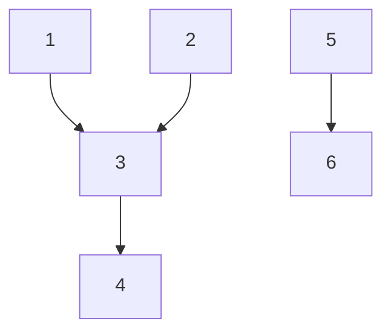

Date: 17th February 2025
Date Modified: 17th February 2025
File Folder: Week 5
#hwsw

```ad-abstract
title: Today's Topics
collapse: open

- CPU Utilization and Scheduling
	- Hyperperiod
	- Periodic Processes
	- Implementations
- Operating Systems
```

# CPU Processes

## Utilization

**CPU Utilization**: Fraction of the CPU that is doing useful work ($T$)
- Calculated by assuming no scheduling overhead.

$$U= (\mbox{CPU time fo useful work})/(\mbox{Total available CPU time})$$
$$U = \frac{\sum_{t_1}^{t_2} T(t)}{t_2-t_1}$$
$$\boxed{U = \frac{T}{t}}$$

## Process States

A process can be in one of *three* states:
1. **Executing** on the CPU
2. **Ready** to run
3. **Waiting** for data

![[Pasted image 20250217110448.png]]

## The Scheduling Problem

Can we meet all deadlines? **MUST** be able to meet **ALL** deadlines in **ALL** cases

```ad-question
title: Problem

Multiple tasks in a task set running in parallel wiht different periods tyring to complete at least one full cycle simultaneously
```

**Example**: We want 1, 2, and 5 to happen almost at the same time so that 3 and 6 can happen at the same time, and so on.


```ad-important
We must have synchronization at every phase to prevent waiting on different processes
```

## Hyperperiod

```ad-summary
title: Defintion
The smallest period of itme that encompasses all the indivudals periods of each task in the system. If the periods of tasks are not integer multiples of each ohter, then it is the **the least common multiple (LCM) of the task periods.** 
```

- Must look at the hyperperiod schedule to find all task interactions.
- Hyperperiod can be very long if task periods are not chosen carefully.


### Example: How to Calculate Hyperperiod

```ad-important
When we know that multiple different periods end on the same is their LCM.
```

**Long** Hyperperiod:
- P1, $7ms$
- P2, $11ms$
- P3, $15ms$
- *LCM* = $1155ms$

**Shorter** Hyperperiod:
- P1, $8ms$
- P2, $12ms$
- P3, $16ms$
- *LCM* = $48ms$

### Simple Processor Feasibility Examples

#### Example 1

```ad-important
$$\mbox{Task Execution Time} = \lceil \frac{LCM}{T} \rceil T_i$$
```

*Given*:
1. P1 period 1ms, CPU time 0.1ms
2. P2 period 1ms, CPU time 0.2ms
3. P3 period 5ms, CPU time 0.3ms

![[Pasted image 20250217111851.png]]

#comebacklater to add picture

#### Example 2

From the *Shorter Hyperperiod*

- P1, $8ms$
- P2, $12ms$
- P3, $16ms$
- *LCM* = $48ms$

![[HWSW - Week 5 Day 1 2025-02-17 11.25.03.excalidraw]]

```ad-warning
Based on this graph, it looks like there may be a CPU usage that is **greater than one**. This means that it is impossible for all of these tasks to run at once!
```

### Stimulability and Overhead

The scheduling process consumes CPU time. Scheduling overhead MUST be taken into account for the exact schedule

```ad-note
Overhead can be *ignored* if it is a small fraction of total exectuion time.
```

## Running Periodic Processes

Need code to control execution of processes. Simplest implementation: **process = subroutine**

### `while` Loop Implementation

Simplest implementation has one loop
- *No control over execution timing.*

```
while (TRUE) {
	p1();
	p2();
}
```

```ad-warning
This can lead to bad scheduling and CPU utilization.
```

### Timed Loop Implementation

Encapsulate set of processes in a single function that implements the task set.

Use timer to control execution of the task.
- *No control over timing of individual processes*
- *Bad if they have different periods*

```
void pall() {
	p1();
	p2();
}
```

### Multiple Timers Implementation

Each task has its *own function*.

Each task has its *own timer*

```
void pA() { /* rate A */
	p1();
	p3();
}

void pB() { /* rate B */
	p2();
	p4();
	p5();
}
```

```ad-warning
May not have enough timers to implement all the rates.
```

### Implementing Processes

All of these non-OS implementations are inadequate
- Need better control over timing
- Need a better mechanism than subroutines

# Operating Systems

The operating system **controls resources**:
- Who gets the CPU
- When I/O takes place
- How much memory is allocated

The most important resource is the CPU itself
-  CPU access controlled by the *scheduler*

## OS Structure

OS needs to keep track of:
1. Process priorities
2. Scheduling state
3. Process activation record

Processes may be created:
- Statically before system starts
- Dynamically during execution

## Preemptive Real-Time Operating Systems

```ad-important
Solves the fundamental problems of a cooperative multitasking system.
```

- It executes processes based upon timing requirements provided by the system designer.
- The most reliable way to meet timing requirements accurately is to build a preemptive operating system and to use priorities to control what process runs at any given time.


