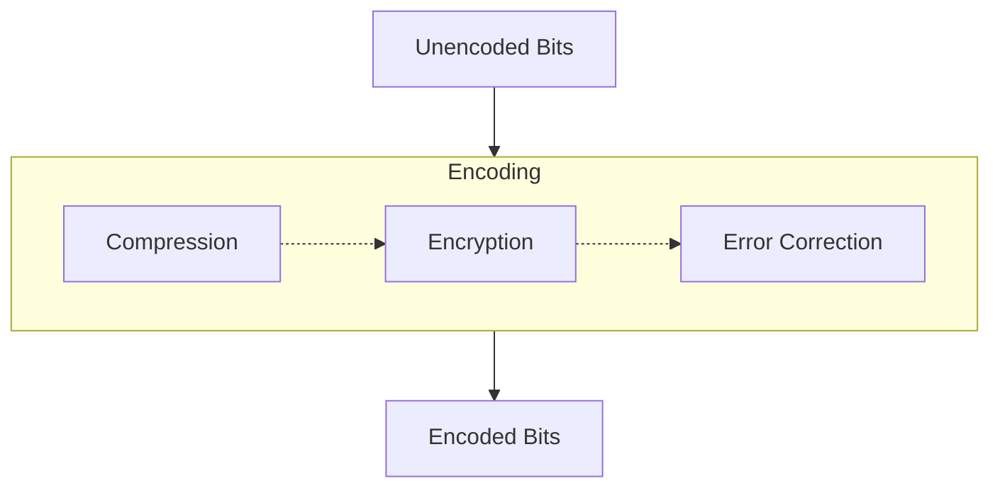

Date: 28th February 2025
Date Modified: 28th February 2025
File Folder: Week 6
#hwsw

```ad-abstract
title: Today's Topics
collapse: open

- FPGA Vulnerabilities

```

# FPGA Vulnerabilities

## Overview

1. Bitstream Modification/Reversal
2. Side Channel Attacks
3. Overproducing
4. Cloning
5. Fault Injection Attack
6. Relay and Replay Attacks
## Reverse Engineering the Bitstream

```ad-summary
Transformation of an encoded bitstream into funcitonally equivalent description of the original design
```

![[Pasted image 20250228111014.png]]



### Partial Reversal

```ad-summary
Extraction of data from bitsteam without full funcitonality
```

```ad-example
- BRAM/LUT
- Memory Cell States
- Compromising Keys
```

## Readback

Process of reading back data from the FPGA device to verify that the design was downloaded properly
- Allows you to get a snapshot of hte FPGA’s current state while still in oepration
	- Configuration
	- LUTs
	- Memory Contents
- Useful for vendors to verify the correct operation

If enabled, an attacker can add missing header/footer information
- Use in another device
- Reprogram FPGA with modified version
- Tamper with a Trojan
- Reverse Engineering
- “Readback Difference Attack” **VERY DANGEROUS**
	- One of the strongest forms of attacks
	- A device that has been configured can have it’s data leaked whenever there is a change in it’s data!

```ad-warning
Every board in the lab is automatically loaded with a test program from it's ROM. The uploaded bitstream is stored in the same place, which can be easily read
```

*Defensive Usage*: Providing evidence of tampering
- Ionizing Radiation Attack
- Can disable readback using a bitstream bit, but it can be countered
- Some devices do *not* provide readback capabilities

## Side Channel Attacks

```ad-important
Some challenges an attacker faces with most side channel attacks:
- Familiarity with implementation detials
- Isolation of target funciton
- Obtianing high SNR
- Probing BGA packages
- Devices manufacutred at 90/64/45/etc nm technlologies
```

### Power Analysis

*SPA*: Not practical for most paralleled cryptographic operations

*DPA*: Statistical correlation techniques that can be used against AES and DES

Can be **countered** using equivalent power signatures.

### EM Analysis

Tracks the movement of a charge
- Fault injection attacks
- Successful side channel attack

### Timing Analysis

*Very difficult* on FPGAs
-  OFF chip for functionality
- Observable via device pins
- Flip-Chip Design makes it harder to mess with the chip

![[Pasted image 20250228113654.png]]

### Ionizing Radiation

**Single Event Upsets (SEU, Soft Errors)**
-  Radiation-induced errors caused when charged particles lose energy by ionizing the medium through which they pass
- May cause transient pulse resulting in delay faults
- Cause memory bit to change state

#### Detection Methods

FPGA vendors introduced measures to ensure high-reliability
- Cyclic Redundancy Check (CRC) or Hamming

Triple Modular Redundancy with majority voting

Chip “scrubbing” to remove block faults form SEU using Error Correction Codes (ECC)

## Crippling & Fault Injection

Subvert a system to perform malicious functions or take it off-line

Reprogramming with or without encryption can take the system down
- Authentication can solve this issue

Attempt to force the device to execute an incorrect operation, or be left in a compromising state
- Altering input clock or voltage

## Relay Attacks

![[Pasted image 20250228114241.png]]

Loaded bitstream uses an authentication protocol to communicate a chip nearby in which case they share a key. This is meant to prevent the bitstream from being used on another system.

```ad-summary
Allows an adversary to impersonate a participant during an authentication protocol
```

Attacker resends recorded protocol transaction data (*impersonation*):
- Cloning of bitstreams is the simplest form


