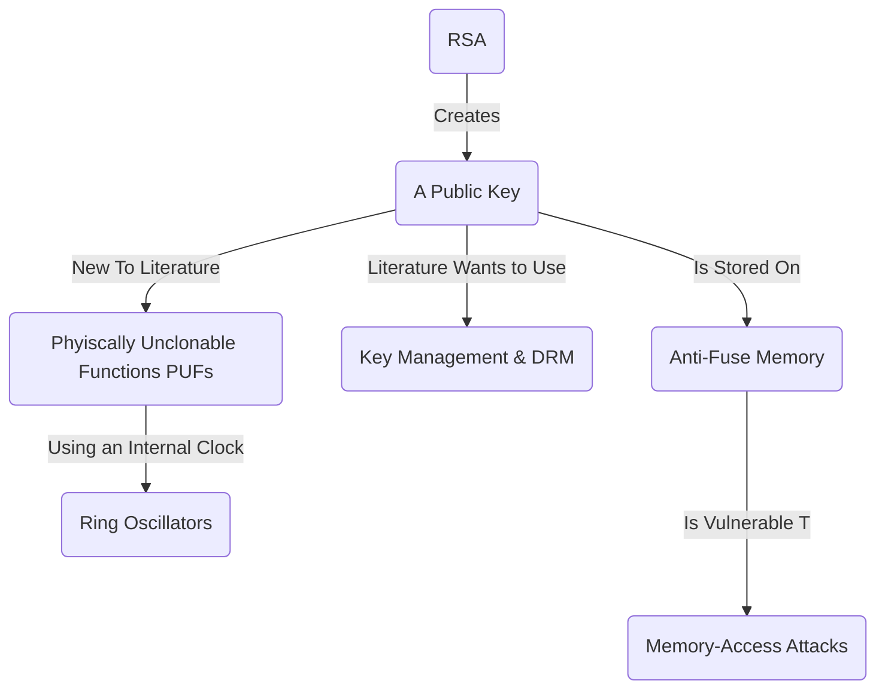

Date: 3rd March 2025
Date Modified: 3rd March 2025
File Folder: Week 7
#hwsw

```ad-abstract
title: Today's Topics
collapse: open

- Countermeasures for Hardware Attacks

```


# Defenses Against FPGA Attacks

## RSA & PUFs



Ring oscillators take advantage of differences in silicon when it comes to it’s silicon

![[HWSW - Week 7 Day 1 2025-03-03 11.22.26.excalidraw]]

A **hash function** can be used to secure the challenge and the response to ensure a secure communication for the PUF.

## Locking a Device using an XOR Gate

```ad-important
An XOR gate is an adaptive inverter
```

$$C_{out}=AB\bar C_{in}+A\bar BC_{in}+\bar A BC_{in}+A B C_{in}$$

In the above sequence, we can replace the bars/invertors with XOR gates to create a password system.

Two-input XOR gates allow for one password, and a three-input XOR gates can use *two* passwords.
- This allows for people to test our device without knowing what it is actually doing
- Compare test cases with black box inputs and outputs

## Overview

**Bitstream Encryption**:
1. Key Storage
2. Key Management

**Theft Deterrents**:
1. PUFs
2. DRM

## Bitstream Encryption

The bitstream is encrypted at the end of design flow and decrypted on the FPGA

*Prevents*:
- Cloning
- Reverse Engineering
- Tampering

The user puts the same key into the FPGA, where the bitstream is then directed through the decryption circuitry.


### Key Storage

Keys *must* be present inside the dvice to decrypt

**Stored in either Volatile/Non-Volatile Memory**, but can also use *PUFs*

### Key Management

Encryption:
- Triple DES or AES 128/256

When encryption is used, it *disables readback* and *partial configuration*

**Establishing Value**:
- Single Key: 
	- Simple
	- Catastrophe if compromised
- One key per device:
	- Very costly
	- If compromised, only one single stream is affected
	- Database of keys is threat

## Theft Deterrents

Vendors offer a few cloning deterrents that rely on secrecy of bitstream encoding
