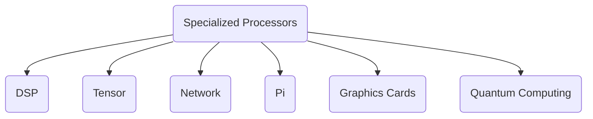
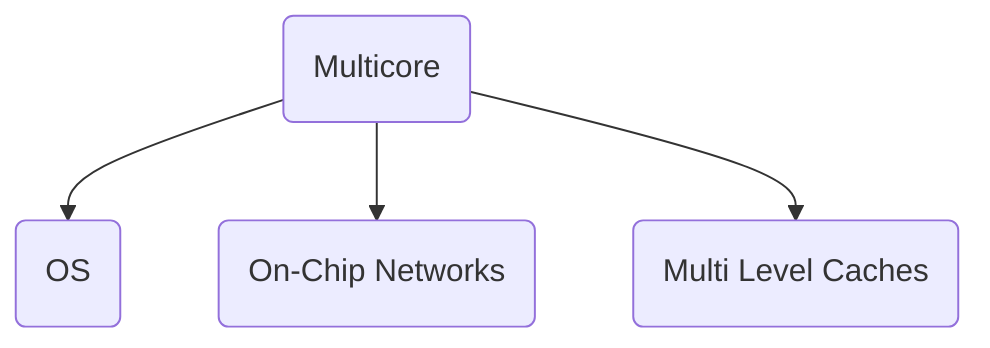

Date: 19th March 2025
Date Modified: 19th March 2025
File Folder: Week 8
#hwsw

```ad-abstract
title: Today's Topics
collapse: open

- Topic1
- Topic2
- Topic3

```

# Project Debrief

```ad-summary
**Potential Areas**:
- Make a project around specialized processors
- Multi-core
- Super Computers
- Data Centers
- Cloud Computing
- Security
- IoT
```

## Specialized Processors



```ad-important
Focusing around Instruction Sets and the hardware that is needed to suppor them
```

## Multi-Core



# JTAG

![[Hardware Security - Week 11 Day 1]]

