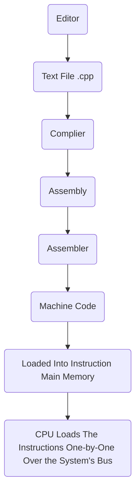

Date: 24th January 2025
Date Modified: 24th January 2025
File Folder: Week 1
#operatingsystems

```ad-abstract
title: Today's Topics
collapse: open

- Syllabus
- Course Introduction

```

# Syllabus
![[eccs3661syllabusV1.pdf]]

## Course Outcomes
1. Processes and threads and how operating systems traditionally deal with them.
2. Memory management issues
3. Strategies for dealing with deadlocks
4. Basic multi-threading on single and multicore systems

## Grading Breakdown

| Item                    | % of Final Grade |
| ----------------------- | ---------------- |
| Midterm 1               | 20%              |
| Midterm 2               | 20%              |
| Final Exam              | 20%              |
| Programming Assignments | 30%              |
| Final Project           | 10%              |

# Introduction to Course

## Background Objectives

```ad-summary
Overview of the following concepts, mostly related to underlying hardware:
- Simplified ocmputer organization
- Instruction execution flow
- Interrupts
- Memory: Levles of a typical system
- Basic organization of multiprocessor and multicore
```

```ad-note
title: Course Approach
Think of a computer like a very complicated board game. You "play" it to learn how to get better at it.
```

## What you must *unlearn*

We **must** forget large multicore/thread computer and think about 1970s simple single core processors. We will eventually go back

## Simplified Computer Organization

![[Pasted image 20250124083000.png]]

![[Simplified-memory-structure-52.png]]

![[images 7.png]]

```ad-important
These are all connected using the system bus to allow them to communicate with each other.
```

**Simple Registers**:
- `PC` → Program Counter
- `IR` → Instruction Register
- `MAR` → Memory addresses register
- `MBR` → Memory buffer register
- `I/O AR` → Input/output address register
- `I/O BR`→ Input/output buffer register

### How Does a C++ Program Run?

```ad-note
C & C++ files are saved as a .cpp text document file (typically encoded in **unicode**)
```



```ad-important
On the basic level, it uses the **Fetch/Execute Cycle**
![[images 4.jpg]]
```

## Instruction Types

1. **Processor Memory**: Load/Saving Data from/to Main Memory
2. **Processor-I/O**: Load/saving data form/to an I/O device
3. **Data Processing**: Using the ALU to make calculations
4. **Control**: Branch & Jump statements

## Demo: Example Program

For the next couple of slides, we’ll run through the execution of the following program:

```c
int x = 1;
int y;
y = x + 3; //read var x; add 3 to it; store into y
```

### Simple Memory Format

![[Operating Systems - Week 1 2025-01-24 08.48.35.excalidraw]]

```ad-note
title: Remember
**Opcode**: What does the instruction do?
**Address**: Subject of the operation
```

**Example Opcodes**:
- `0001` = Load into AC from memory
- `0010` = Store from AC into memory
- `0101` = Add to AC from memory

![[Operating Systems - Week 1 2025-01-27 08.09.54.excalidraw]]

```ad-important
Everything is memory is loaded when the program is compiled and assembled.
```

## Interrupts

### Infinite Loop: What Happens from there?

```ad-question
Is our copmuter doomed ot the tyranny of the fetch-execute cycle?
```

**NO!** We need to us *interrupts* to stop the program

### Definition

```ad-summary
title: Definition
Mechanism by which other modules may interrupt the normal sequencing of the processor
```

**Provided to improve processor utilization**:
- Most I/O devices are slower than the processor
- Processor must pause to wait for device
- This is a *wasteful* use of the processor without any interrupts

### Exercise

```ad-question
Think of times when humans or computers  use interrupts in your everyday life.
```

- Cruise Control
- Alarms waking you up
- Laundry stop
- Keyboard input
- Stove burning

### Classes of Interrupts


| Class            | Summary                                                                                                                                                                                                                                 |
| ---------------- | --------------------------------------------------------------------------------------------------------------------------------------------------------------------------------------------------------------------------------------- |
| Program          | Generated by some condition that occurs as a result of an instruction execution:<br><br>arithmetic overflow<br>division by zero<br>attempt to execute an illegal machine instruciton<br>reference outside a user’s allowed memory space |
| Timer            | Generated bya  timer within the processor. This allows the operating system o perform certain functions on a regular basis.                                                                                                             |
| I/O              | Generated by an I/O Controller                                                                                                                                                                                                          |
| Hardware Failure | yk what that looks like                                                                                                                                                                                                                 |


