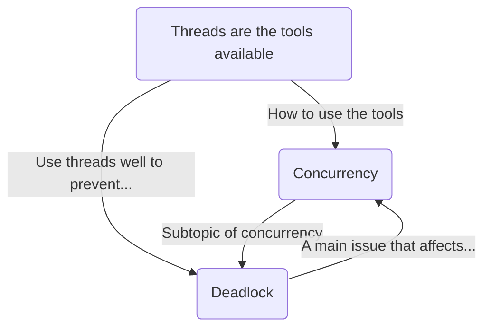

Date: 14th April 2025
Date Modified: 14th April 2025
File Folder: Week 12
#operatingsystems

```ad-abstract
title: Today's Topics
collapse: open

- Topic1
- Topic2
- Topic3

```


# Midterm 2 Review

## Introduction

You are responsible for studying *all* the content that can be found within the slide decks

```ad-important
1. Justify important critical design decisions of operating systems (why use threads? Why use mutual exclusion?)
2. Replicate exercises done in class
```

**Format**:
- Short answer 
## Topics

### Threads

- The difference between threads and processes
- Single thread process model versus multi-threaded process model
- Why do programmers use threads
- Why are threads useful even on single-core systems
	- How interleaving typically works
- Thread states
- Types of thread implementation, and their relative cost/benefits
	- User
	- Kernel
	- Combined
- Multi-core and multi-threading
	- Intuition behind *Amdahl’s Law*
	- Characteristics of programs that use multi-core programming effectively

### Concurrency

- Interleaving versus overlapping
- Race conditions
- Role of OS in managing concurrency
- Kinds of concurrency between processes
- Potential problems because of concurrency
	- Mutual exclusion and critical sections
	- Starvation
- Hardware support for mutual exclusion, and their pros and cons
	- Disabling interrupts
	- Compare and swap
- Software support for mutual exclusion, and their pros and cons
	- Semaphores
		- `n`
		- `semSignal`
		- `semWait`
		- Binary semaphores
		- Strong/weak semaphores
		- How semaphores are used for mutual exclusion
		- How semaphores are based on hardware concurrency
	- Monitors
		- How monitors differ from semaphores
- Case studies:
	- The producer/consumer case study for mutual exclusion
	- Message passing
		- Types
			- Blocking send, blocking receive
			- Non-blocking send, blocking 
			- Non-blocking send, non-blocking receive
		- Direct vs. Indirect addressing

### Deadlock and Starvation

- Deadlock definition
- Joint process diagrams
- Safe/unsafe states
- Reusable versus consumable resources, and how deadlock can occur
- Resource allocation graphs, and identifying deadlocks in them 
- The conditions leading to/causing deadlocks
	- Mutual exclusion
	- Hold-an-wait
	- No preemption
	- Circulation
- Dealing with deadlocks, and their pros and cons
	- Deadlock prevention
		- Disable mutual exclusion
		- Disable hold and wait
		- Allowing preemption
		- Disabling circular wait
	- Deadlock advoidance
		- Process and resource state matrices/vectors
		- Process initiation denial
		- Resource allocation denial
	- Deadlock detection
		- Deadlock detection algorithm
		- Deadlock recovery
## Q/A Sessions

### Semaphores

```ad-question
Exmaples of what kind of questions will be asked in the semaphore section
```

- See slide 33 of the concurrency slides
- Be able to run through examples when you need to calculate `n` given a series of `semSingals` and `semWaits`

```ad-note
Typically `n` is the # of instances of a resources that is available.
```

```ad-example
Let’s say that we have an SSD that can handle *two* simultaneous processes accessing it.
```

- Then we initialize $n = 2$
- Whenever a process tries to access the SSD, then they run `semWait`.
- `semWait` → “I want access to resource $s$, and I will wait if needed”
- `semWait` → $n = n-1$      ($2-1 = 1$)
- As long as $n > 0$, then `semWait` will not block
- Process $B$ calls `semWait` $n = n-1 \Rightarrow S = 0$
	- Process $B$ is not blocked
- Process $C$ calls `semWait` $n = n-1 \Rightarrow n=-1$
	- Process $C$ is blocked because $n \le 0$
- Process $B$  is done with their task. They call `semSignal`
	- $n = n + 1 \Rightarrow n = 0$
	- Process $C$ is unblocked and gains access to the resource

### Monitors

```ad-summary
An object that manages access to one or more resources in a centralized location
```

![[Pasted image 20250414083546.png]]

**Important Features**:
- Encapsulated: Cannot gain access to this stuff without permission)
- Central point of control (*Entrance*)
- Contains a number of protected and built-in semaphores
- Management tools & getters/setters

#### Semaphores vs. Monitors


| Semaphores           | Monitors                         |
| -------------------- | -------------------------------- |
| Decentralized        | Centralized                      |
| More prone to missue | Potentially less prone to missue |
| More Flexible        | Less flexible                    |

```ad-warning
Do not worry about coding & interfacing with the monitor
```

### Concept Connection

```ad-question
Is there any overriding conept the exam covers taht links the topics togehter?
```





### Threads and Processes

```ad-question
Can you go over the difference between threads and processes?
```

**Process**: Unit of *resource access*

**Thread**: Unit of *scheduling/state*
- Running
- Blocked
- etc.

