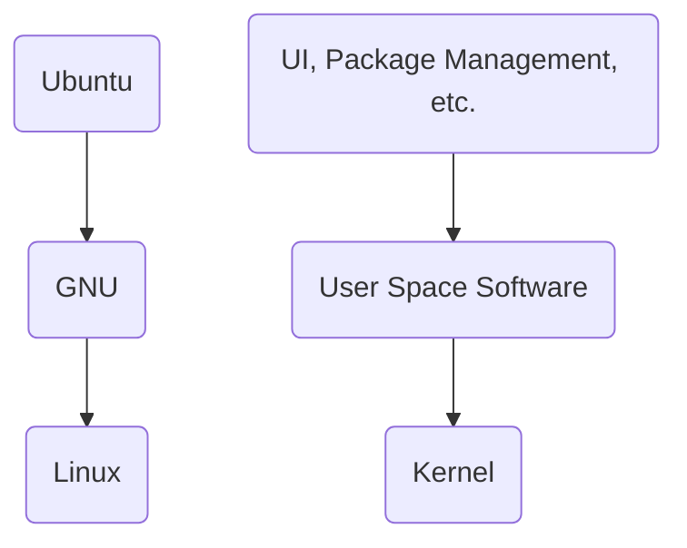

Date: 29th January 2025
Date Modified: 29th January 2025
File Folder: Week 2
#operatingsystems

```ad-abstract
title: Today's Topics
collapse: open

- Getting Docker Prepared
- Developing in a Linux Environment

```

# Developing inn a Linux Environment

## Housekeeping

```ad-important
The first hoework assignment will require you to do a in-person demo showing you can develop on a Linux environment
```

## What is Linux?

It is an **operating system**
- UNIX-based (same family as MacOS, Android, iOS)
- *Note*: Windows does not share many similarities with Linux

**Applications**:
- Server applications
- Mobile
- Desktop
- *Highly* configurable

## Linux Distros

```ad-example
title: Distrbutions
- Ubuntu
- Fedora
- Debian
- openSUSE
- Arch Linux :nerdemoji:
```

Each distribution has different:
- Install process
- Default graphical user interface
- Package manager

```ad-note
We will be using **Ubuntu** thorughout this class
```
## Docker

```ad-summary
Utilizes containers to spin up a development sandbox on your host computer
```

*NOT* a virtual machine in the traditional sense. They might have a vm running in the background

Makes it so that no virtual machines are need in MacOS, Linux, and Windows
- Windows does need **WSL**, which is a compatibility layer

## Your Operating System

The Docker container is running on Ubuntu, a flavor of Debian
- Ubuntu is build upon the GNU operating system
- GNU runs off of the Linux kernel



**Kernel**: Interface between hardware & software

## Shell

**Shell**: A software text-based interface to a computer

**Terminal**: An application for accessing a computer shell

```ad-note
Shell is where you type commands into a computer; while the terminal is how you *access* the shell
```

## Package Manager


