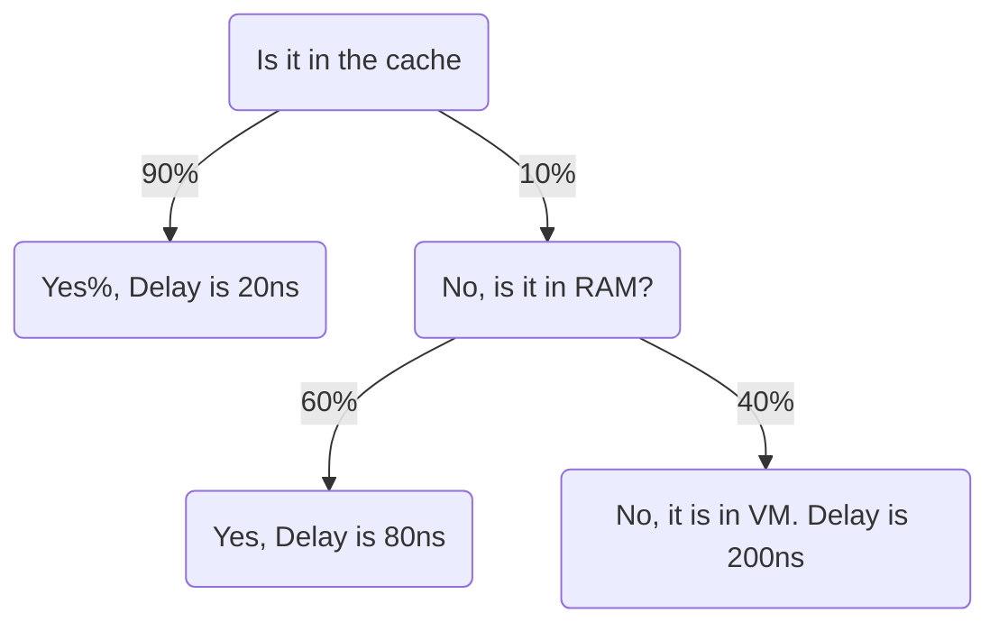

 Date: 10th February 2025
Date Modified: 10th February 2025
File Folder: Week 4
#operatingsystems

```ad-abstract
title: Today's Topics
collapse: open

- Topic1
- Topic2
- Topic3

```


# Memory Hierarchy

## Introduction

## The Design Problem

Design constraints on a computer’s memory:
- Cost
- Speed
- Storage

We wish we could have infinitely cheap, fast, and large storage, but it is impossible.
### Memory Tradeoffs


## Memory Hierarchy Pyramid

![[Memory-Hierarchy-Design.webp]]

## Hit Ratio

```ad-summary
title: Definition
The proabability $H$ that the data you are looking for is in $L_1$
```

**Problem**: Suppose the CPU has access to two levels of memory: $L_1$ and $L_2$
- $L_1$ has 1,000 bytes and an access time of $0.1 \micro s$
- $L_2$ has 100,000 bytes and an access time of $1 \micro s$
- The data is either in $L_1$ or $L_2$, but we don’t know where

```ad-question
What is the average load time of data?
```

![[Operating Systems - Week 4 Day 2 2025-02-12 08.18.41.excalidraw]]

How can we have the storage capacity of $L_2$ with the speed of $L_1$? $L_1$ acts as a **temporary storage** for commonly used data.

![[Pasted image 20250212082257.png]]

### Principle of Locality

Fortunately, $H$ is often very high (~90%)!
- Memory references by te processor tend to cluster
- Data is organized so that the percentage of accesses to each successively lower level is substantially less than that of the level above.
- Can be applied across more than two levels of memory

```ad-example
In a simple for loop, you are consistently accessing the same variables over-and-over again (typically a counter and an output variable)
```

## Cache Memory

- Stored on the CPU itself
- Invisible to the OS
- Interacts withtother memory management hardware
- Processor must access memory at least once per instruction cycle
- Processor execution is limited by memory cycle time
- Exploit the principle of locality with a small, fast memory

![[images 5.jpg]]

![[1_SSuGwN1mZZdEzdKqG_xOXg.png]]

### How Does Cache Work?

![[Operating Systems - Week 4 Day 2 2025-02-12 08.32.38.excalidraw]]

**Tag**: The most significant bits that determine where a block of data came from the cache from main memory.

### Cache Read Operation Flow Chart

![[Pasted image 20250212083821.png]]

## Cache Design

Can come down to *six different design concepts*:
- Cache Size
- Number of cache levels
- Block Size
- …

### Cache vs. Block Size

**Cache Size**: Small caches have significant impact on performance

**Block Size**: The unit of data exchanged between cache and main memory

### Mapping Function

```ad-summary
title: Defintion
Determiens which cache lcoaiton the block will occupy
```

**Two Design Constraints**:
1. When one block is read in, another may have to be replaced
2. The more flexible the mapping function, the more complex is the circuitry required to search the cache.

### Replacement Algorithm 

**Least Recently Used (LRU) Algorithm**:
- Effective strategy is to replace a block that has been in the cache the longest with no references to it
- Hardware mechanism are needed to identify the least recently used block

### Write Policy

Dictates when the memory write operation takes place
- Can occur every time the block is updated
- Can occur when he block is replaced

```ad-warning
It minimizes write oeprations BUT might leave the main memory in an obsolete state
```

### Exercise

```ad-question
Memory System = Cache + Main Memory + Disk (Virtual Memory)

Access time for a word reference:
- $20ns$ if it is in the cache
- $60ns$ if it is not in cache but in main memory to load it into the cache
- $12ms$ if not in main memory to fetch from disk into main memory

Cache Hit Ratio = $90\%$

Main memory hit ratio = $60\%$
$
What is the *average access time* for a word access in $ns$
```

$$\mbox{Expected Outcome} = \mbox{Probability} \times \mbox{Outcome}$$



$$P_{hit}\times \mbox{time} + P_{not \space hit} \times \mbox{time}$$
$$(0.9) \times (20*10^{-9})+(0.1)\times \boxed{\mbox{Time for not Cache}}$$
$$(0.9*20*10^{-9}) + 0.1[(0.6) \times (20*10^{-9}+60 *10^{-9})]+0.40 \times \mbox{Time NOT in RAM}$$
$$(0.9*20*10^{-9}) +(0.6\times(20*10^{-9}+60*10^{-9}))*0.40*(20*10^{-9}+60*10^{-9}+12*10^{-3})$$

## I/O Techniques

### Programmed or Busy Waiting

Imagine that we want to write data from the main memory to an I/O module through waiting. How can we do this?
1. Load data into MBR
2. Send data to I/O device
3. Poll the I/O device until finished
4. Continue execution when done

### Interrupt Driven
 
Imagine that we want to write data from the main memory to an I/O module through *interrupts*. How can we do this?
1. Load data into MBR
2. Send data to I/O device
3. CPU will continue execution on other programs until the I/O is ready
4. The I/O will interrupt the CPU when done

### Direct Memory Access (DMA)

```ad-note
This can only happen if there is a DMA module present on the system bus.
```

Imagine that we want to write data from the main memory to an I/O module through *DMA*. How can we do this?
1. CPU will tell DMA what data to move (e.g. move memory 101 to HDD)
2. CPU continues other work & DMA loads the data into its *buffer*
3. DMA sends data to I/O
4. I/O interrupts the DMA when done
5. DMA interrupts the CPU


